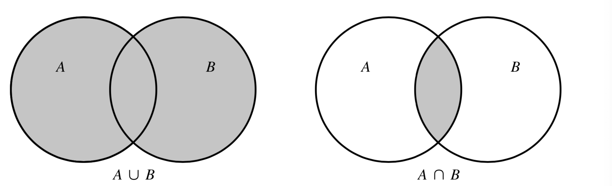

# Chapter 1: Probability

The ideas of probability and statistics and interconnected. The theory of probability is a mathematical model to determine the chance phenomena. Statistics, on the other hand, is essentially concerned with procedures for analyzing random variables. To comprehend the theory of statistics, we must need to have a sound background in probability. 

## Sample Spaces

Probability theory is concerned with outcomes that occur randomly. A set of all possible outcomes in a given experiment is the **sample space** of that experiment. The sample space is denoted by $\Omega$. A sample space of a 6-sided die is: 
$$
\Omega = \{1, 2, 3, 4, 5, 6\}
$$
The sample space of three coins that are tossed one after another is: 
$$
\Omega = \{HHH, HHT, HTT, HTH, TTT, TTH, THH, THT\}
$$
In probability we are interested in certain subsets of the sample space. Such a subspace is called an **event**. In other words, an event is a favorable outcome. For example, in the experiment of tossing three coins simultaneously where we have heads on the first coin is: 
$$
A = \{HHH, HHT, HTT, HTH\}
$$
Here are some of the characteristics of events in various experiments: 

* The **union** of two events, A and B, is an event C that either A occurs or B occurs or both occur. We write this as, 
  $$
  C = A \cup B
  $$
  For example, A is the event of getting a 2 on the role of a die and B is the event of getting a 6, then the union of A and B is: $C = \{2, 4\}$.

* The **intersection** of two events, A and B, is an event C that both A and B occur. We write this as, 
  $$
  C = A \cap B
  $$
  Continuing with our example, we see that getting a 2 on the role of a die and getting a 6 on the role of a die is impossible. So in this case $C = \{\}$ is an **empty set**. 
  

* An **empty set** is a set that has no events. 
  

* The **complement** of an event, A, is an event $A^C$ in which case A does not occur. If A is an event of getting a 2 in a role of a die, the complement of A is all events where 2 does not occur. We write this as, 
  $$
  A^C = \{1, 3, 4, 5, 6\}
  $$
  

* If two events A and B have no outcomes in common, we say that events A and B are **disjoint**. 

Let’s look at some of the laws of set theory: 

#### Commutative Laws

$$
A \cup B = B \cup A \\[10pt]
A \cap B = B \cap A
$$

#### Associative Laws

$$
(A \cup B) \cup C = A \cup (B \cup C) \\[10pt]
(A \cap B) \cap C = A \cap (B \cap C)
$$

#### Distributive Laws

$$
(A \cup B) \cap C = (A \cap C) \cup (B \cap C) \\[10pt]
(A \cap B) \cup C = (A \cup C) \cap (B \cup C)
$$

The **Venn diagrams** allow us to visualize the set theory. Here’s an example of union and intersection of two sets. 

## Probability Measures

 A **probability measure** of $\Omega$ is a function $P$ from subset of $\Omega$ to the real numbers that satisfies the following axioms: 

1. $P(\Omega) = 1$

2. If $A \subset \Omega$, then $P(A) \geq 0$

3. If $A_1$ and$A_2$ are disjoint, then 
   $$
   P(A_1 \cup A_2) = P(A_1) + P(A_2)
   $$
   More generally, if $A_1, A_2,..A_n,... are mutually disjoint, then
   $$
   P \left(\bigcup\limits_{i=1}^{\infty} A_i \right) = \sum_{i=1}^{\infty}P(A_i)
   $$

This means that if A and B have no outcomes in common, then the probability of their union is simply the the sum of their probabilities. 

* Because the probability of the sample space is 1, we can write
  $$
  P(A^C) = 1 - P(A) \\[10pt]
  P(A) + P(A^C) = P(\Omega) = 1
  $$

* If $A \subset B$, then $P(A) \leq P(B)$. This means that if B occurs whenever A occurs, then $P(A) \leq P(B)$. For example, if whenever it rains (A) it is cloudy (B), then the probability that it rains is less than or equal to the probability that it is cloudy. 

* It can be shown that, 
  $$
  B = A \cup (B \cap A^C)
  $$
  then from the third axiom, 
  $$
  P(B) = P(A) + P(B \cap A^C)
  $$
  and thus, 
  $$
  P(A) = P(B) - P(B \cap A^C) \leq P(B)
  $$

### Addition Law of Probability

If we have two events A and B, then the probability of their union is, 
$$
P(A \cup B) = P(A) + P(B) - P(A \cap B)
$$
If A and B are disjoint, then Eq. 16 has the same form as axiom 3. If A and B are not disjoint, then Eq. 16 holds. The reason we have to subtract the $P(A \cap B)$ is because when we add the probabilities of A and B, we are double counting. So, we have to subtract the region $A \cap B$ that is common between A and B. 

## Computing Probabilities: Counting Methods

If we have 5 samples: A, B, C, D, and E and 5 places. There are 5! ways of arranging those 5 samples in 5 places. This is because the first place has 5 ways of arranging. The second place has 4 ways of sampling given that the first place is taken. The third place has 3 way of sampling and so forth. 

If we have 5 samples: A, B, C, D, and E and 2 places, then there are 20 ways of arranging these 5 samples in those 2 places. This is because, there are 5 ways in first and 4 ways in the second. If we have n samples and k places, then there are: 
$$
P(n,k) = \frac{n!}{(n-k)!}
$$
This is known as **Permutations**. Note that this is only possible if we take each sample **without replacement**. 

However, if we take each sample **with replacement** then the formula is simply
$$
\text{Total Possibilities } = N^k
$$
Let’s look at some examples: 

* Suppose that from ten children, five are to be chosen and lined up. How many different lines are possible? 

  Using Eq.17 we can say there are: 10!/5! = 30,240 different lines. 

* In some states, license plates have six characters: three letters followed by three numbers. How many distinct such plates are possible? 

  In this case, we use Eq. 17 as we do this with replacement. There are 26 letters in the English alphabets. So, out of 26 letters, we can choose 3. So, there are: $26^3$  = 17,576 ways of arranging characters in three places. This is because each space is independent of the next space. There are 10 numbers between 0 and 9. So, there are $10^3$ = 1000 ways of arranging 10 numbers in three places. Finally for every arrangement in three characters, we can have 720 ways of arranging numbers. Hence, the total distinct such plates possible are:  17,576 $\times$ 1000 = 17,576,000. 

* If all sequences of six characters are equally likely, what is the probability that the license plate for a new car will contain no duplicate letters or numbers? 

  Now in this case we need to use Eq. 17 first to compute all possibilities that have no duplicates. So, there are: 26!/23! = 15,600 chracters and 10!/7! = 720 numbers and total possibilities are: 11,232,000 possibilities. So, the probability of a license plate with no duplicate letters or numbers is: 

  $11,232,000/17,576,000 = 0.639$ or 64%. 

So, far we have considered the cases where the order matters. So, the permutations: $ABC \neq CAB$ are considered unique. The permutations of three characters are: 
$$
\Omega = \{ABC, ACB, CAB, CBA, BCA, BAC\}
$$
However, if we consider that order does not matter. That is to say, $ABC = CAB$, then the above sample space would be: 
$$
\Omega = \{ABC\}
$$
When order does not matter, we call this **combination**. The equation for combination is the following: 
$$
C(n,k) = \frac{n!}{(n-k)!k!}
$$
Notice that we can write combination as permutation: 
$$
C(n, k) = \frac{P(n,k)}{k!}
$$
In other words, when order does not matter, we need to divide the permutation equation by the total number of permutations. The combination equation is also written as: 
$$
C(n, k) = {n \choose k}
$$

> The combination equation is saying the following:  the number of unordered samples of $k$ objects selected from $n$ objects without replacement is: ${n \choose k}$. 

In our example, we have $n = 3$. So, the total number of permutations are: $3!/0! = 6$ and the total number of combinations are: $3!/((3 - 3)!3!) = 1$. 

The numbers ${n \choose k}$, called the **binomial coefficients**, occur in the expansion: 
$$
(a + b)^n = \sum_{k=0}^{n}{n \choose k}a^kb^{n-k} \\[20pt]

2^n = \sum_{k=0}^n {n \choose k}
$$
So, if $a = b = 1$, we have the second equation. 

> The number of ways that $n$ objects can be grouped into $r$ classes with $n_i$ in the $i$th class, $i = 1, 2, ...r$, and $\sum_{i=1}^rn_i = n$ is
> $$
> {n \choose n_1n_2...n_r} = \frac{n!}{n_1!n_2!...n_r!}
> $$

Let’s take an example to understand this in more detail. A committee of seven members is to be divided into three subcommittees of size, three, two and two. This can be done in: 

${7 \choose 322} = 7!/3!2!2! = 210$. 

Let’s see another example: How many ways there are to arrange `mississippi`? We see that there are a total of 11 letters. However, there are 4i, 4s, 2ps. So, the total ways of arranging `mississippi` is: 

${11 \choose 442} = 11!/4!4!2! = 34,650$ ways. 

The numbers ${n \choose n_1n_2...n_r}$ are called **multinomial coefficients**. They occur in the expansion: 
$$
(x_1 + x_2 + ... + x_r)^n = \sum{n \choose n_1n_2...n_r}x_1^{n_1}x_2^{n_2}...x_r^{n_r} 
$$
where, the sum is over all nonnegative integers $n_i$ such that $\sum n_i = n$

## Conditional Probability

To understand conditional probability, let’s consider the following example: A therapy is used to measure a hormone in the blood. The measurement of this hormone allows doctor’s determine whether the patient is likely to suffer from congestive heart failure. To improve the diagnosis, the concentration of the hormone is measured. A study was done on 135 patients. The result of this study is as follows: 

Here the symbols mean the following: 

For example, 25 of 135 patients had a high blood concentration of the hormone and suffered toxicity. We can convert the above table to a proportions, or a frequency table as follows: 

We can regard the proportions as probability. So, from the table we can say, $P(T+) = 0.289$ and $P(D+) = 0.318$. Now we ask ourselves, *If we know that the test was positive (D+), what is the probability of toxicity (T+) given this knowledge?* We denote the probability that a patient shows toxicity given that the test is positive by $P(D+|T+)$, which is called the **conditional probability** is given by, 
$$
P(D+|T+) = \frac{25}{39} = 0.640
$$
Similarly, we can calculate this probability as, 
$$
P(D+|T+) = \frac{P(D+ \cap T+)}{P(T+)} = \frac{0.185}{0.289}
$$
So, in this case we ask, “*Of the total T+ that we have, how many of them are also D+*?”

> Let $A$ and $B$ be two events with $P(B) \neq 0$. The conditional probability of $A$ given $B$ is defined as: 
> $$
> P(A|B) = \frac{P(A \cap B)}{P(B)}
> $$

We can rearrange Eq.29 as follows: 

> Let $A$ and $B$ be events and assume $P(B) \neq 0$. Then
> $$
> P(A \cap B) = P(A|B)P(B)
> $$

This is known as the **multiplication law**.

Let’s look at an example: An urn contains three red balls and one blue ball. Two balls are selected without replacement. What is the probability that they are both red? 

So, let $A$ denote the first trial that we get a red ball and let $B$ be the second trial that we get a red ball. We want to find: 

$P(A = red \cap B = red)$ = $P(A = red|B = red)P(B = red)$

Now, $P(B = red) = 3/4$ while $P(A|B) = 2/3$. So, the probability of getting a red given that we got a red is: $(2/3)(3/4) = 1/2 $. 

Another useful tool for computing probabilities is provided by the following law: 

 

The law is useful in situations where it is not obvious how to calculate $P(A)$ directly but in which $P(A|B_i)$ and $P(B_i)$ are more straightforward. 

For example, consider the case: What is the probability that a red ball is selected on the second draw? 

Let A be the first draw and B be the second draw. Then we can write the above equation as follows: 
$$
P(B) = P(B|A)P(A)
$$
Now there are two possibilities: We get a blue ball of the first trial and red on the second or we get a red on the first and red on the second. So, we have: 

P(A = blue) = 1/4; P(B = red|A = blue) =  1 $\implies P(B = red) = (1/4)(1) = 1/4$

P(A = red) = 3/4; P(B = red|A = red) = 2/3 $\implies P(B = red) = (3/4)(2/3) = 1/2$

So, $P(B = red) = 1/4 + 1/2 = 3/4$

From conditional probability, we come to **Bayes’ Rule**. The Bayes Rule is defined as follows, 

## Independence

We say that two events $A$ and $B$ are independent, if knowing that one has occurred gives us no information about whether the other has occurred. Mathematically, we can say that as, 
$$
P(A|B) = P(A)
$$
holds true only when $A$ and $B$ are indpendent. It follows then, 

