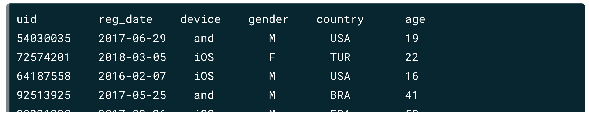
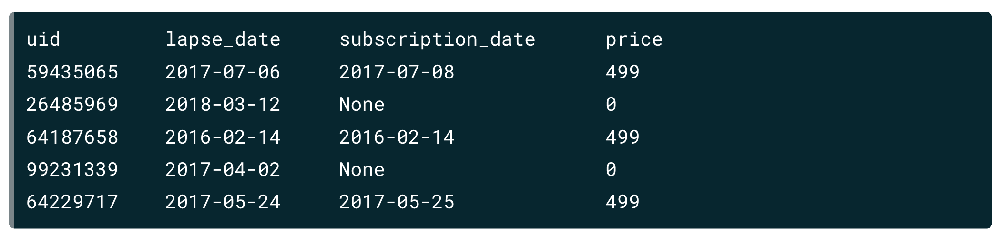
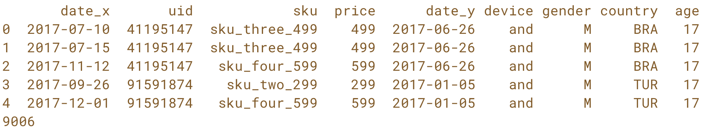
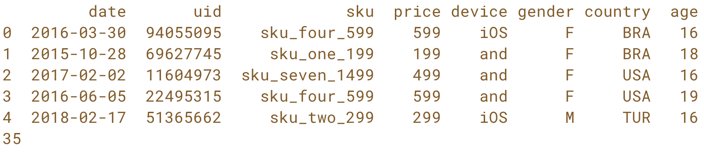
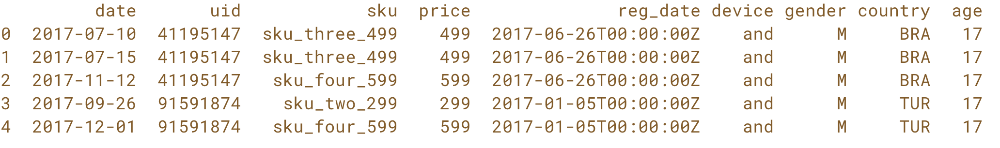

[TOC]

# A/B Testing in Python

## Customer Analytics & A/B Testing in Python

The most successful companies today are the ones that know their customers so well that they can anticipate their needs. Customer analytics and in particular A/B Testing are crucial parts of leveraging quantitative know-how to help make business decisions that generate value. This course covers the ins and outs of how to use Python to analyze customer behavior and business trends as well as how to create, run, and analyze A/B tests to make proactive, data-driven business decisions.

### Chapter 1: Key Performance Indicators (KPI): Measuring Business Success

This chapter provides a brief introduction to the content that will be covered throughout the course before transitioning into a discussion of Key Performance Indicators or KPIs. You'll learn how to identify and define meaningful KPIs through a combination of critical thinking and leveraging Python tools. These techniques are all presented in a highly practical and generalizable way. Ultimately these topics serve as the core foundation for the A/B testing discussion that follows.

#### What is A/B Testing? 

A/B testing allows you to test two or more different ideas against each other to see which one empirically perform better. A/B testing leaves out guessing as you are the one designing the experiment and therefore know what matters most. 

A/B Testing has other benefits: 

* Provide accurate answers
* Allows to rapidly iterate on ideas
* Allows to establish causal relationships using statiscal framework

A/B testing works by randomly assigned unique users each of the ideas that you want to test. Noting how they behave, you can entangle the effects your ideas have on the users and ultimately determining which is the best. If you have users and ideas, chances are you can run A/B test. 

A/B testing can be used in varied ways: 

* Testing impact of drugs
* Incentivizing spending 
* Driving user growth
* and many more...

Before you perform test, it is worth noting what is worth testing and optimizing for.  To understand this, we will progress through this course in the following way: 

1. We will try to understand users through KPIs
2. Identify the trends using EDA
3. Optimizing performance through the design of A/B Tests
4. Understand data driven decisions by analyzing A/B Test Results

#### Key Performance Indicators (KPIs)

In general, A/B tests are run to improve KPIs. The KPIs are the most important metrics to any organization. These KPIs could be likelihood of a side-effect, the revenue, conversion rate, or even play time per user. 

Identifying KPIs come through experience, domain knowledge, and EDA. 

#### Example: Meditation App

We will use an example of a meditation mobile app. Such a mobile app has the following: 

* Services
  * Paid Subscription
  * One-off in-app purchases
* Goals/KPIs
  * Maintain high conversion rate

We have two datasets related to the app: 

* User demographics: this is tied to unique user ID number. We will import this file as follows: 

  ```python
  customer_demographics = pd.read_csv('customer_demographics.csv')
  ```

  This includes a broad set of demographics: 
  

* User Actions: this includes the date the subscription ended, the price they paid, and when they renewed their subscription

  ```python
  customer_subscription = pd.read_csv('customer_subscription.csv')
  ```

  

For now consider the KPI of conversion rate. In what time frame should we consider the conversion rate? Here are possibilities: 

* Right after subscription lapse? 
* One week after subscription lapse? 
* One month after?

One way is to decide is to choose: 

* stable, generalizable KPIs are better than custom KPIs. This allows for a better generalizability. 
* Correlation with business factors. We need to see KPIs are that are correlated to retention or spending than the others. 

We begin with joining the two tables. Then we will aggregate this combined dataset and calculate the potential KPIs that we are interested in. 

#### Joins and Aggregations

We merge the two datasets on `uid`: 

```python
# Merge on the 'uid' field
uid_combined_data = app_purchases.merge(customer_data, on=['uid'], 
                                            how='inner')

# Examine the results 
print(uid_combined_data.head())
print(len(uid_combined_data))
```

The output looks something like this: 



To look for purchases that happened **on** the date of registration, we merge the two datasets on `uid` and `date`. 

```python
# Merge on the 'uid' and 'date' field
uid_date_combined_data = app_purchases.merge(customer_data, on=['uid', 'date'], how='inner')

# Examine the results 
print(uid_date_combined_data.head())
print(len(uid_date_combined_data))
```



We got 35 rows rather thn 9005 as there were few people who purchased on the date of registration. 

> Goal: We want to know which conversion rate metric is the most appropriate

Note that often a company will have more than one KPI. In our case, we have one KPI. We will begin with aggregation. Let’s look at the purchase data: 



We can calculate the mean using the `agg()` function: 

```python
# Calculate the mean purchase price 
purchase_price_mean = purchase_data.price.agg('mean')

# Examine the output 
print(purchase_price_mean)

406.77259604707973
```

We can also pass more than one argument as a list: 

```python
# Calculate the mean and median purchase price 
purchase_price_summary = purchase_data.price.agg(['mean', 'median'])

# Examine the output 
print(purchase_price_summary)

mean      406.772596
median    299.000000
Name: price, dtype: float64
```

Finally, we can also compute the mean values across columns: 

```python
# Calculate the mean and median of price and age
purchase_summary = purchase_data.agg({'price': ['mean', 'median'], 'age': ['mean', 'median']})

# Examine the output 
print(purchase_summary)

             price        age
mean    406.772596  23.922274
median  299.000000  21.000000
```

We see that the mean is higher than the median. This happens when the distribution is positively skewed. This suggests that we have some users who are making a lot of purchases! 

We will do some additional group by: we want to group by the purchase data by `device` and `gender` and then aggregate the price by mean, median and std: 

```python
# Group the data 
grouped_purchase_data = purchase_data.groupby(['device', 'gender'])

# Aggregate the data
purchase_summary = grouped_purchase_data.agg({'price': ['mean', 'median', 'std']})

# Examine the results
print(purchase_summary)

                    price                   
                     mean median         std
device gender                               
and    F       400.747504    299  179.984378
       M       416.237308    499  195.001520
iOS    F       404.435330    299  181.524952
       M       405.272401    299  196.843197
```

#### Calculating KPIs - A practical Example

We will look at a KPI we will look at the number of users who subscribed to the app within the first week after the trail ended. 

Suppose our current date is March 17th, 2018. We want to know what the maximum lapse is in our dataset. 

```python
from datetime import datetime, timedelta
current_date = pd.to_datetime('2018-03-17')
print(sub_data_demo.lapse_date.max())

`2018-03-17`
```

The maximum lapse date is today as well. Next we restrict users by lapse date: 

```python
# latest lapse date: a week before today
max_lapse_date = current_date - timedelta(days=7)

# restrict to users lapsed before max_lapse_date
conv_sub_data = sub_data_demo[(sub_data_demo.lapse_date < max_lapse_date)]

# Count the total number of users whose trial ended in the last 7 days
total_users_count = conv_sub_data.price.count()
print(total_users_count)
2787
```

So there are 2787 users whose trial ended in the last 7 days.

 Next we find the users who subscribed within 7 days of their trial ended: 

```python
# latest subcription date: within 7 days of lapsing
max_sub_date = conv_sub_date.lapse_date + timedelta(days=7)

# filter the users with non-zero subscription price
# who subscribed before max_sub_date
total_subs = conv_sub_data[(conv_sub_data.price > 0) & 
                          (conv_sub_data.subscription_date <= max_sub_date)]

# count the users
total_subs_count = total_subs.price.count()
print(total_subs_count)
648
```

Next we see the first week of conversaion rate: 

```python
conversion_rate = total_subs_count / total_users_count
print(conversion_rate)
0.2325
```

Next we want to see week two conversion rate. That is, how many users subcribed within 14 days of the end of trial. We repeat the same process: 

```python
# keep users lapsed in the last 14 days
max_lapsed_date = current_date - timedelta(days=14)
conv_sub_data = conv_sub_data.copy()
conv_sub_data = sub_data_demo[(sub_data_demo.lapse_date <= max_lapse_date)]
```

We can find the number of days between subscription and lapse date if subscribed as follows: 

```python
sub_time = np.where(
							 # if
               conv_sub_data.subscription_date.notnull(),
               # then
						   (conv_sub_data.subscription_date - conv_sub_data.lapse_date).dt.days
               # else
					     pd.NaT)
# Create a new column `sub_time`:
conv_sub_data.loc[:, 'sub_time'] = sub_time
```

We create two functions `gcr7()` and `gcr14()` that look at conversion rates over 7 and 14 days. Basically, convert all of the above into a function.  We can then aggregate and apply the functions: 

```python
purchase_cohorts = conv_sub_data.groupby(by=['gender', 'device'], as_index=False)

# Find group conversion rated for each cohort using the functions
purchase_cohorts.agg({sub_time: [gcr7, gcr14]})
```

The result is the following: 


#### How to Choose KPI Metrics? 

To carefully choose KPIs, here are some tips to follow: 

* Consider how long it takes. Longer the time, the more impractical it gets
* Use EDA to reveal relationships between metrics and key results
* Explore ties of the above relationships to business metrics

Here’s another example of a KPI: 

You're now going to take what you've learned and work through calculating a KPI yourself. Specifically, you'll calculate the average amount paid per purchase within a user's first 28 days using the `purchase_data`DataFrame from before.

This KPI can provide a sense of the popularity of different in-app purchase price points to users within their first month.

```python
# Compute max_purchase_date
max_purchase_date = current_date - timedelta(days=28)

# Filter to only include users who registered before our max date
purchase_data_filt = purchase_data[purchase_data.reg_date < max_purchase_date]

# Filter to contain only purchases within the first 28 days of registration
purchase_data_filt = purchase_data_filt[(purchase_data_filt.date <= 
                        purchase_data_filt.reg_date + timedelta(days=28))]

# Output the mean price paid per purchase
print(purchase_data_filt.price.mean())
414.4237288135593
```

Since our average price is 414 cents which is below 499 cents, it seems that our purchasers tend towards the lower priced set of options. 

Building on the previous exercise, let's look at the same KPI, average purchase price, and a similar one, median purchase price, within the first 28 days. Additionally, let's look at these metrics not limited to 28 days to compare.

We can calculate these metrics across a set of cohorts and see what differences emerge. This is a useful task as it can help us understand how behaviors vary across cohorts.

Note that in our data the price variable is given in cents.

```python
# Set the max registration date to be one month before today
max_reg_date = current_date - timedelta(days=28)

# Find the month 1 values
month1 = np.where(
                 # If
                 (purchase_data.reg_date < max_reg_date) &
                 (purchase_data.date < purchase_data.reg_date + timedelta(days=28)),
                 # then
                  purchase_data.price,
                 # else
                  np.NaN)
                 
# Update the value in the DataFrame
purchase_data['month1'] = month1

# Group the data by gender and device 
purchase_data_upd = purchase_data.groupby(by=['gender', 'device'], as_index=False) 

# Aggregate the month1 and price data 
purchase_summary = purchase_data_upd.agg(
                        {'month1': ['mean', 'median'],
                        'price': ['mean', 'median']})

# Examine the results 
print(purchase_summary)

      gender device      month1              price       
                           mean median        mean median
    0      F    and  388.204545  299.0  400.747504    299
    1      F    iOS  432.587786  499.0  404.435330    299
    2      M    and  413.705882  399.0  416.237308    499
    3      M    iOS  433.313725  499.0  405.272401    299
```

This value seems relatively stable over the past 28 days. 

