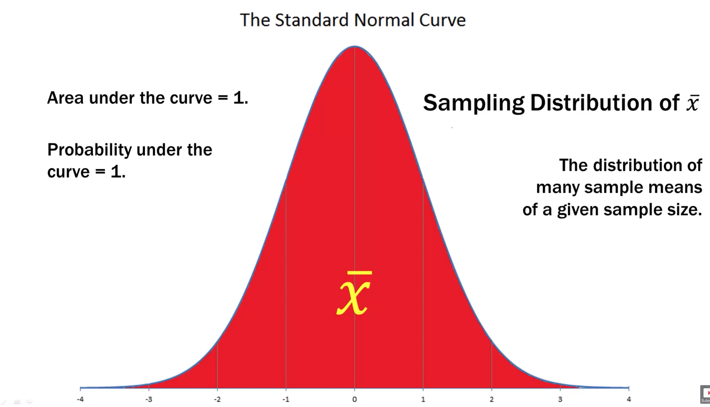
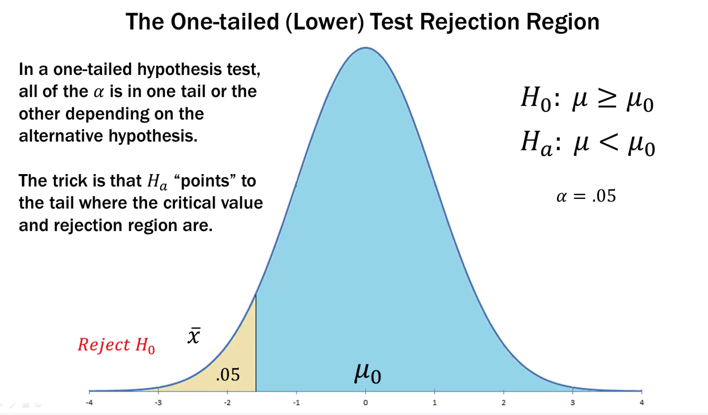
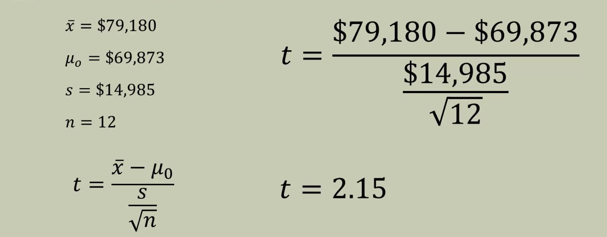

# Hypothesis Testing

These are my notes to hypothesis testing from YouTube videos by Brandon Foltz. 

## Introduction to Hypothesis Testing 

This section will help us set up the hypothesis testing. In this section we will see how hypothesis tests are formed, what questions to ask, and how to find solutions to those questions. This section is more of what hypothesis is in terms of statistics. 

Let’s start with an example: 

The hypothesis starts with a statement like the one above. We have a bottle of water with 355 ml and we assume it to be true. But we may ask, is this really true? From the customers side, we are ok if the bottle has more than 355 ml but from the manufacturing side, we want to ensure that there is exactly 355 ml because if we underfill we cheat the customers and if we overfill we lose money. In summary, we have: 

What we have done here is that we have put the assumption in a mathematical formulation. The questions each would ask: 

Customer: Is there, on average, at least 355 ml of water in each bottle? 

Manufacturer: Is there, on average, exactly 355 ml of water in each bottle? 

Now to test the assumptions or answer the above questions, we set up an experiment as follows: 

> There is a difference between **assumption** and **claim**. A claim is something we don’t know and therefore needs to be tested. An assumption is thought to be true, a status quo, which we test to reconfirm or verify. 

When trying to formulate a statistical hypothesis, we need to ask ourselves the following questions: 

> Am I testing an **assumption**, or the **status quo**, that already exists? 
>
> Or am I testing a **claim** or **assertion** beyond what I already know or can know? 

Once we have formulated our questions, the next step is to create the **null** and **alternative** hypotheses. Here are some points: 

* The null and the alternative hypotheses are two opposing roads that lead to the same place. 
* By definition the null and alternative hypothesis are opposite, mutually exclusive. They both cannot be true at the same time. 
* The null is either rejected or it is not. Only if the null is rejected can we proceed to the alternative. 
* Researchers can start with either the null or the alternative, and then form the other as a complement to the first. 
* Which to start with largely depends on the point of view of the researcher, the context of the problem, and what can or cannot be assumed to be known upfront. 

The above slide shows the difference between the null and alternative hypothesis. The null says that “*This is accepted as true, let’s test it*”. The alternative hypothesis says “*This might be true, let’s test it. If not, the truth is something else.*”

## Null and Alternative Hypotheses

We make the null hypotheses all the time in our daily lives. For example, we pour milk in the glass, we assume that the glass is not broken. When driving we take a turn onto another street, we assume the street is flat and made of asphalt or concrete. We make assumptions about the world all the time. So, in our lives, we live out these assumptions, the null hypotheses. But when these assumptions get broken we really notice.  

> A null hypothesis is simply, an **assumption** we make about something and we test whether or not that assumptions holds true

> The alternative hypothesis is what happens when we **fail** to accept that null hypothesis. 

These are the two things we do every day in our lives that are null and alternative hypotheses. 

The **null hypothesis** is given by a mathematical symbol: $H_0$ . The *null* in the null hypothesis means that **nothing new or different** is happening. Or that the assumption and status quo is maintained. 

The alternative hypothesis is given by a mathematical symbol: $H_a$. The *alternative* hypothesis means the **other option** when the null is rejected. 

The properties of null and alternative hypotheses are the following: 

| $H_0$                                         | $H_a$                                   |
| --------------------------------------------- | --------------------------------------- |
| Assumption, status quo, nothing new           | Rejection of an assumption              |
| Assumed to be “True”; a given                 | Rejection of an assumption or the given |
| Negation of the research question             | Research question to be “proven”        |
| Always contains an equality ($=, \leq, \geq$) | Does not contain ($\neq, >, < $)        |

Using the last property, we can logically derive the possible null/alternative pairs: 

Here are the null and alternative statements: 

* All statistical conclusions are made in reference to the null hypothesis. 
* As researchers we either **reject** the null hypothesis or **fail to reject** the null hypothesis; we do not accept the null hypothesis
  * This is due to the fact that the null hypothesis is assumed to be true from the start; rejecting or failing to reject an assumption. 
* If we **reject** the null hypothesis, then we conclude the data supports the alternative hypothesis
* However, if we **fail to reject** the null hypothesis, it does not mean we have proven the null hypothesis is “true”
  * Why? Because remember from the outset we **assumed** it was true. 
  * **Failure to reject** the null does not equate to *proof* about its truth

## Null and Alternative Hypotheses Example Problems

As a first example, we will start with the bottle water example. As we have seen earlier, in this example we assume that the bottle has 355 ml of water. Hence, the null hypothesis would be $H_0$ = 355 ml. Then the alternative hypothesis would be $H_a \neq$ 355 ml. 

If we test across 50 bottles and find the mean of this sample and find that the bottles are filled properly, then we **fail to reject** the null hypothesis. Or we fail to reject our assumption. We just say that our assumption has held up. 

If the data indicates that bottles are not being filled properly, then we **reject** the null hypothesis. Subsequently, we reject our assumptions. We say that our assumption has not held up under analysis. We have statistical support for the validity of the alternative hypothesis. 

When it comes to wording, it is important to use the following: 

 

Let’s look at another example: 

What would be the null and alternative hypothesis? 

>  Null hypothesis: $H_0 \leq 2.3$
> Alternative hypothesis: $H_a > 2.3$

Here our **assumption** would be that the farm size has remained the same or has decreased. We have the **claim** that the farm size has increased. Hence, we use the choice as shown above for null and alternative hypotheses. 

## Type I and Type II Errors

As we have seen in the previous sections, the null hypothesis is something that is given or is assumed. We do a statistical test to either reject or fail to reject the null hypothesis. If we fail to reject the null hypothesis there is nothing else to be done. However, if we reject the null hypothesis, then we move onto the alternative hypothesis. Of course, from statistics we know that we can never be 100% certain. Remember that we base or conclusion from the analysis based on some sample we took. Using this sample, we either reject or fail to reject the null hypothesis. When we do the hypothetical analysis, we ask ourselves whether our conclusion from the analysis matches the state of reality? We know that it is not going to happen 100%, so there is a possibility that we could be wrong in concluding from our analysis. In a nutshell this is Type I and Type II error. 

Let’s take an example: 

Let’s say you are going down the hallway at work or school, doing you own thing; everything is normal. Suddenly you encounter a sudden smell of smoke. You know that may mean a serious fire is taking place. Or it could be nothing serious; maybe someone burned popcorn in the microwave. What do you do next? 

1. If you think the smoky smell was nothing serious, you may decide your assumption that everything is normal is correct and you will not pull the fire alarm. 
2. If you think the smoky smell is due to a serious fire, you may reject your assumption that everything is normal and you will pull the fire alarm. 

Let’s put scenario `2` in context of statistics: 

* You smell the smoke and think that this is not normal. So, you reject your null hypothesis and pull the fire alarm. You have therefore acted on your alternative hypothesis. 
* The fire department come and conclude that there was no fire and you falsely pulled the fire alarm. 
* When you **rejected your assumption** that everything was OK, when it really was OK, you committed Type I error. A **false alarm**. 

> **Type I error**: Rejection of the assumption (null hypothesis) when it should not have been rejected

Now let’s put scenario `1` in context of statistics: 

* You smell the smoke and think that this is normal. So, you do not reject your null hypothesis and do nothing. So, you uphold your assumption. 
* However, there was really a fire. 
* When you **failed to reject your assumption** that everything was OK, when it really was NOT OK, you committed Type II error. 

> **Type II error:** Failure to reject the assumption (null hypothesis) when it should have been rejected

We can look at these two scenarios using the following table: 

In general, the real-world consequences of a Type II error are much greater. In this case, a Type II error may mean loss of property or even lives. 

## Type I and Type II Error Examples 

We will go back to our bottled water example to illustrate type I and type II errors. In this example, we have the following: 

$H_0: \mu = 355$

$H_a: \mu \neq 355$

We can setup the chart we did earlier: 

let’s look at the next example, which was about farm. In this case, we have: 

$H_0: \mu \leq 2.3$

$H_a: \mu > 2.3$

We can again setup the chart as follows: 

The causes of Type I and Type II errors are the following: 

* Remember that when selecting samples we are always subject to the laws of chance. 
* We may, by random chance alone, select a sample that is not representative of the population. 
  * We may select a sample of under-filled or over-filled water bottles
  * We may select a sample of very small or very large farms 
* Our sampling techniques may be flawed
* The assumptions in our null hypothesis may be flawed
  * Maybe the USDA data is incorrect in the case of the farm? 
* But the most common cause is chance and chance alone

Finally, here is the generic table for Type I and Type II errors: 

## Visualizing Type I and Type II Error

In the last section, we have talked about Type I and Type II errors. Here we will visualize this to understand better. 

### Type I Error

Here we have a standard normal curve. It is the sampling distribution of sample means $\bar{x}$. In other words it is a distribution of many sample means of a given sample size. 

We are interested to put this idea in terms of actual verus hypothesized mean. 

When we do hypothesis testing, we ask the following question: 

> Does the actual mean align with the hypothesized mean? 

We answer the question using sample means and confidence intervals in the next video but that is what the idea is. 

**We have a hypothesized mean that is given to us in our problem. Then we are going to go and take a sample of the population and we are going to test whether or not that sample is from a population that aligns with our hypothesized population.** 

Let’s say we have hypothesized distribution with a mean of $\mu_0$. We use $\alpha = 0.05$. The value of $\alpha$ states that 95% of all sample means ($\bar{x}$) that we take from the population are hypothesized to be in the shaded blue region. 

Remember, our null and alternative hypotheses is the following: 

$H_0: \mu = \mu_0$	

$H_a: \mu \neq \mu_0 $

> The null hypothesis says that our hypothesized distribution is right on top of the actual distribution and so a sample that we take from our population will be between the confidence intervals and closer to the mean of the hypothesized distribution. This would then suggest that the population mean and the hypothesized mean are “nearly” on top of each other.  

> The alternative hypothesis says that hypothesized sample mean is different from the mean of the actual distribution. So, we were to take a sample from the hypothesized distribution it will fall in the non-shaded area.  

Suppose we have 7 samples from the population. We see that 6 out of 7 right between the blue region. So, in 6 cases, we fail to reject the null hypothesis. However, for the sample 5, we would reject the null hypothesis. 

Suppose, the mean of the hypothesized distribution (green $\mu$) is actually close to the population mean. Now, if we took a sample and it was by chance, like $\bar{x_5}$, we would **incorrectly reject the null hypothesis**. In such a case, we would make a **Type I error**. So, we reject the null hypothesis because, by chance, we get a sample that is too far away from hypothesized mean. This is always the risk we take when we do sampling and test the hypothesis. 

> $\alpha$ is the **level of significance** or our tolerance for making a Type I error. 

In this case, our value of $\alpha = 0.05$. This means that if we did the test a 100 times, we expect 5 of these sample means to fall outside of the blue region. 

### Type II Error

Let’s look at a similar scenario but in this case, the hypothesized sample mean is outside the blue region of population mean ($\mu_0$). In other words, we would reject the null hypothesis. But if we took a sample and it was by chance like $\bar{x_4}$, we would **incorrectly accept the null hypothesis**. In such a case, we would make a **Type II error**. 

> $\beta$ is the probability of committing a Type II error. The value of $\beta$ varies with certain experimental factors such as sample size. 

Things to remember: 

> $\alpha$ is the probability of committing Type I error
>
> $\beta$ is the probability of committing Type II error

### The Two-tailed Test Rejection Region

When we have non-directional hypothesis testing, we have a two-tailed test. The rejection region would be as follows: 

> If we take $\alpha$ = 0.05, we divide this value equally on two sides of the rejection region. 

The boundary between the rejection and non-rejection regions is called the **critical value**. The critical value is determined by $\alpha$ and if we are using the z- or t-distribution. We will talk about in the later sections. 

What we are asking in this case is the following: 

> Did our sample come from the same population we assume is underlying the null hypothesis? 

If so, then we expect our sample mean to be inside the critical region 90%, 95% or 99% of the time depending on what we choose for $\alpha$. The choice of $\alpha$ is in our hands. 

We see that as $\alpha$ decreases, the rejection region decreases. 

Alternatively, we say that as $\alpha$ decreases, so does the chance of Type I error. The critical value to reject the null hypothesis moves outward thus “capturing” more sample means. 

> Decreasing $\alpha$, **decreases** the chance of Type I error

However, the move outward of the critical values may also capture a mean from a different population off to the side. We would fail to reject the null when indeed we should. Thus, the chance of Type II error increases as $\alpha$ decreases. 

> Decreasing $\alpha$, **increases** the chance of Type II error

This is illustrated in the series of figures shown below. Here we have a mean $\bar{x}$. As we increase the value of $\alpha$, we begin to accept the null even though we should not. 

So, there is a delicate balance between $\alpha$ and $\beta$. 

### The One-tailed (lower) Test Rejection Region

We will have a lower one-tailed rejection when our null and alternative hypotheses are the following: 

$H_0: \mu \geq \mu_0$

$H_a: \mu < \mu_0$

Here we reject the null hypothesis because the $\bar{x}$ is less than the $\mu_0$. If it were on the other side of $\mu_0$, we would fair to reject the null hypothesis. 

### The One-tailed (upper) Test Reject Region

We will have an upper one-tailed rejection when our null and alternative hypotheses are the following: 

$H_0: \mu \leq \mu_0$

$H_a: \mu > \mu_0$

In this case we would fail to reject the null hypothesis because the $\bar{x}$ of a certain population is lower than the mean of hypothesized distribution, $\mu_0$. 

## Single Sample Hypothesis Z-test Concepts

  There are many types of hypothesis tests. We are going to do the most simple one in this section: we have a single sample with known $\sigma$. Or in other words, we have a single sample which we are testing against hypothesized mean and we are given $\sigma$ which is the population standard deviation. 

The general procedure of hypothesis testing is the following: 

1. **Start with a well-developed, clear research problem or question**
2. **Establish hypotheses, both null and alternative**
3. **Determine appropriate statistical test and sampling distribution**. Now there are different types of tests such as the z-test, the t-test, or the F-test. The sampling distribution will depend on whether are not we are given the population standard deviation or we have to estimate it. 
4. **Choose the Type I error rate**. This depends on the comfort level we have in making a type I error. It can be 5%, 10% or 1%. This depends of what is asked for or what makes us comfortable. This also has to do with what the type II error we are comfortable with. 
5. **State the decision rule**. This can be z-statistic, t-statistic, or F-statistic. Depending on this rule we decide whether to reject the null hypothesis or fail to reject the null hypothesis. 
6. **Gather sample data**. Only when we have gone through these 5 steps, we go ahead and start gathering data. 
7. **Calculate test statistics**
8. **State statistical conclusion**
9. **Make decision or inference based on conclusion**

### Statistical Tests

There are two types of statistical tests. These are based on either we know the population standard deviation or we do not. 

* When the population standard deviation, $\sigma$ is known, we use the normal standard, or z-distribution, to establish the non-rejection region and critical values. 
* When the population standard deviation, $\sigma$ is NOT known, we use the t-distribution instead to establish the non-rejection region and critical values. 
* Some people say that using the z-distribution is acceptable any time when $n \geq 30$ whether you know $\sigma$ or not. I prefer to use t-distribution anytime I do not know $\sigma$. 
* It is always good to check the sample data for normality

### The Hypothesized Vs True Mean

In hypothesis test, we are testing the hypothesized mean versus the true mean. For example, we have our hypothesis test: 

$H_0: \mu = \mu_0$ 			$H_a: \mu \neq \mu_0$

Here, $\mu$ is the true mean of the population under analysis

$\mu_0$ is the hypothesized mean of the population under analysis

So, the question we ask is: Is the true mean the same as the hypothesized mean? In other words, we are testing our data mean $\mu$ with some hypothesized mean, $\mu_0$. We test this using sample means and confidence intervals. 

This translates to the following figure: 

Here we have chosen $\alpha$ to be 0.05. This says that a sample mean is expected to fall in the blue region 95% of the time. The hypothesized mean is set in the middle at 0 and the blue region is called the non-rejection region. The ends or the tails are called the rejection regions. 

The critical value is determined by $\alpha$ and if we are using the z- or the t-distribution. With alpha equal to 0.05 and sigma known, we would consult the z-table and find the corresponding z-scores for the two-tailed test. When we do that we find that our z-values are -1.96 and +1.96. 

> When $\alpha$ increases, the z-values decrease or become smaller

### What Are We Really Asking? 

Did our sample come from the same population we assume is underlying the null hypothesis? So if we take a sample from a population we use z-statistic to determine whether it came from the population we are hypothesizing it came from. If this is true, then we expect our sample mean to be inside the critical region determined by the value of $\alpha$. 

### Z-test for a Single mean

This is given by: 

When we do the z-test, we ask whether the z-value that we compute falls in the rejection or non-rejection region. 

## Single Sample Hypothesis Z-test Examples

Having gone through the concept, let’s solve some examples. 

We have some more information: 

In the case, we will assume that the population mean, $\mu_0$ is \$69,873. What the Bureau of Labor Statistics wants to do is to see if the average current salary, $\mu$,  is different from this mean. So, we would write our hypothesis as follows: 

$H_0: \mu = \mu_0$

$H_a: \mu \neq \mu_0$

$\sigma$ = 13985

n = 112

$\alpha = 0.05$

The decision rule would be: if z is outside $\pm1.96$, we will reject the null else, we will fail to reject it. 

We gather our data and for n = 112, we find that $\bar{x}$ = \$72,180. We now calculate the z-statistic: 

Now we have a decision to make: 

As $\bar{x}$ is within the non-rejection region, we fail to reject the null hypothesis. So, we find that based on the sample, the higher average salary is not statistically significant. So, we conclude that the new salaries and old salaries is not statistically different. 

Let’s move on to the next question: 

Let’s go through our hypothesis testing steps: 

1. **Establish Hypothesis**: 

   $H_0: \mu \leq 3$ and $H_a: \mu > 3$

2. **Determine the appropriate statistical test and sampling distribution:**

   This would be a one-tailed test and it will be an upper test. Sigma is known so it will be a z-distribution. 

3. **Specify the Type I Error rate:**

   In this case, we will use $\alpha = 0.01$. 

4. **State the decision rule:** 

   If $z_{\alpha} = 2.33$, reject $H_0$

5. **Gather data:**

   n = 225, $\bar{x}$ = 225

6. **Calculate test Statistic:**

   We find z = 2.50 

   The value is in the rejection region, we reject the null hypothesis. We accept the alternative hypothesis. 

We can also calculate what the $\bar{x}$ would be for z critical of 2.33. We find that it would be 3.233. So, for any n = 225 sample with $\bar{x}$ > 3.233 would lead to a reject of $H_0$ assuming a constant $\sigma$ and $\alpha$.  

## Single Sample Hypothesis Z-test Alpha and p-values

Continuing with our example, we ask ourselves: How does the critical $\bar{x}$ and error risk change as $\alpha$ changes? To answer this question, let’s compute this value for various values of $\alpha$. 

So, when the $\alpha$ increases, the critical $\bar{x}$ goes inward or becomes smaller or decreases. We can also see the relative probability of Type I and Type II errors. As $\alpha$ increases, the relative probablity of Type I error goes up while that of Type II error goes down. So, we see that the $\alpha$ is inverse or $\beta$. Note that this is relative to each other. 

### The Alpha Effect

Let’s see what this happens. Have a look at the figure below: 

Here we have the normal distribution with various values of $\alpha$. We see that as $\alpha$ decreases, we cover a lot more of the distribution on the right. This means that we throw a wider net when we  analyse the sample mean value. With smaller $\alpha$ value, we are less likely to find a mean that will reject the null hypothesis and so we are less likely to make a Type I error. 

However, this comes at a price. Just because of rejection region is small, we could catch a sample mean that belongs to a distribution that tells us that we should reject the null hypothesis. But with wider non-rejection region, we conclude that we cannot reject the null hypothesis when truly it should be rejected. Therefore, we make Type II error. So, by making $\alpha$ small, we are like to make Type II error. 

For example, consider the case where we have a sample mean with a value of 2.1. If our $\alpha$ value is 2.33, we would conclude that we fail to reject the null hypothesis. 

But what the blue point belongs to a distribution that is further up on the scale, like this: 

So, our conclusion was wrong! We should have rejected the null hypothesis but we did not. So, we made a Type II error. So, we can see the trade off between Type I and Type II error. 

### The p-value Method

The p-value is slightly different but has the same conclusion. Consider the case shown below: 

We have our $\alpha$ of 0.01. So, we know from this that the area (probability) is 1% past the z-critical value of 2.33. In the p-value method, we ask how much area (probability) is above the test statistic of z = 2.5, if this is the z-score we got for our sample mean. Using the z-table we find this to be 0.0062. Since this is less that $\alpha$, would reject the null hypothesis. 

So, we can either reject the null hypothesis if the z-value is outside our critical value or if the p-value is less than the $\alpha$. The p-value is often referred to as the **observed significance level**.

>  The p-value is the probability of finding the sample mean, $\bar{x}$, given that the null hypothesis is true. 

## Single Sample Hypothesis T-test Concepts

In statistics there are just two single sample hypothesis tests: 

1. Case when we are given the population standard deviation
2. Case when we are NOT given the population standard deviation

Here’s how the two tests are different: 

1. When we know the population standard deviation, we use the Z-distribution and conduct the z-test
2. When we are not given population standard deviation, we estimate that using our sample. We use the T-distribution and conduct a t-test. 

### Conceptual Background of t-Test

The author mentions that he uses the t-distribution anytime $\sigma$ is unknown and $n < 100$. If $n \geq 100$, then he prefers to use the z-distribution. Always make sure to check for normality of data. If the data are not normal, the tests will not work. 

The t-distribution is different from the z-distribution in the sense that each t-distribution depends on the degrees of freedom. For a given t-distribution, the degree of freedom is given by $n - 1$. Therefore, a 19th-degree t-distribution is different from 22nd-degree distribution. 

For z-distribution, the critical values are $\pm1.96$. For the t-distribution, the critical values are $\pm2.093$. The reason the critical values are moved outwards is because the tails in the t-distribution are thicker. To have the same 2.5% rejection regions, then need to move outwards. 

To find the critical value for the t-distribution, we make use of the t-distribution table. For example, we have a $\alpha = 0.05$ and we are looking at “two tails”. If our n = 20, we have $n-1 = 19$ degrees of freedom. Thus, using this information, we can find the critical value: 

Here are some characteristics of T-distribution patterns

* A smaller sample size means more sampling error
* This sampling error due to small $n$ means a higher probability of extreme sample means
* More probability in the tails means the center hump of the t-distribution must come downward
* This process “squishes” the distribution slightly downward and outward thus taking the critical values along for the ride
* Given the same $\alpha$ and $s$, a smaller $n$ will push the critical values further outward in the tails to the uncertainty associated with small $n$. 

The t-test for the single mean is given by: 

## Single Sample Hypothesis t-Test Examples

Let’s illustrate the use of t-Test using examples. We will use the example we did in the previous chapter concerning z-test. 

Here is our null and alternative hypothesis: 

$H_0: \mu = 69873$

$H_a: \mu \neq 69873$

This would be a two-tailed test as the salaries could be higher OR lower. As standard deviation of the population is not known, we will use the t-test. We will use $\alpha = 0.05$. As our sample is 12, we will use 11 degrees of freedom. For this, we have the critical values of $\pm 2.201$. 

We are now ready to compute the t-value: 

Putting that in the context of the problem we have: 

Let’s see what happens when we increase the sample size to 15: 

We get a t-value of 2.41. In this case, our degrees of freedom is 14 and the critical value is: $\pm 2.145$. The t-value, we calculated for a sample of 15 is ouside of non-rejection region and therefore we can reject the null hypothesis. 

So, what happened in this case: 

1. The larger sample size decreased the standard error thus narrowing the distribution. This made the $\bar{x}$ stand further out on its own; more likely to belong to a different population that does not overlap much with $\mu_0$. This created separation between $\bar{x}$ and $\mu_0$. 
2. The larger $n$ led to higher $df$. This brought more probability towards the middle of the t-distribution around $\mu_0$. Being inside the non-rejection region is a more exclusive club. Our $\bar{x}$ is like someone outside who cannot affort the cover charge to hang out with $\mu_0$.  

Let’s take another example of Starbucks customer satisfaction. Here our hypothesis test comes out to be: 

$H_0: \mu \leq 3$

$H_a: \mu > 3$

Taking this as our condition, we would then use one-tailed test. Suppose we are not given the population standard deviation and we use a sample size of 25. Considering the level of significance of 0.01, we have 24 degrees of freedom. Looking at the t-table, we find that our critical one-tailed value is 2.492.  The mean of the sample of 25 is given to us as 3.5. Using this information we compute the t-value: 

We see that the t-value is inside of the critical value and therefore, we fail to reject the null hypothesis. 

### p-value Method

In the case of p-value method, we ask “how much area (probability) is above our test statistic of t = 1.79?” Using the t-table we see that it is less that 0.05. As this is greater than 0.01, the level of significance, we confirm that we cannot reject the null hypothesis because the area to the right of the t-value is greater than the significance level. 

 