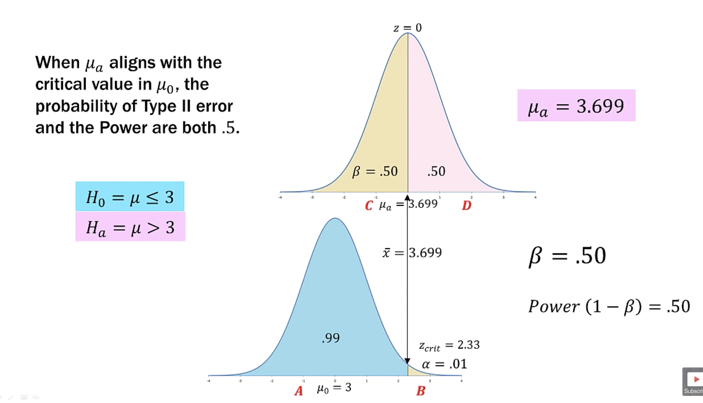
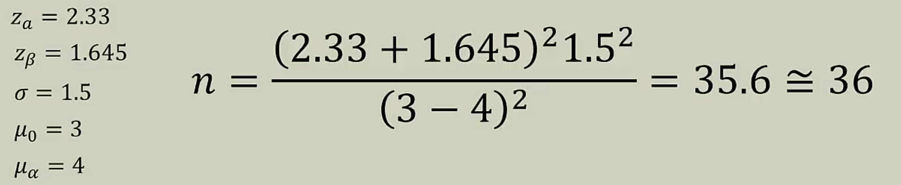

# Hypothesis Testing Continued

We continue our discussion about hypothesis testing. 

## Calculating Type II Error, Concept with Example

To explain the calculation of type II error, let’s look at example: 

Given this information, we can set up the hypothesis as follows: 

$H_0: \mu \leq 3$

$H_a: \mu > 3$

As we can see here, we are going to do a one-tailed test. As sigma is known, we will use the z-test. We set the significance limit of 0.01. This gives a critical z-value of 2.33. So, if the z-value is greater than 2.33, we will reject the null hypothesis. 

First we ask ourselves, what is the $\bar{x}$ for the critical value of 2.33? We are given a sample size, $n = 25$. We can solve this algebraically as follows: 

We find this value is 3.699. Any sample mean that is greater than 3.699, will be in the rejection zone for the given $\alpha$ and $\sigma$. 

### Calculating Type II Errors

* To calculate the probability of Type II error, we have to select a $\mu_a$ that satisfies the alternative hypothesis. 
  * There is no “one” Type II error. It is different for every $\mu_a$ that satisfies the alternative hypothesis. 

Given the following: 

​                             $H_0: \mu \leq 3$                          $H_a: \mu > 3$

We can choose any value greater than 3 that meets the alternative hypothesis condition. We could choose 3.7, 4.4 or even 5. We cannot choose anything greater than 5 because that is beyond the range of the Starbucks scale or the data we have. 

* For this example, we will choose an alternative population mean of $\mu_a = 4$. 
* Once we have selected $\mu_a$, we will begin by finding where the $\bar{x_{crit}}$ of 3.699 falls in the distribution where $\mu_a = 4$. 

In order to calculate the type II error, we start by asking ourselves, “What if the true population mean is $\mu = 4$?” And if so, where does the $\bar{x_{crit}}$ of 3.699 falls on the distribution where the mean if 4? 

We calculate that using the z-statistic:

We find the z-value of -1.00. So, for the distribution with a mean of 4, our x-critical value of 3.699 falls at z-value of -1.00 as shown by the arrow. 

Now, note that we have our hypothesis with the null and alternative shown below. For these hypotheses and for a mean of 3, we find the z-critical value of 2.33. We reversed this and found this also to be the location of x-critical value of 3.699. 

Having chosen the $\alpha = 0.01$, we know that 99% of the area of the curve will be the non-rejection area while 1% will be the rejection area. 

With the x-critical value calculated in both the distributions, we can align this x-critical value from the distribution where the mean is 3 with a distribution where the mean is 4. This is shown below:

 We can now calculate the total area in the brown region. This amounts to 16%, which means the pink area is 84%. 

If in reality the $\mu = 4$, then there is a 16% probability of NOT rejecting the null hypothesis when **it should be rejected**. Let’s see how it works. 

Let’s say we have a sample mean where the red star is in the figure below.

The star is in the blue region for the hypothesized distribution, which means we cannot reject it. But if the true population mean was 4, then by accepting the null hypothesis when it should have been rejected, we make a type II error. The probability of making this error is 16%. 

Another way of saying this is that 0.16 of the $\mu = 4$ distribution is shared with the non-rejection region of $\mu = 3$.  

So, from this we see that the probability of making a Type II error is $\beta = 0.16$ when the true mean is $\mu = 4$. 

Let’s look at the Type I and Type II errors in this context: 

Given the current hypotheses, we have the following: 

* If the null hypothesis is true and we have a z-score at A in the distribution where $\mu_0 = 3$, we would fail to reject the null hypothesis and we would be correct. 
* If the null hypothesis is true and we have a z-score at B in the distribution where $\mu_0 = 3$, we would reject the null hypothesis and we would be wrong. We would then make a **Type I error**. 
* If the alternative hypothesis is true, in which case the distribution has $\mu_a = 4$. If we had a z-score at point D, we would correctly reject the null hypothesis. 
* If the alternative hypothesis is true, in which case the distribution has $\mu_a = 4$. If we had a z-score at point C, we would fail to reject the null hypothesis even though it is wrong. We would then make a **Type II error**. 

So, this depends on which part of the distribution we are considering that makes a difference. 

The value $(1-\beta)$ is known as **Test Power**. In this example, the test power if 0.84. 

> Think of test power, as the power to differentiate $H_0$ and $H_a$ between our null population and alternative population mean. 

### Notes to Calculating Type II Error

* There will be a unique Type II error for every value in the alternative hypothesis. 
* The $H_a$ value on which the Type II error is based is simply a choice. In this case we chose an $H_a$ value of $\mu = 4$. 
* As $\mu_a$ moves toward $\mu_0$, the Type II error probability approaches zero. Therefore, the power ($1 - \beta$) approaches 1. 
  * Another way of saying this is that the test “gets better” at correctly rejecting $H_0$ as $\mu_a$ distances itself frm $\mu_0$. 
* As $\mu_a$ moves towards $\mu_0$, the probability of Type II error approaches $1-\alpha$. In our example, that would be 0.99. 
* When $\mu_a$ aligns exactly with the critical value in $\mu_0$, the probability of Type II error and the Power are both 0.5. 

## Calculating Type II Error

Now consider the case where our true mean is at 2.33, the z-critical value of our hypothesized distribution. In this case, we will have the following: 

In this case, we can say that when the $\mu_a$ aligns with the critical value in $\mu_0$, the probability of Type II error and the Power are both 0.5. 

Consider the position of the z-value at A, B, C, and D. We would have the following: 

* A: In this case, we fail to reject the null hypothesis and this is done correctly. 
* B: We reject the null hypothesis, but if the true population mean is at 3.699, we would make a Type I error. In this case, there is a 50% chance of making such error. 
* C: We would fail to reject the null hypothesis but if the true population is at 3.699, we would make a Type II error. 
* D: We would reject the null hypothesis and this would be done correctly. 

> As $\mu_a$ moves towards $\mu_0$, the probability of Type II error, $\beta$, approaches $ 1 - \alpha$. Therefore, the power ($1-\beta$) approaches 0. 

In other words, we are more like to make a Type II error as the two means come closer together. We can see this here: 

The A, B, C, and D will remain the same. But given that the distributions are so far apart. The chances of making a type II error are very large. This is because the $\beta$ value is large. 

> As $\mu_a$ moves away from $\mu_0$, the Type II error probability $\beta$ approaches zero. Therefore, the Power ($1 - \beta$) approaches 1. 

The A, B, C, and D will remain the same. But given that the distributions are so far apart. The chances of making a type II error are very very small. This is because the $\beta$ value is small. 

### Test Power Curve

The Power Curve is created by first setting the true population distribution on top of the hypothesized distribution. When then are on top of each other, both have the same mean and the critical z-value is 2.33. The power in this case is 0.01. We then slide the true population mean distribution to the right of the hypothesized distribution in steps of 0.5. As we do so, we compute the power at each step. We see that we get further and further away from the hypothesized distribution, we find that if we reject $H_0$, we are almost assured that the reject is correct. 

So, if we have the green stars, we are confident that all correctly reject the null hypothesis. Out of 1000, there will be just one (blue), where we will make a Type II error. 

We now can draw how the power looks like, known as the power curve: 

When the two distributions align, their power gets closer to zero, while when they are far apart, their power is close to 1. This means that we are likely to make Type II error when the power is closer to 0 and least likely to make Type II error when the power is closer to 1. 

## Controlling Type II Error Using $n$

The Type I error is easy to control as it is something that we decide to implement. Type II error is something that makes more effort as it is something that we do not decide before we start the experiment. This is something that we will see in this section. 

There are few things that we need to keep in mind when it comes to standard error, as the standard error is at the center of hypothesis testing. 

* The standard error of the mean, which is the standard deviation of sample distribution of sample means, is foundational to almost everything in inferential statistics. We use standard error in computing the test statistic such as the following: 

  

* By looking at the standard error component in these formulas, what happens to the overall standard error as $n$ increases assuming $\sigma$ remains constant? When $n$ becomes large, the standard error decreases. 

* The increasing $n$ will make the sampling distribution narrow.  

When it comes to comparing the two distributions, we compare their: 

* Mean 
* Variance

Note that we do not need to compare one verus the other. We can compare both the mean and variance at the same time. 

Let’s look at our ability to set Type I and Type II error: 

* So far we have seen that we establish ahead of time the acceptable amount of Type I error. However, it is possible to set Type II in the same fashion
* To achieve this however, we must locate the two distributions in the proper location/alignment
* Since the population means and variances are given in the problem, we will be forced to “manipulate” the sample size to achieve a certain standard error
* We will find the appropriate sample size to shape the variance in a manner that brings the distributions into alignment at the proper Type I and Type II error locations

Let’s see how this works: 

By manipulating the sample size, $n$, we are changing the values at the standard error marks. A larger sample size, given the same $\sigma$, will decrease the standard error making the interval between the marks smaller. 

Let’s use an example of Starbucks as we have done before. To remind ourselves, in this problem we have $n$ = 25; $\sigma = 1.50$ and $\mu$ = 3.5. We estalish our hypothesis: 

* $H_0$: $\mu \leq 3$      and $H_a$: $\mu > 3$
* This is a one-tailed test. 

* As $\sigma$ is know, we will use the z-statistic.

* We will use the Type I error rate of $\alpha = 0.01$. This means that I am comfortable in making a Type I error 1% of the time. In other words, I may get a sample mean that belongs to other population, 1% of the time, and by looking at it, I can erroneously reject the null hypothesis. 

* Our decision rule is that at $\alpha = 0.01$, if the z-value > 2.33, the z-critical value, we will reject $H_0$. 

* We will gather our data and we have $n$ = 25 and $\bar{x}$ = 3.5. 

* To do a Type II error problems, we need to compute the mean $\bar{x}$ at the $z_{crit}$. In our case, we need to compute the mean value at 2.33. 

* We find that the critical mean value of 3.699. Therefore, any $n = 25$ with $\bar{x} > 3.699$ would lead to a reject of $H_0$ assuming same $\sigma$ ane $\alpha$. This was done using the formula: 

  

  This formual is a rearrangement of the compute the z-value given $\mu_0$ and $\sigma$ and $n$. 

To calculate the probability of Type II error, we have to select a $\mu_a$ that satisfies the alternative hypothesis. There is no one Type II error. It is different for every $\mu_a$ that satisfies the alternative hypothesis. 

Our alternative hypothesis states: $H_a: \mu > 3$. So, we could pick any mean that is greater than 3 but within the boundaries of the range of the data we have at hand. 

For this example, we will choose $\mu_a = 4$. Let’s stipulate a Type II error rate of 5% or $\beta = 0.05$. So what region is $\beta$ = 0.05 of $\mu_a$? We can use the z-table to find this location. It comes to $z_{\beta} = -1.645$. Here’s how it looks: 

Because the alternative hypothesis distribution mean should be greater than 3, and as we have chosen it to be 4, the beta value will be on the left of the curve. 

As we have seen earlier, this location is the same for both the curves: 

We see that the location is the same but it was found using two different equations. The pink was used to compute the location in the alternative hypothesis distribution while the blue was used in the null hypothesis distribution. 

We find the value in the pink and the blue values to be: 
$$
4 - 1.645\frac{1.5}{\sqrt{25}} = 3.501 \\
3 + 2.33\frac{1.5}{\sqrt{25}} = 3.699
$$
We find that these two critical values don’t have the same value: 

In order to solve this discrepancy, we need to find the size of sample size, $n$ that will make the two values the same. We can do so by setting these two equations equal to each other and solve for $n$: 
$$
\mu_a - z_{\beta}\frac{\sigma}{\sqrt{n}} = \mu_0 + z_{a}\frac{\sigma}{\sqrt{n}}
$$
This will give us a sample size which will generate a standard error that will align the distributions. Remember, when $n$ is large, $\sigma/\sqrt{n}$ is small. And as we saw earlier, the value of $n$ changes the marks in the distribution. 

Solving for $n$, we find: 
$$
n = \frac{(z_a + z_{\beta})^2 \sigma^2}{(\mu_0 - \mu_a)^2}
$$

Here’s what each of the coefficients mean: 

> If the hypothesis is a two-tailed test, we substitute $Z_{a/2}$ for $Z_a$. 

Coming back to our problem we have: 

We find that value of $n$, the sample size is 46. So, what does this mean? 

> To control Type II error at 5%, a sample size of 36 must be taken. This $n$ will produce the correct standard error to align distributions at a common $c$. 

The $c$ value is the value that will make the two sides of the equation, in equation 2, equal. Thus, here’s what we have: 

### Controlling $\beta$ Review

* Controlling $\alpha$ is easy because we chose it. 
* Controlling $\beta$ is a bit more complicated
* The goal is to align the $\alpha$ and $\beta$ regions in the $\mu_0$ and $\mu_a$ distributions respectively
* Since the means, $\sigma$, and critical values are set, we can manipulate the sample size, $n$, to generate a standard error that brings $\alpha$ and $\beta$ into alignment at $c$. 
* This new $n$ will create a new $\bar{x_{crit}}$ value for our decision rule
* Since Type II error is controlled, we CAN use the phrases “reject $H_0$” or "accept $H_0$“
* We would have to redo our study with an $n$ of at least 36 to control Type II error at 5%. 