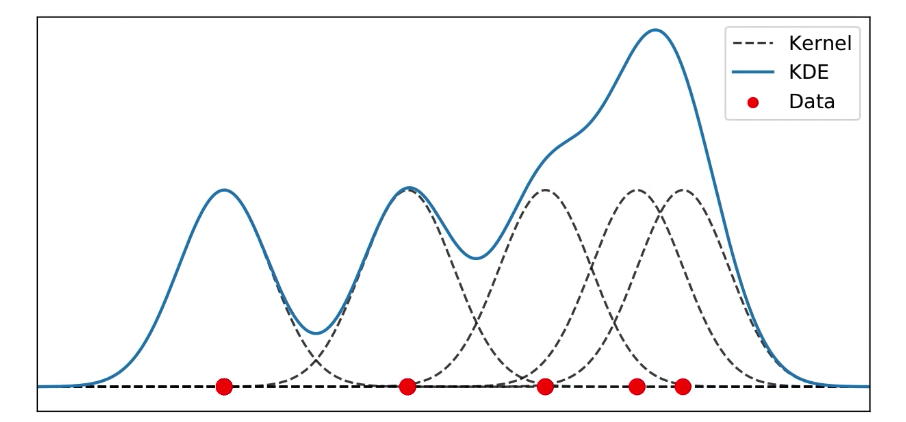
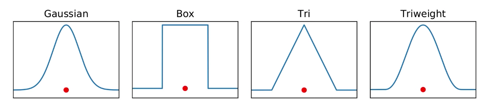
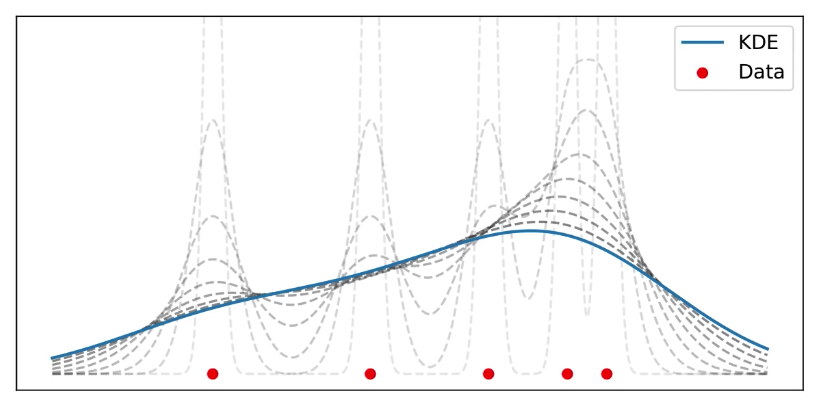
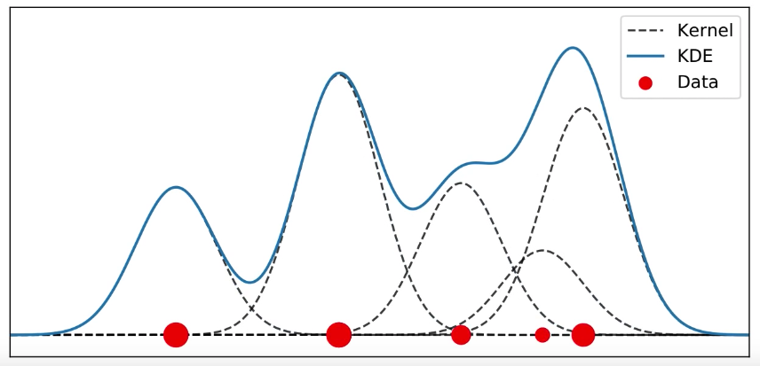
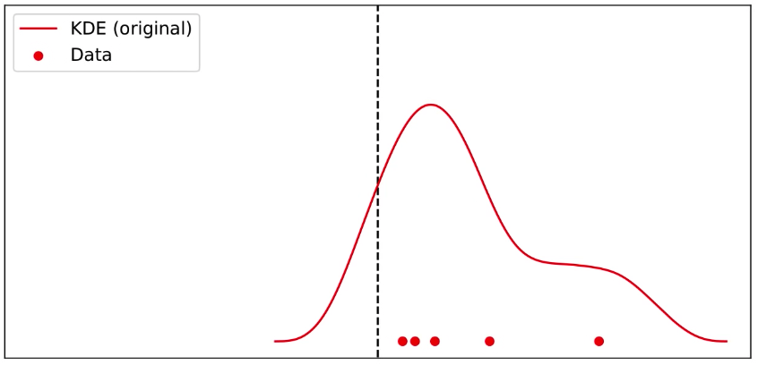
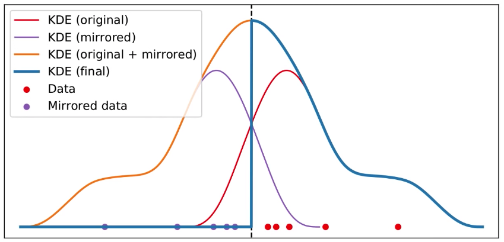
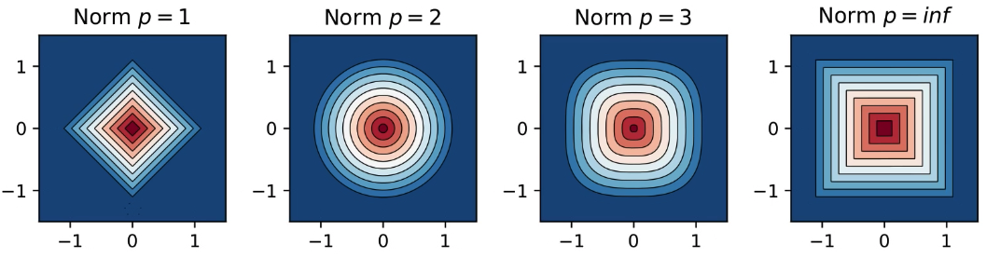
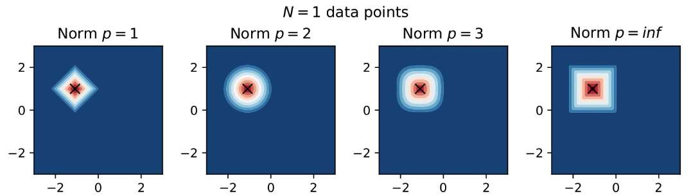
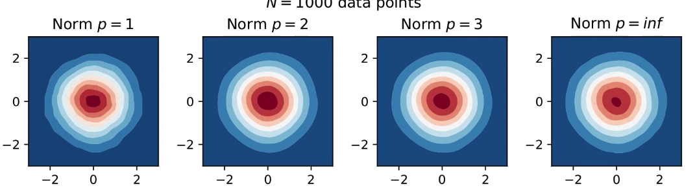

# Kernel Density Estimation

The kernal density estimation (KDE) is a way of estimating an unknown probability density function given some data. The idea is to select a kernel function, center the function on each data point, and sum all the kernels. Mathematically, this is written as, 
$$
f(x) = \frac{1}{Nh}\sum^N_{i=1}K\left(\frac{x - x_i}{h}\right)
$$
 where $x_i$ is the data point, $K$ is the kernel function, $N$ is the number of data points, and $h$ is the bandwidth of the function. We divide the function $N$ to normalize the function. 

Graphically, this looks something like this: 

The blue line is the sum of all the kernels, which then gives us the estimate of the unknown probability density function. 

## The Choice of Kernel

The choice of kernel can vary but typically the kernel function, $K$ should be: 

* $K(x) \geq 0$ for every $x$ as the kernel density function represents the probability. As the probability cannot be negative, the kernel function cannot be negative. 
* The kernel function is symmetric. That is $K(x) = K(-x)$ for every $x$. 
* The kernel function should go to zero as it gets away from the data point. So, the derivative of the kernel should be negative or zero. $K^{'} (x) \leq 0$ for every $x > 0$

Here are various kernels that can be used: 

However, most often the kernel used is a Gaussian function. 

## Choice of Bandwidth

The use of $h$ to control for the *bandwidth* of the function is very important. The bandwidth is the width of the kernel function. If $h$ is small, the kernel is tall and narrow; if $h$ is large, the kernel is short and wide. 

## Estimating $h$

What is the optimal value of $h$ to use can be very tricky. Apriori, we have no idea what value to use. However, we can use  *Silverman's rule of thumb* find this value. However, to apply the rule, we need to to assume that the data are normally distributed. This is generally a good starting point in many cases. 

Another approach to estimating $h$ is the *improved Sheather Jones (ISJ)* algorithm. This algorithm is more robust with respect to multimodality. 

## Adding Weights

It's possible to add weights $w_i$ to data points $x_i$ by writing, 
$$
f(x) = \frac{1}{h}\sum^N_{i=1}w_iK\left(\frac{x - x_i}{h}\right), \quad \text{where}\quad \sum_{i=1}^N w_i = 1
$$
What the weights do is to increase the height of individual kernels. In the figure below, some data points have higher weight (illustrated by large size). We can see that their kernel functions are much taller: 

The total KDE is shown in blue. 

## Bounded Domains

There are cases when the domains (e.g. x-values) need to be bounded. For example, you wish to estimate the probability density function for data that contain ages. Now, the ages cannot be negative but by simply fitting the kernel, we may get so: 

To avoid this problem, we take a mirror image of the data in the negative direction, then fit the kernels to each of the points, and add all the kernels. As a final step, we only take the positive side of the KDE as follows: 

The blue line shows the KDE for the red data points. Note that the red and violet are the two KDE for the data points, The blue line is the KDE of the two KDEs. 

## KDE in $d$ dimensions

An approach to $d$-dimensional estimates is to write the kernel function as follows: 
$$
f(x) = \frac{1}{h^d}\sum^N_{i=1}w_iK\left(\frac{||x - x_i||_p}{h}\right), \quad \text{where}\quad \sum_{i=1}^N w_i = 1
$$

The $||x - x_i||_p$ is a norm. We use some sort of a norm because in higher dimensions we need a way to measure the distance. 

The choice of norm comes into play when $d \geq 2$, that is when the dimensions are greater than 2. The norml we use is given by: 
$$
||x||_p := \left(\sum_{i=1}|x_i|^p \right)^{1/p}
$$
Various values of $p$ create various norms: 

We should be familiar with the $p = 1, 2$ because these are the $L1$ and $L2$ norms we see in regression. The $L1$ is called known as **Manhattan distance** while $L2$ is also known as **Euclidean Distance**

> As the number of samples grow, the choice of both kernel $K$ and norm $p$ becomes unimportant. The bandwidth $h$ is still important

The figure below shows what happens when we start with N = 1 and then when N = 1000. As we can see, starting with any of the norms, when N is very large has no difference: 

And when N = 1000

Reference: [Kernel Density Estimation](https://www.youtube.com/watch?v=x5zLaWT5KPs)

# Maximum Likelihood Estimation 

Maximum likelihood estimation (MLE) is a technique used for estimating the parameters of a given distribution, using some observed data. For example, if a population is known to follow a “normal distribution” but the “mean” and “variance” are unknown, MLE can be used to estimate them using a limited sample of the population. MLE does that by finding particular values for the parameters (mean and variance) so that the resultant model with those parameters (mean and variance) would have generated the data.

So generally, likelihood expression is in the form of: **L(parameters | data ).** Meaning of this is, “*likelihood of having these parameters, once the data are these*”.

Likelihood and Probability are two different things although they look and behaves same. We talk about probability when we know the model parameters and when predicting a value from that model. So there we talk about how probable is the resultant value to be come out from that model. So probability is: **P(data | parameters)**

Now we can see that Likelihood is other side of probability. That is we are going to guess the model parameters from the data. So there we know the results well and we know for sure that they have occured (probability = 1)

To understand the maximum likelihood estimation (MLE), let's start with an example. Consider the case where we have an unknown parameter $\Theta$. To estimate the value of $\Theta$, we go out in the world and collect some data. In ML, we are given a training set, so we use that instead. Let $X_1, X_2, ..., X_n$ be a random sample from a normally distribution PMF or PDF. 

> A **Probability Density Function (PDF)**is a continuous probability distribution such that the area under the curve is 1. The PDF allows us to compute the probability in a given interval. The PDF for a given single continuous value is zero. This is because the area under the curve for a point is zero.
>
>
> A **Probability Mass Function (PMF)** is a discrete function that gives the probability for given discrete random value. 

Note that for $X_1, X_2, ..., X_n$ to be random samples, the observations need to be independent and identically distributed then the observation would be considered a random sample. We also assume that we have collected our data and that it does not change. We now how to guess what the $\Theta$ would be given that we have this independent and identically distributed distribution of observations. A better question to ask is “*What is likely to the value of $\Theta$ given the distribution of observation*?”

To answer the question we define the **likelihood function**. It is defined as follows: 
$$
L(\Theta |X_1, X_2, ..., X_n)
$$
We keep the observations constant, i.e. $X_1, ..., X_n$ are kept constant but we plug in various values of $\Theta$ and see which value works the best. Think of likelihood function as a distribution of various values of $\Theta$. The “best” value of $\Theta$ would be the value that is most popular. In other words, the peak of the likelihood distribution will be the best possible value of $\Theta$. Ok, so how do we find this likelihood distribution. 

The likelihood distribution is defined as the joint PDF of our observations and $\Theta$. So, we can write our likelihood function as, 
$$
L(\Theta) = f(X_1, X_2, ..., X_n|\Theta) \\[10pt] 
          = f(X_1|\Theta),..., f(X_n|\Theta)
$$
We can break the multivariate equation into univariate because each observation is independent. Most of the time, we can write the above equation as:
$$
L(\Theta) = \prod_{i=1}^n f(X_i|\Theta)
$$
This means that the likelihood function is simply the product of univariate functions. The value that maximizes the distribution of likelihood function is called the **Maximum Likelihood Estimator (MLE)**. So, MLE is the value of $\Theta$ that maximizes the likelihood function. 

If the likelihood function is nice and smooth, we can use calculus to find the maximum value of the likelihood function. Computationally, this is done using the gradient descent algorithm. 

The log function is a **monotone function** that is, it is a function that either monotonically increases or decreases. So, rather than taking the derivative of the product, we take a log of the likelihood function and then find the maximum value through the derivates. The advantage of using the log function is that when there are products, the log of the products are simply the individual sums. So, when we take the log of the likelihood function we get, 
$$
log(L(\Theta)) = log(f(X_1|\Theta)) + log(f(X_2|\Theta)) + ... + log(f(X_n|\Theta))
$$
Now we can take the derivative of this likelihood function to get the maximum value. Note that we take the second derivative to ensure that the value we get is the maximum value and not the minimum value. 

### Binomial Example

We will use MLE to find the maximum value of the likelihood function, which is a binomial distribution. Suppose we attempt 6 free throws and make 5 successes. So, our random variable X is a binomial distribution with n = 6 and $p$ unknown, where $p$ is the probability of making a shot in the basket. Our PMF for the problem is given by, 
$$
f(k|p) =  {n\choose k}p^k(1-p)^{n-k}
$$
Now, let’s write down our likelihood function, 
$$
L(p|x) = {n \choose x}p^x(1-p)^{n-x}
$$
Now as we saw earlier, it is easy to take a log of the likelihood function and then compute the derivative rather than do it right now. 
$$
log(L(p|x)) = log\left({n \choose x} + xlog p + (n-x)log(1-p)\right)
$$
Taking the derivative, we get the following: 
$$
l^{'}(p|x) = \frac{x}{p} + \frac{n-x}{1-p}(-1) = 0
$$
We set that equal to zero, because we want the derivative the maximum to be zero. So, solving for $p$, we get: 
$$
\hat{p} = \frac{x}{n}
$$
When we have a general equation as above, we call this the **maximum likelihood estimator** and when we plug in the value of x and compute for $p$ in this case, we then call it the **maximum likelihood estimate**. 

In this example, the maximum likelihood estimate is then: 
$$
\hat{p} = \frac{5}{6}
$$
So, this gives the unknown probability $p$ for this problem. 

## Binomial Example Revisted

In the last example