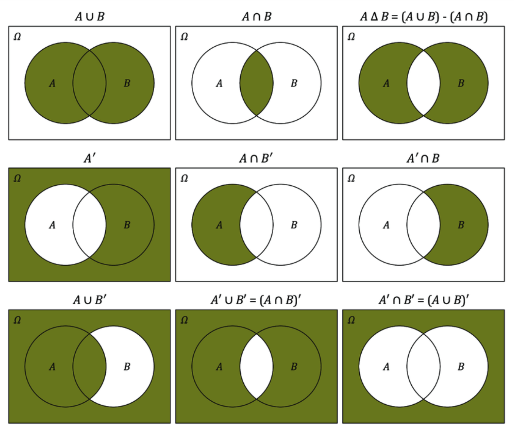

[TOC]

# Probability

## Probability Basics

When we think of probability, we think of `how many equally likely possibilities are there`, say when we flip a fair coin? In this case, the probability is given by, 
$$
\frac{\text{# of possibilities that meet my condition}}{\text{# of equally likely possibilities}}
$$
So, if we are looking at getting a head, we would get: 
$$
P(H) = \frac{1}{2}
$$
In other words, if you were to flip the coin thousands of time, the probability of getting a head will limit to 0.5. The more you flip the coin, the more it will be close to 0.5. 

### Few Rules of Probability 

* The probability of an event can only be between 0 and 1 and can also be written as a percentage
* The probability of event A is often written as P(A)
* If P(A) > P(B), then event A has a higher chance of occurring than event B
* If P(A) = P(B), then events A and B are equally likely to occur
* The space of all the possibilities is called the sample space
* If we have events, A, B, C, and D. The probability of `not` selecting an event A is equal to `1-P(A)`. 

### Monty Hall Problem

In this problem, we have three places. There is a prize in one place and a goat in the other place. The third place has nothing. Now, you are asked to pick a place that contains a prize. Once we do that, the game host shows a place that has a goat. The question then is, should you switch or not? 

* If we don’t switch, your probabilities are: 
  * Winning: 1/3
  * Losing: 2/3
* If you always switch, your probabilities are: 
  * If I picked a goat and I am shown a place that has nothing, and then I switch I will win. 
  * If I picked a place that has nothing and I am shown a goat, and then I switch I will win
  * If I picked a place that has the prize and I am shown a goat, and then I switch I will lose
  * Winning: 2/3 
  * Losing: 1/3

>  So, in the Monty Hall Problem, always switch as the probability of winning when switching is higher than not switching. 

## Probability Using Sample Spaces

To understand the probability when using sample spaces, let’s take an example. 

`Find the probability of flipping exactly two heads on three coins`. When you think about this, there are following possibilities. 

S = {TTT, TTH, THT, THH, HTT, HTH, HHT, HHH} 

These are 8 possible outcomes. This is known as the sample space for this problem. Now, there are 3 outcomes with exactly 2 heads. So, the probability is 3/8. 

> When there is more than one outcome in an event, it is known as a **compound event**. 


## Basic Set Operations

> A set of a collection of distinct objects. 

A set can contain anything but each element in the set is unique or distinct objects. 

To understand the operations between sets, let’s take an example. We have two sets, X and Y: 

X = {3, 12, 5, 13}

Y = {14, 15, 6, 3}

### Intersection & Union

The `intersection` of two sets is a set that contains elements that are in set X `AND` Y So, we have: 
$$
X \cap Y = {3}
$$
The `union` of two sets is a set that contains elements that are in set X `OR` Y. So, we have: 
$$
X \cup Y = {3, 12, 5, 13, 14, 15, 6}
$$
The set `S` or $\Omega$ is a set that is considered to be the sample space. It has all the possibilities.

The `complement` of a set A is denoted by $A’$. It is a set that contains all the elements that are `NOT` in A. Here are the Venn diagrams that illustrate set operations: 

 

Let’s go through each Venn diagram: 

1. This is a union of A and B. It contains elements that are in A or B. This also contains elements that are both in A and B
2. This is an intersection of A and B. It contains elements that are in A and B
3. This is a difference of the union of A and B. It contains elements that are in A or B but not in both. 
4. This is the complement of A. It contains elements that are in the sample space and B but not in A
5. This is a difference between A and B. It contains elements that are only in A and not in B. 
6. This is a difference between A and B. It contains elements that are only in B and not in A. 
7. This is a complement of B. It contains elements that are in the sample space and A but not in B
8. This contains all the elements that are not common between A and B
9. This cotains all the elements that are not in A or B. 


* We say that B is a `subset` of A if **all** the elements in B are in A. 
* We say that B is a `strict subset` of A, if all the elements of B are in A, but all the elements of A are not in B. 
* If B is a subset of A, then A is a `superset` of A. 
* if B is a strict subset of A, then A is a `strict superset` of A. 

### Example of Set Operations

```python
A = {3, 7, -5, 0, 13}
B = {0, 17, 3, Blue, Star}
C = {Pink, Star, 3, 17}
```

We need to find this operation: 
$$
A - (A \cap (B - C)') \cup ( B \cap C)
$$
Let’s do this one by one: 
$$
B \cap C = \{17, Star, 3\} \\
(B - C) = \{0, Blue\} \\
(B-C)' = \{3, 7, -5, 13, 17, Star, Pink\} \\
A \cap (B-C)' = \{3, 7, -5, 13\} \\
A - A \cap (B-C)' = \{0\}
A - A \cap (B-C)' \cup B \cap C = \{0, 17, Star, 3\}
$$
So, the answer is {0, 17, 3, Star}

## Experimental Probability

There are times when the probability is not so straightforward as flipping a coin or rolling a die. In situation like this, we need to rely upon experiments. For example we are part of the football team. We have played a lot of games over last year and we have created a histogram of the number of games played and the number of points won. 


We wish to know the probability of scoring more than or equal to 30 points in the next game. It is very hard to find the exact probability. However, we can estimate this based on our past experiment. Using the histogram that we have, our experimental probability would be: 
$$
P(pts \geq 30) = \frac{5}{16}
$$
This is just an estimated probability. The interesting thing to note, as we will see later, we can convert this histogram into a probability distribution. 

It is to be noted that even when we know that the probability of flipping a coin is 0.5, when we do an experiment, we may get 5 heads or tails in a row. The difference between theoretical and experimental probability is that the experimental probability approaches the theoretical probability when we increase the number of trials. 

## Addition Rule for Probability

If there are two events A and B and we wish to know the probability of A `or` B happening, we write this as: 
$$
P(A \cup B) = P(A) + P(B) - P(A \cap B)
$$
This is know as the addition rule of probability. 

The reasoning behind this can be illustrated using a Venn diagram: 


So, if we want to get the probability of events A `OR` B, then we add the probability of event A and the probability of event B, but because there is an overlap between the two events, we need to subtract the case where `BOTH` A `AND` B exist. If we don’t do this, we will be over counting! 

If there is no overlap between the events A and B, in which we say that the two events are **mutually exclusive**, the addition rule is simply, 
$$
P(A \cup B) = P(A) + P(B)
$$


## Multiplication Rule For Independent Events

When we have sample spaces where there are more than two ways of looking at it, they are known as **compound sample spaces**. For example, at an ice-cream shop there are three flavors, strawberry, vanilla, and chocolate and three cup sizes, small, medium, and large. Such a sample space is a compound sample space as there are 9 possibilities in here. 

### Probability of Compound Event

Imagine that we flip a coin and we wish to find the probability of getting two consecutive heads. The flipping of the coin constitutes a **compound event** as we are looking at two events that happen one after another. This event is also an **independent event** as the first flip of the coin has no influence on the second flipping of the coin. 

When a compound event, A and B is indpendent, the probability of such an event is given by: 
$$
P(A \cap B) = P(A) \times P(B)
$$

> The above equation **only** works when the two events A and B are independent and each event is equally likely. 


### Probability Without Equally Likely Event

So, far we have seen the cases where the events are equally. What happens when the events are not equally likely? An example of such would be an unfair coin. In such a coin, the probability of getting a head could be 60% and therefore, the probability of getting a tail would then be 40%. So, we cannot say that the events `H` and `T` are equally likely event. 

So, what is the probability of getting two consecutive heads?  The multiplication rule of probability still works as the events are independent or mutually exclusive. So, in this case, the probability would be: 

(0.6) * (0.6) = 0.36

### Probability of At Least One Suceess

When working with probability problems, when we are asked to find “the probability of at least 1 success”, the general strategy is to do the following: 
$$
P(\text{at least 1 failure}) = 1 - P(\text{all successes})
$$

 ## Multiplication Rule for Dependent Events

We saw in the last section, that if events A and B are independent, the probability of event A `and` B happening is the product of the probability of event A happening and the probability of event B happening. 

Now, when the events are **not** independent, the above rule does not apply. Instead, we need to reevaluate the probability after event A has happened. Therefore, the multiplication rule for dependent events is written as: 
$$
P(A \cap B) = P(A) \times P(B|A)
$$
$P(B|A)$ is the conditional probability. It states that the probability of B `given` that A has happened. If the events A and B are independent, the above equation will be equal to the equation 10 because: 
$$
P(B|A) = P(B)
$$


