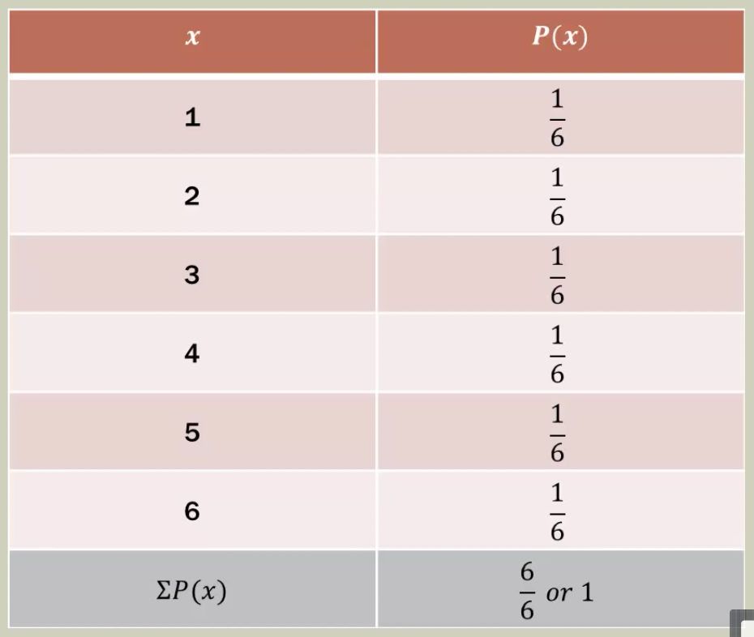
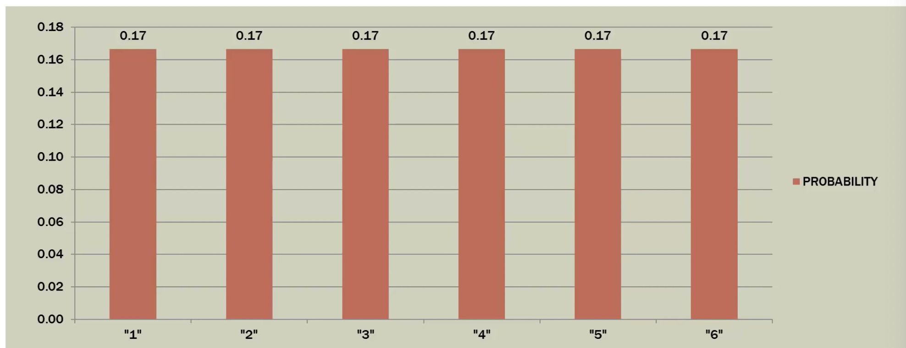
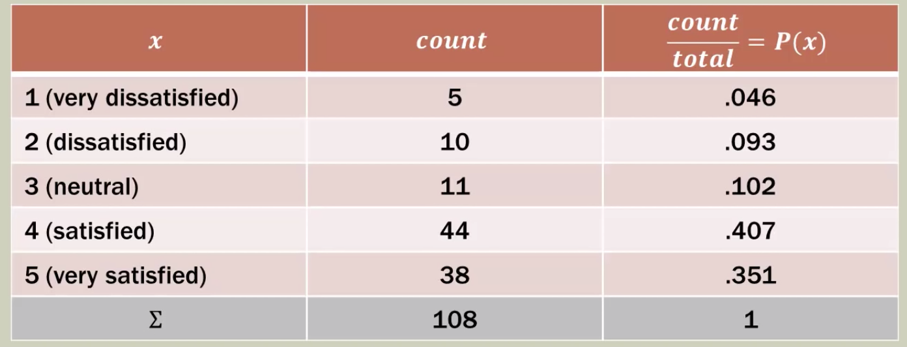
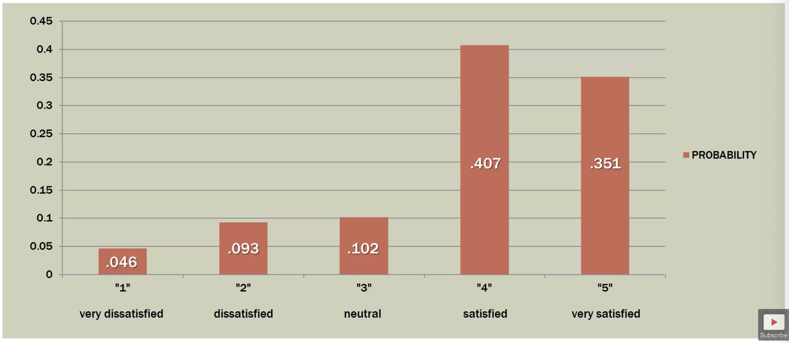
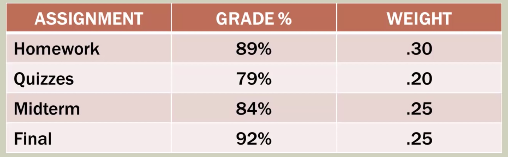
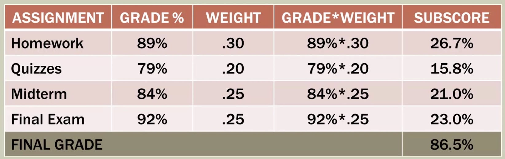
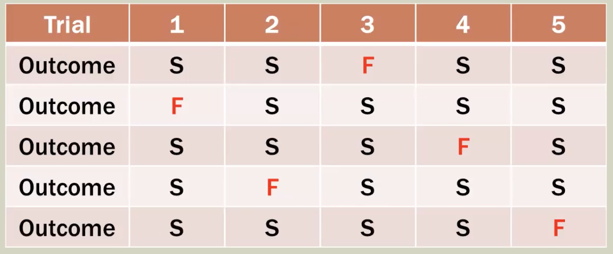
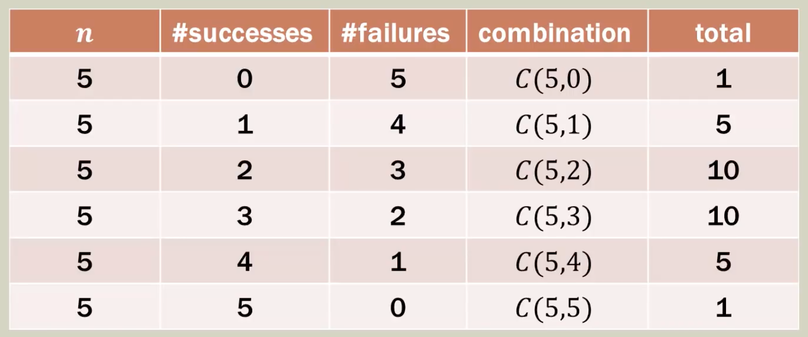

[TOC]

# Statistics Missing Manual

In this document, I have included the notes pertaining to Statistics that were not included in the Statistics Textbook by Witte & Witte. These notes are from Brandon C. Foltz and from the book, Introduction to Statistics and Data Analysis. 

## Random Variables

Random variables allow us to visualize, analyse data, and build distributions of data. To get more understanding of random variables, let’s look at an example: 

If I roll a die, what are the possible outcomes I can get?

* If we have a 6-sided die, we can have 6 outcomes.
* Exactly 6 unique outcomes are possible.

Here’s another example: 

If I were to measure the average family income (to the nearest cent) for the state of Indiana, how many outcomes could I get? 

* This could be any value; nearly infinite possibilities.
* If we were to all possible incomes on a die, such a die would be a continuous curve. In the case of the die, it would be a sphere. 

So, what is a random variable? 

> A random variable is a variable that takes on **numerical value** as a result of a random experiment or measurement; associates a numerical value with each possible outcome. Random variables must have numerical values.  

The random variable is denoted by a capital letter, X. 

The outcomes are denoted by lowercase letters, x. For our die throw example, our outcomes would be listed as: 

x = 1, x = 2, x = 3, x = 4, x = 5, x = 6. 

We say that for the throw of the die, the random variable X consists of: 

X = {1, 2, 3, 4, 5, 6}

### Discrete & Continous Random Variable

> A **discrete random variable** has an finite number of values or an infinite sequence of values (0, 1, 2, ...) and the differences between the outcomes are meaningful. 

In our case of a die throw, the random variable is discrete as it can only take 1 through 6 unique values

> A **continuous random variable** has a nearly infinite number of outcomes that cannot be easilly counted and the differences between the outcomes are NOT meaningful. 

In our case of average income in Indiana, the difference between \$40,000.00 and \$40,000.01 is not meaningful. 

## Random Variable Basics

Consider the case of flipping a coin. There are two outcomes: heads (H) or tails (T). So, we can associate a random variable X with this event: 

X = {H, T}

This is a discrete random variable because it takes two values. Now, we know that the probability of getting a head on a flip of an unbiased coin is 50%. The same goes with the tail. Given that we have a random variable associated with the flipping of the coin we can create a distribution: 

> A probability distribution of a random variable X describes how probabilities are assigned to each outcome for the random variable.  

So, in our example, let 0 = Heads and 1 = Tails. So, our discrete random variable X is described as: 

X = 0, 1

The probability for each outcome is described by a discrete probability function denoted by P(X). So, we have: 
$$
P(X = 0) = 0.5 \\
P(X = 1) = 0.5 \\
\sum P(X) = 1
$$
Let 1 through 6 represent the outcomes for a die roll. So our discrete random variable X is described as: 

x = 1, 2, 3, 4, 5, 6

What will our probability distribution look like? What will our probability function P(x) values look like? 

Assuming a fair die, the probabilities are exactly the same for each number. The plot will look like this: 

This is known as **uniform probability distribution**. 

Let’s look at another example: 

Let 1 through 5 represent a class overall satisfaction score given by 108 students at end-of-semester evaluations: 1 (very dissatisfied) to 5 (very satisfied). 

We define X = score. Then the values, the outcomes are x = 1, 2, 3, 4, 5. Here’s our data: 

The right-hand column, we have the probabilities for each score. This does not look like the previous one we have. This is also the relative frequency. The distribution looks like this: 

### Conditions for Discrete Probabilities

The conditions we have for discrete probabilities are: 

* $0 \leq P(x) \leq 1$
* $\sum P(x) = 1$

### Compound Probabilities

The compound probabilities are when we look at an event that take more than just state. For example, here’s a question: 

What is the probability of rolling a 2 or a 5 during a die roll? 

In this case, we have x = 2, 5. Each of the outcomes has a probability of 1/6. So, the probability of getting a 2 or a 5 would be: 

P(x) = 1/6 + 1/6

The general rule of compound probabilities is: 
$$
P(A \cup B) = P(A) + P(B) - P(A \cap B)
$$
This is known as the **law of addition**. 

### Probability Distribution Summary

> * The probability distribution for a random variable describes how probabilities are assigned to each outcome for the random variable $x$. 
> * The probability function P(x) denotes the associated probability for each outcome of the random variable. 
> * We have two conditions for discrete probabilities: 
>   - $0 \leq P(x) \leq 1$
>   - $\sum P(x) = 1$

## Expected Value

To understand the concept of expected value, let’s start with an example: 

On your Psycology 101 syllabus, it states that your final grade will be determined in the following manner: 

The question is: What is your final grade in the class? 

Here’s how you do it: 

So, your final grade is 86.5%. This is what we would do in expected value. 

> The expected value is simply the **mean of a random variable**; the average outcome. It does not have to be a value the discrete random variable can assume. 

The formula of expected value is the following: 
$$
E(X) = \mu = \sum xP(x)
$$
This is also known as the **weighted average**. 

Let’s look at another example: If I roll a die many times and then average my rolls, what should I expected for $\mu$? 

According to the equation, it would be: 

$E(X) = \mu = 1 \times \frac{1}{6} + 2 \times \frac{1}{6} + ... + 6 \times \frac{1}{6} = 3.5$

In this case, the weighting is the same for all events, so the value is 3.5, just the same as the average we know. 

Let’s use the class satisfaction example we used earlier. In that case, the expected value would be: 

$E(X) = \mu = 1 \times 0.046 + 2 \times 0.093 + ... + 5 * 0.351 = 3.70$

The probabilities are not the same so the weights are not the same. So, our expected value is different from just the mean. 

## Binomial Distribution

A binomial distribution is a discrete probability distribution. Such a distribution can only take certain values. Let’s understand this concept through a problem. 

As a sales manager you analyze the sales records for all salesperson under your guidance. So, you look at the number of sales calls each person makes, how many successful sales they make, how many they close relative to their calls and their productivity. Let’s look at two people: 

Joan has a success rate of 75% and averages 10 sales calls per day. Margo has a success rate of 45% but averages 16 calls per day. What is the probability that each salesperson makes 6 sales on any given day? We can answer this question by using the binomial distribution. 

### Binomial Experiment

A binomial experiment has the following characteristics: 

1. The process consists of a sequence of $n$ trials
2. Only two exclusive outcomes are possible in each trial. One outcome is called a **success** an the other is called a **failure**.
3. The probability of a success denoted by$p$, does not change from trial to trial. The probability of failure is$1-p$ and is also fixed from trial to trial. 
4. The trials are independent; the outcome of previous trials to not influence future trials. 

> A success is defined here as to whether the event satisfies our condition

For example, 

* let’s consider an experiment involving 5 trials; $n = 5$. 
* Our interest is in the number of “successes” in $n$ trials. 
* We establish a discrete random variable X to represent the number of successes in our trials.

So, we can have: 

X = # of successes in 5 trials

Consider the case when we have 4 successes and 1 failure. There are different ways that these outcomes can be ordered: 

We can write the total number of outcomes mathematically as follows: 
$$
C(5, 4) = \frac{5!}{1!4!}
$$
which turns out to be equal to 5, as we expected. We can expand this in terms of successes: 

The above chart shows different number of successes and their possible combination. 

