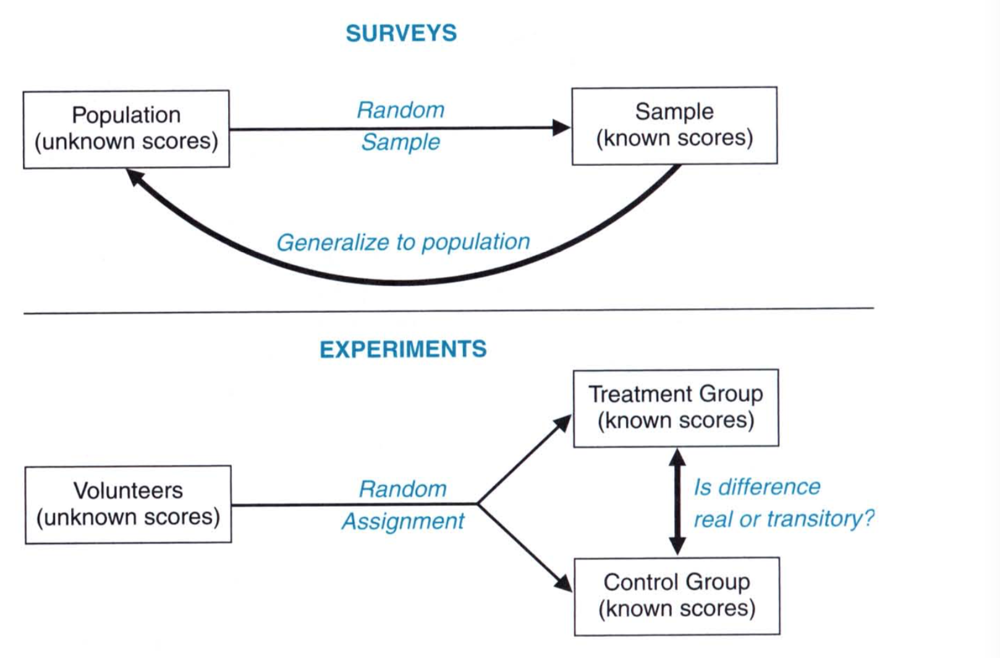

# Statistics Summary

Statistics is the study of variability. In nature, there is always variability and statistics helps us to quantify and study this variability. Broadly speaking statistics is divided into two categories: **descriptive statistics**, which provides the tools to describe, summarize, and organize the variability among observations and **inferential statistics** that allows us to generalize information based on a limited set of observations. 

In inferential statistics, there are two concepts: **population** and **sample**. The population refers to the any complete collection of observations or potential observations while a sample refers to any smaller collection of actual observations that we draw from the population. Population does not have to be very large. All the people who rode the elevator this morning can be considered a population while all the people who rode the elevator, say at 7 a.m. would be a sample from the population. 

In most cases, we only have the sample and not the population. Inferential statistics allows us to characterize the population based on the set of samples we draw from the population. 

In Statistics, there are two types of errors: **systematic** and **unsystematic**. Systematic errors are errors that can be corrected while unsystematic errors are those that cannot be corrected. For example, when we weigh something, we have some error in that measurement. We can thus make efforts to reduce that error. In order to avoid systematic errors, we make use of **random sampling**. The idea behind random sampling is that every observation in the population has an equal chance of being picked. Random sampling allows us to reduce the bias in an experiment for example. Just like picking up something, or sampling, we can also assign something to a value. This is known as **random assignment**. We can randomly assign a number to a person. This means, that a person has an equal chance of being assigned. 

To study the variabilty we make use of **experiments** or **surveys**. Surveys use random sampling that allows them to generalize the population based on the samples they collect. For example, astronomers do surveys to understand the evolution of stars. They pick stars from the population of stars at various stages of their lives and to see how the stars evolve. 

Experiments on the other hand pick samples from the population, randomly assign them two groups, **control group** and **treatment group**. They then tweak the treatment group and see if there is any difference between the control group and treatment group. For example, a doctor wants to know if ingestion of Vitamin C causes better IQ scores. She would randomly pick students from a school, put them in two groups. She would then give Vitamin C to treatment group but not Control group. She would then test their scores to see if Vitamin C causes any difference. 

 

### Types of Data

To do a survey or an experiment, we need to collect data. **Data** is a collection of actual observations and scores in a survey or an experiment. Data come in various forms or types. 

The two big cateogories of data are: **Categorical (or qualitative)** and **Numerical (or quantitative)**. Categorical data is made up of categories. For example, data associated with the gender of the person is categorical as gender has two categories, Female and Male. Temperature is an example of quantitative data.

These two categories are sub-divided: 

* **Categorical**: Data that is composed on categories
  * **Nominal**: Data that is associated with numbers but have no meaning. For example, we can assign numbers to cricket players but they have no quantitative meaning
* **Numerical**: Data that is composed of numbers
  * **Ranking**: The top three players have numbers associated with them. But other than 1 > 2 > 3, there is not much we can do with these numbers. Data that have ranking are also called **ordinal**. 
  *    **Interval**: Data that have a constant interval. Age is an example of interval data.
  * **Interval & Ratio**: Data that have a constant interval and a constant ratio. Temperature is an example of  this. 