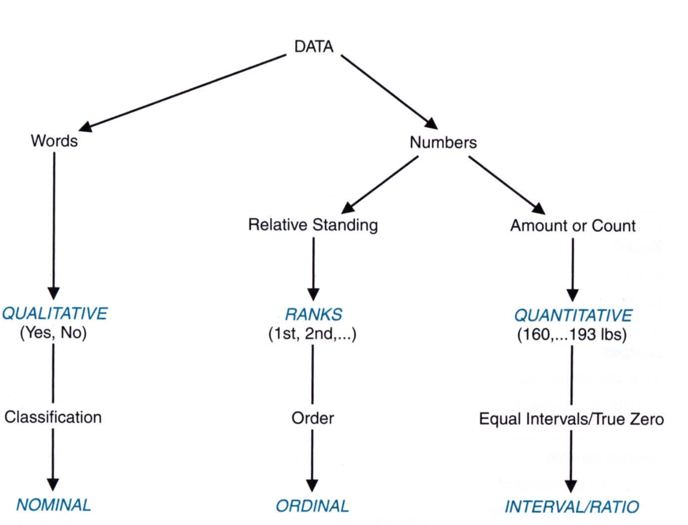
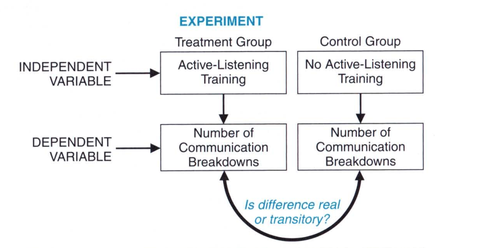
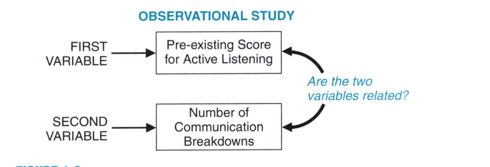
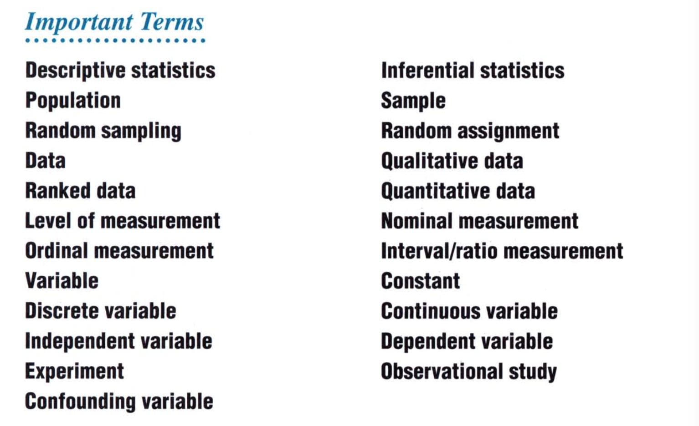

# Statistics

## Chapter 1: Introduction

Statistics deals with variability. There are two types of statistics: the **descriptive statistics** provides tools to describe, summarize, and organize the variability among observations. **Inferential statistics** supplies powerful concepts, that by adjusting for the pervasive effects of variablity, permits us to generalize beyond limited sets of observations. For example, it can find whether, after adjusting the variability in observations, the value occurs by chance or attributed to a physical phenomenon. 

### Populations & Samples

Inferential statistics is concerned with generalizing beyond the sets of actual observations, that is, with generalizing from a sample to a population. In statistics, a **population** refers to **any complete collection of observations or potential observations**, while a **sample** refers to **any smaller collection of actual observation drawn from a population**. 

What a population is, depends on the problem at hand or the perspective. A collection of weights of 52 female statistics students can be considered a population if we wish to limit the number of students in a given elevator, where the total weight may exceed. But it can be a sample from a population of females between a certain age group across the country. 

### Random Sampling

When selecting a sample from a population, we use **random sampling**. A random sampling is a procedure designed to ensure that each potential observation in the population has an equal chance of being selected in a survey. Sometimes, random sampling can be hard if there is no structure in the population or has specific boundaries. Just like random sampling, there is also **random assignment**. It signifies that each person has an equal chance of being assigned to any group in an experiment. In general random sampling and random assignment minimize any bias that may exist in the population or group. 

### Surveys and Experiments

The figure below compares surveys and experiments. Surveys make use of random sampling that permit them to generalize the population from these samples. The experiments make use of random assignment that allows the experimenter to see if the chances they see are due to chance or a cause. 

## Three Types of Data

A **data** is a *collection of actual observations or scores in a survey or an experiment*.

> A precise form of a statistical analysis often depends on whether data are qualitative, ranked, or quantiative. 

A **qualitative data** consists of binary data (e.g. Y or N, Male or Female) that represent a class or category. It is often called **categorical data**. A **ranked data** consists of ordered numbers that represent relative standing within a group. If the rank has an order it is called **ordinal**.  A **quantiative data** consits of numbers that represent an amount or count. 

### Levels of Measurement

The level of measurement specifies the extent to which a number actually represents some attribute and, therefore, has implications for the appropriateness of various arithmetic operations and statistical procedures. 

There are three levels of measurement: 

* **Nominal** - The single property of nominal measurement is **classification**.  If the data are qualitative and they are assigned numbers, the data becomes nominal. 
* **Ordinal** - The distinctive property of ordinal measurement is **order**. Ordinal data fail to reflect the degree of increase from one value to another. The degree of burn would be an example of ordinal data. 
* **Interval/Ratio** - The distinctive property of interval/ratio measurement are **equal intervals and a true zero**. The centigrade scale would be an example of interval data where the raio are equal. 

We can summarize the above into a following figure: 

### Types of Variables

A **variable** is a characteristic or property that can take on different values. So when a categorical data is associated to a variable, we say that the variable is categorical. If a variable takes just one value, we would say that it is a **constant**. 

Variables can be discrete or continuous. A **discrete variable** consists of isolated numbers separated by gaps. On the other hand, a **continuous variable** consits of numbers whose values, at least in theory, have no restrictions. In theory, a continous variable can have infinite number of terms for a given value. However, we round off some of the digits in a given variable. This is known as **approximation** of the true values of the variable. By approximating the variable, we are effectively discretizing the variable. 

#### Independent & Dependent Variables

In the lab, a scientist may create an experiment to study the effect of a given drug on mice. He may give one set of mice the drug and the other no drug. With everything being equal, she can see the effect of drug the mice have. An **experiment** is a study in which the investigator decides who receives the special treatment and who does not. A well designed experiments yield the most informative and unambiguous conclusions about cause-effect relationships. 

An **independent variable** is a variable that is manipulated by the investigator. When the variable is believed to have been influenced by the independent variable, it is called a **dependent variable**. In an experimental setting, the dependent variable is measured, counted, or recorded by the investigator. The dependent variable is not manipulated, instead it represents an **outcome** of the experiment. 

An **observational study** focuses on detecting relationships between variables not manipulated by the investigator, and it yields less clear-cut conclusions about cause-effect relationships than does an experiment. The observational study does not have an independent and a dependent variable as we look at the relationships between them and not cause and effect.  

There are cases when the outcome is not directly influenced by an independent variable but by a hidden variable that is not visible to the investigator. Such a variable is called a **confounding variable**. it can sometimes compromise the experiment and therefore the interpretation of a study. One can avoid confounding variables by assigning subjects randomly to various groups in the experiment and also by standardizing all experimental conditions, other than the independent variable, for subjects in both groups. 

An example of confounding variable is the following: 

*weight loss among obese males who choose to participate either in a weight-loss program or a self-esteem enchancement program*

In there, because the participants choose the program, there can be a confounding variable. 

Here's a graphical representation of experiment and observation study: 

And finally, here are the important terms that we have learned in this chapter: 

