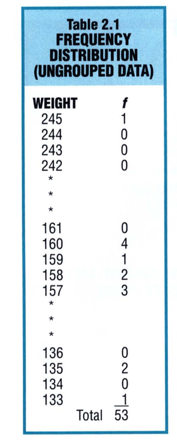
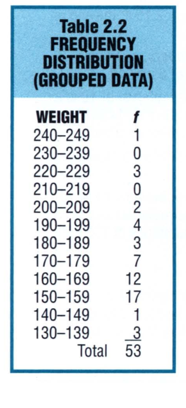
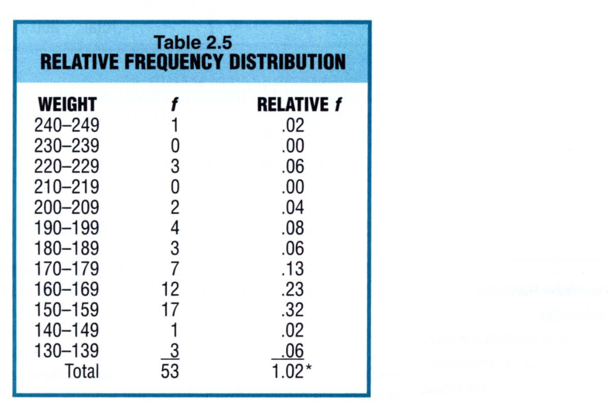
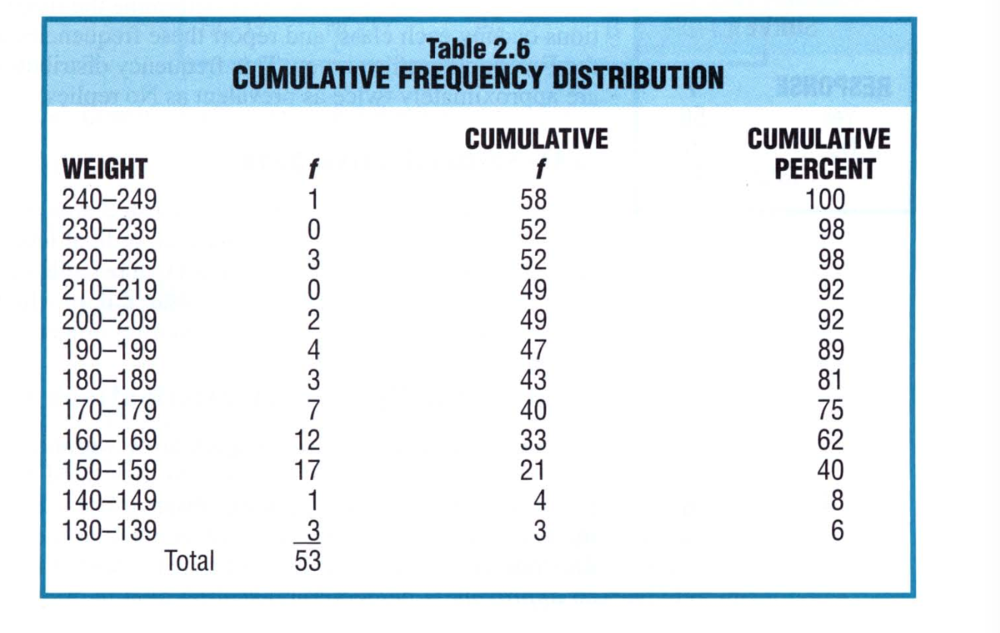
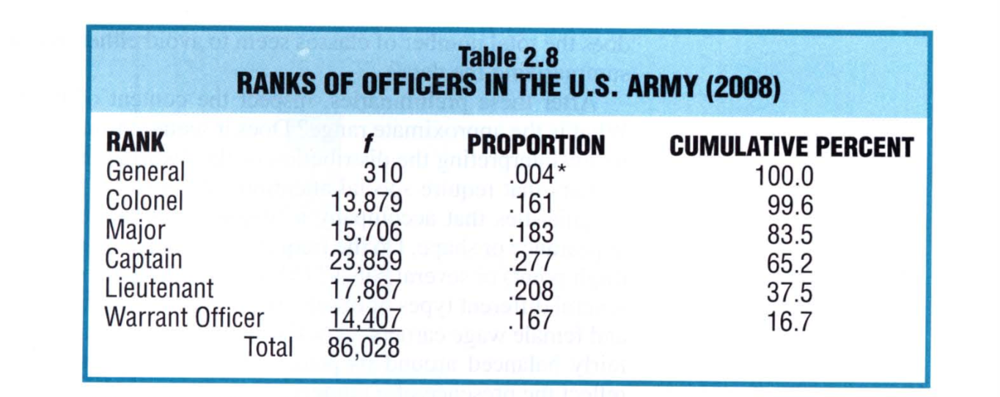
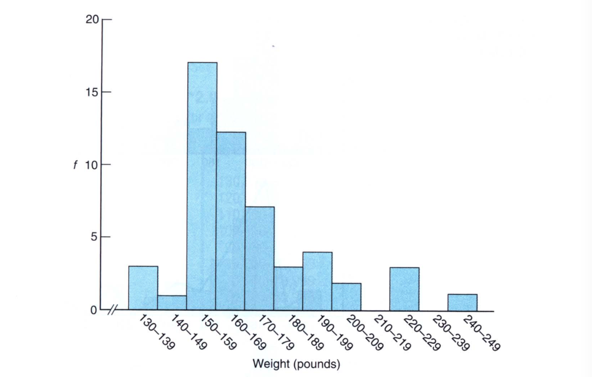
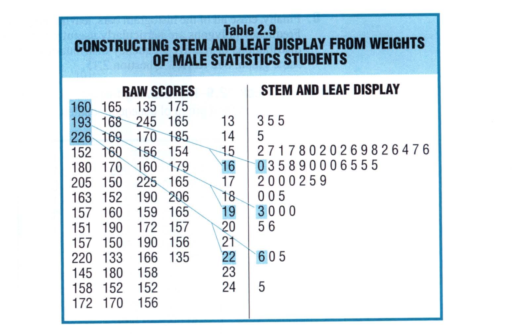
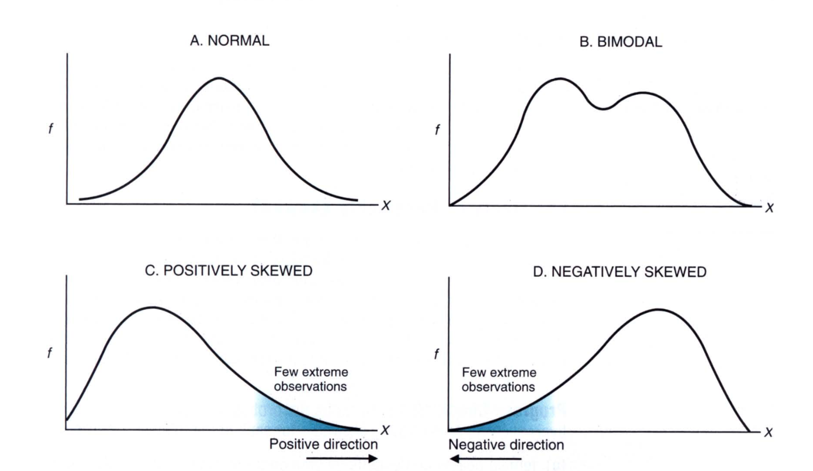
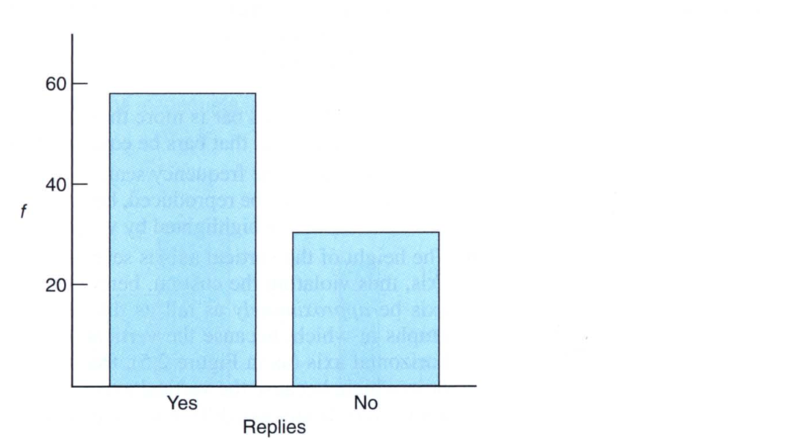
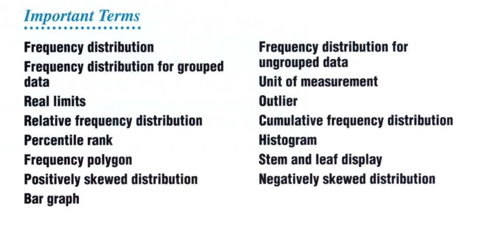

## Chapter 2: Describing Data with Tables and Graphs

## Frequency Distributions

In order to describe the data we use tools. These tools are tables and graphs. For example, we can create a frequency distribution table of the weights of students. It would look something like this: 

In the table we have the actual weights that are arranged in the decreasing order and their frequency. That is how often do they occur. A **frequency distribution** is a collection of observations produced by sorting observations into classes and showing their frequency (f) of occurrences in each class. When observations are sorted into single values as we see in the table above, the result is referred to as a **frequency distribution of ungrouped data**. When the observations are sorted into classes of more than one value, the result is referred to as a **frequency distribution for grouped data** and it looks like this: 

Here are some guidelines for frequency distributions: 

- Essential:
  - Each observation should be included in one, and only one, class
  - List all classes, even those with zero frequencies
  - All classes should have equal intervals
  - The size of gap should always be equal to one unit of measurement
- Optional:
  - All classes should have both an upper boundary and a lower boundary
  - Select the class interval from convenient numbers such as multiples of 5, 10
  - The lower boundary of each class interval should be a multiple of the class interval
  - Aim for a total of approximately 10 classes. 

Here is the recipe to construct a frequency distribution: 

There are cases when there will be one or more observations with extreme scores. These are known as **outliers**. When it comes to outliers we cannot simply discard them. Instead, we should follow these steps: 

1. **Check for accuracy.** Find out how accurate is the observation. If it is accurate, then we cannot reject it. If it is wrong, we are justified to reject the observation. 
2. **Might Exclude from Summaries**. You may decide to exclude from the summary or use two summaries, one with and the other without. 
3. **Might Enhance Understanding**. Dig deeper to understand why did the observation(s) came into being. This may enhance your understanding of the problem at hand. 

### Relative Frequency Distributions

A relative frequency distribution shows the frequency of each class as a part or fraction of the total frequency for the entire distribution. The relative frequency distribution of our `Table 2.2` would look something like this: 

In general, the sum of the relative frequencies should equal 1. In our case it is at `1.02`. This is because of the rounding error. 

> To convert a frequency distribution into a relative frequency distribution, divide the frequency of each class by the total frequency for the entire distribution. For example, in `table 2.5`, we get the frequency of, say, 130-139 by dividing `3` by `53`. 

### Percentages or Proportions

Some people prefer to deal with percentages rather than proportions because percentages usually lack decimal points. A proportion always varies between 0 and 1. 

> To convert a frequency distribution into a proportion frequency distribution, convert first to relative frequency distribution and then multiply each proportion by 100

### Cumulative Frequency Distributions

The cumulative frequency distribution is the sum of adding the frequencies of each class, starting with the lowest class and going to the highest class. 

> To convert a frequency distribution into a cumulative frequency distribution, add to the frequency of each class the sum of the frequencies of all the classes ranked below it. 

Here's an example of our `table 2.2` that shows frequency, cumulative frequency, and cumulative frequency percentage: 

### Percentile Ranks

When used to describe the relative position of any score within its parent distribution, cumulative percentages are referred to as percentile ranks. 

> A **percentile rank** of a score indicates the percentage of scores in the entire distribution with similar or smaller values than that score. 

For example, the percentile rank of weight class `200-209` is 92. This is because 92 is the cumulative percent for this interval. 

### Frequency Distribution for Qualitative Data

The frequency distribution for categorical data would look something like this: 

The process is similar to quantitative data as we have seen before. 

### Interpreting Distributions Constructed by Others

When inspecting a distribution for the first time, train yourself to look at the following: 

- The frequency table
- Read title, column heading and any footnotes
- Focus on the form of the frequency distribution. For quantitative data, does the total number of classes seem to avoid either oversummarizing or undersummarizing the data? 
- Look at the content of frequency distribution. what is the approximate range? It is reasonable? 
- Look at overall characteristics of the distribution. 

## Graphs

Data can be described clearly and concisely with the aid of a well-constructed frequency distribution. The data can be described more vividly through graphs. 

### Histograms

The frequency distribution in `table 2.2` can be graphed as a **histogram**. We see this in the figure below: 

Some of the important features of histogram are the following: 

* Equal units along the horizontal axis reflect various classes
* Equal units along the vertical axis reflect increasing frequency
* The two axes intersect at 0
* Numerical scales always increase from left to right and bottom to top
* The bar heights reflect the frequencies for the various classes

### Stem and Leaf Displays

The stem and leaf display is another technique to summarize quantiative data. An example of our weights example shows the stem and leaf displays below: 

To construct the stem and leaf display for these data, first note that, when counting by tens, the weights range from 130s to 240s. Arrange a column of numbers, the stems, beginning with 13 (representing 130s) and ending with 24 (representing 240s). Draw a vertical line to separate the stems. Now scan through the raw data and find an occurance of 130s. Write the last digit of the 130s that appear. So, we have 133, 135 and 135 in our raw data. Hence, we have 13 | 3 5 5 as our stem and leaf. 

> Stem values are not limited to 10s. They could be 100s 0r even 0.001s. It depends on the range of data and how you wish to put them in classes. 

### Typical Shapes

Whether expressed as a histogram, a frequency polygon, or a stem and leaf display, an important characteristic of a frequency distribution is its shape. Some of the major shapes are shown below. 

* The **normal distribution** is symmetric, has one maximum value. It is the familiar bell-shaped curve we are used to. 
* The **bimodal distribution** has two peaks as can be seen in the figure above. The distributions with more than two peaks is called **multi-modal distribution**. The bi- or multi-modal distribution reflects the coexistance of two or more different types of observations in the same distribution. 
* A lopsided distribution caused by a few extreme observations in the positive direction is called the **positively skewed distribution**. 
* A lopsided distribution caused by a few extreme observations in the negative direction is called the **negatively skewed distribution**. 

### Graph of Qualitative Data

For qualitative data, we make use of the **bar graph**. The bar graph looks just like the histogram with the exception that each bar represents a class. The height of the bar graph is the value of the class. Here's an example of a bar graph with two classes: 

Here are some of the important terms that we learned in this chapter: 

