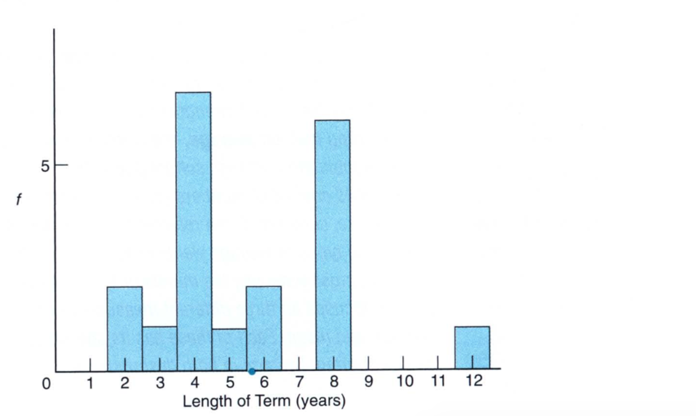
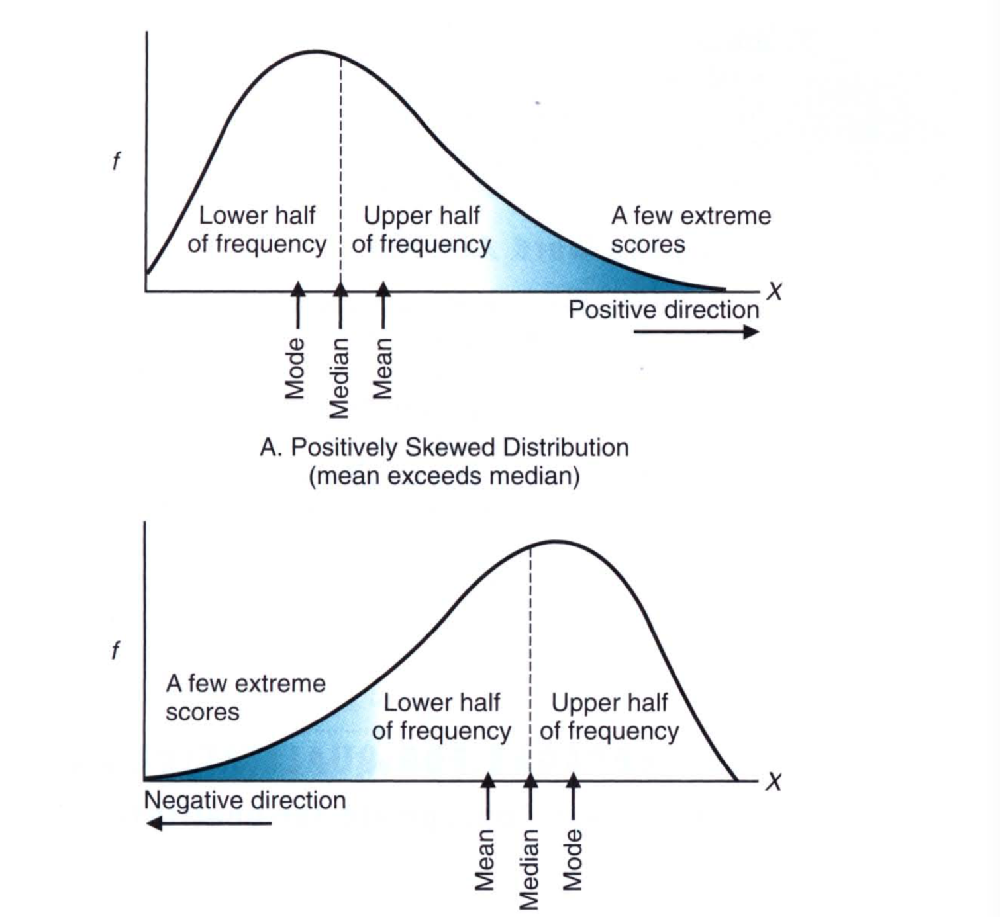
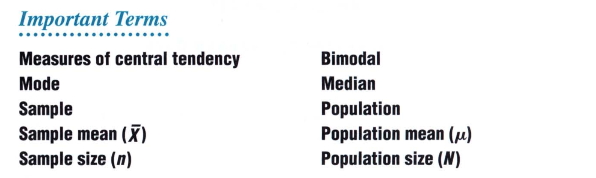

# Chapter 3: Describing Data with Averages

In the last chapter we learned how to describe data through tables and graphs. In this chapter we will learn to describe data by creating summaries of it through the use of three tools: **mode, median, and mean**. These three tools are called the **measures of central tendency** because they describe the center of the distribution or its location. Of all the three tools, the mean is the most important because it is used both in descriptive and inferential statistics. 

## The Mode

> The mode reflects the value of the most frequently occuring score. 

For example, if we have a list of data with counts or values and we create a histogram, it may look something like this: 

From the length of the bars we can clearly see that `4` and `8` are the most frequent values in this distribution. Hence, for this distribution there are two modes and therefore such a distribution is called **bimodal**. The bimodal distribution tells that there is more than one frequency that co-exist in the distribution or that the data we have is composed of two or more distributions. In such cases, we may need to disentangle them and study separate distributions. 

As we saw in the previous chapter, there could be more than two modes. Such distributions, with more than two modes is called **multi-modal distribution**. 

## Median

> The median reflects the middle value when observations are ordered from least to most

The median splits a set of ordered observations into two equal parts, the upper and lower halves. The median has a **percentile rank of 50**, since observations with equal or smaller values constitute 50 % of the entire distribution. 

The algorithm to finding the median is the following: 

1. Sort the data into increasing order
2. Find the middle of the order.
   1. If the total number of data points are odd, the middle is the value where on each of its side there will be equal number of data points. This will be your median
   2. If the total number of data points are even, the middle will be between two central values. Take these two values, sum them and divide by 2. This will then be your median. 

## Mean

> The mean is found by adding all scores and then dividing by the number of scores

This is how we find the mean of the data points: 
$$
Mean = \frac{\text{sum of all scores}}{\text{number of scores}} 
$$

### Sample or Population? 

The mean of the population is found differently than the sample mean. So, depending what data you have, you will need to use different formulae to find the mean of the data at hand

#### Sample Mean

The sample mean is found by summing all of the scores and dividing by the number of sample scores: 
$$
\bar{X} = \frac{\sum X}{n}
$$
where $n$ is the total number of sample scores. 

#### Population Mean

The population mean is found by summing all the scores in the population and dividing the total by the population size, $N$, 
$$
\mu = \frac{\sum X}{N}
$$

> The mean serves as the balance point for its frequency distribution

This is particularly true, because once we find the mean of the distribution, the sum of deviations, that is the sum of the difference between the mean and each of the values will sum up to zero. In its role as a balance point, the mean describes the single point of equilibrium at which, once all scores have been expressed as deviations from the mean, those above the mean counterbalance those below the mean. 

> The mean reflects the values of all scores, not just those that are middle ranked, as with the median, or those that occur most frequently, as with the mode. 

## Skewed Distribution

> When a distribution of scores is not too skewed, the values of the mode, medium, and mean are similar, and any of them can be used to describe the central tendency of the distribution. 

When extreme scores cause a distribution to be skewed, the values of three central tendency can differ appreciably. Unlike the mode and median, the mean is very sensitive to extreme scores, or outliers. This is because any extreme scores contributes directly to the calculations of the mean and this sways the mean towards those values. 

> Ideally, when a distribution is skewed, report both the mean and the median. 

The reporting of both the mean and median will signal the presence of a skewed distribution. Here's how the location of mean can change with respect to the median. 

So, when the distribution is postively skewed, the mean is towards the positive values while when the distribution is negatively skewed, the distribution is towards the negative values. 

## Averages of Qualitative And Ranked Data

When it comes to categorical data, the `mode` is always appropriate to be used. 

The `median` can be used whenever it is possible to order qualitative data from least to most because the level of measurement is ordinal. In the same manner, when the data consists of a series of ranks, with its ordinal level of measurement, the median is the preferred tool to use. 

Here are the important terms that we have learned in this chapter

 