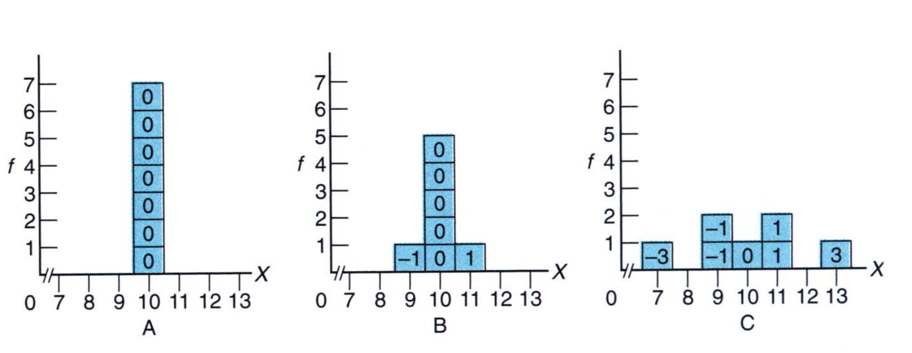
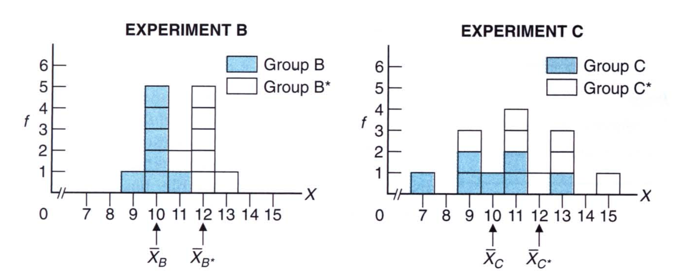
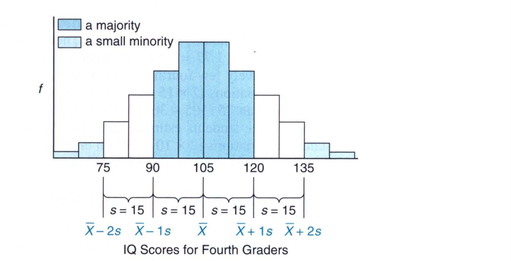
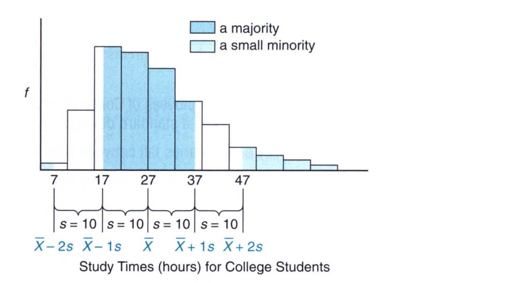
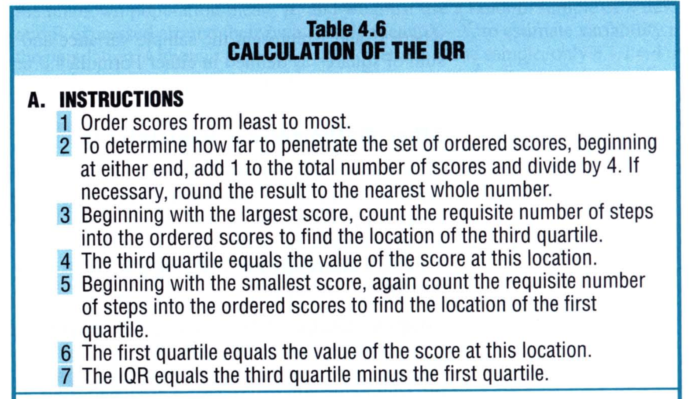
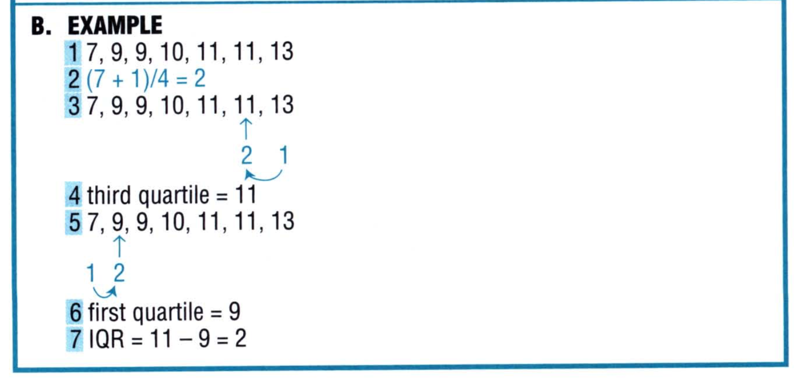
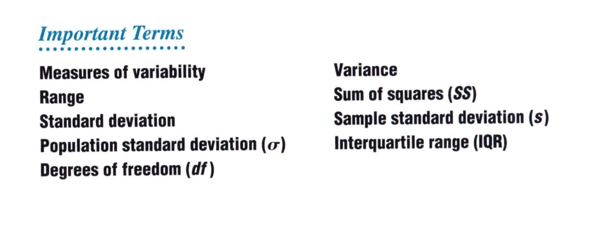

# Chapter 4: Describing Variability

The graphs and the tools used to compute the central tendency tell only part of the story. When summarizing a set of data, we specify not only measures of central tendency, such as the mean, but also **measures of variability**, that is, measures of the amount by which scores are dispersed or scattered in a distribution. This chapter describes several measures of variability, including the range, the interquartile range, the variance, and most important, the standard deviation. 

## Intuitive Approach

To understand why variability is important to describe the distribution, have a look at the figure below. 

All three distributions have a mean of 10 but they are quite different. By looking at the figures, you will realize that A has the lowest variability while C has the most variability. 

Variability is extremely important in the analysis of research results. For example, we would like to know if exercise can help decrease depression. We could then randomly assign people to two groups, one that does exercise and the other that does not. We can then check the variability of test scores to determine whether there has been any change between the two groups. Here's an example of how we can do this: 

To illustrate the importance of variability consider the result of two experiments that were done. Both experiments have the mean difference of 2, but the two groups seem to show different variability. For example, the experiment B seems to show more variability than experiment C because of the smaller variability in B to begin with. 

As we will see in later chapters, variabilities within groups in experiment B translate to *more statistical stability* for the observed mean difference of 2 *when it is viewed as just one outcome among many possible outcomes for repeat experiment*. Therefore, insofar as *similar* but not necessarily identical mean differences would reappear in repeat experiments, we can conclude that the observed mean difference of 2 probably reflects a real difference in favor of the treatment in experiment B.

On the other hand, the larger variabilities within groups in experiment C translate into *less statistical stability*for the observed mean difference of 2 when it is viewed as just one outcome among many possible outcomes for repeat experiments. Insofar as *dissimilar* mean differences—even zero or negative mean differences—would appear in repeat experiments, we can conclude that the observed mean difference of 2 fails to reflect a real difference in favor of the treatment in experiment C. Instead, since it is most likely a product of chance variability, the observed mean difference of 2 can be viewed as merely transitory and not taken seriously. We will see more of this in Chapter 14. 

> Large variability within the groups translates into **less statistical stability** while small variability within the group translates to **more statistical stability**. 

## Range

There are some tools in statistics that allow us to measure variability. The simplest of them all is the range. 

> The **range** is the difference between the largest and the smallest scores. 

The range has several shortcomings: 

1. Because it depends on two scores, it fails to use the information provided by the remaining scores. 
2. It is susceptible to variation based on the data that is provided and so it is not stable. 

## Variance

> The **variance** is defined as the mean squared deviation from the mean. 

The variance computes the deviation from the mean for each point. It then squares these deviations and then sums them all. Note that if it were to simply sum the deviations, they would amount to zero and we would have nothing. Therefore, it is first squared and then divided by the total number of scores, 
$$
\text{variance} = \frac{\text{sum of squared deviation scores}}{\text{number of scores}}
$$
The sum of squared deviation scores are sometimes written as `SS` or **sum of squared errors**. 

> Rather than taking the square of deviations, we can also take the absolute value of the deviation before summing the values. This is known as the **Mean Absolute Deviation** or **M.A.D**. However, this measure of variability is not preferred because, in the end, the simple act of ignoring negative signs has undesirable mathematical and statistical repercussions. 

### Population Variance

The variance of the population is written as: 
$$
\sigma^2 = \frac{\sum(X - \mu)^2}{N}
$$
where N is the total population. 

### Sample Variance

For the case of sample variance, the numerator essentially remains the same, but there is a small but important change in the formulas for the variance and standard deviation for samples. This change appears in the denominator of each formula where $N$, the population size, is replaced not by $n$, the sample size, but by $n - 1$, as shown: 
$$
s^2 = \frac{\sum (X - \bar{X})^2}{n - 1}
$$
The only weakness of variance is that the scores are computed in squared units. For example, the variance in the weights of the women would be `4.5` squared pounds rather than pounds. It is harder to associate with squared units. 

## Standard Deviation

The standard deviation gets rid of this pesky squared units by taking the square root of the variance. So, the standard deviation is simply, 
$$
\text{standard deviation} = \sqrt{\text{variance}}
$$

> You might find it helpful to think of the standard deviation as a *rough* measure of the average (or standard) amount by which scores deviate on either side of their mean

In other words, it is reasonable to describe the standard deviation as the average amount by which scores deviate on either side of their mean—as long as you remember that an approximation is involved. 

### Majority of Scores within One Standard Deviation

Because the standard deviation looks at the variation of scores with respect to the mean, it can also help us understand where the majority of scores lie in a given frequency distribution. 

> For most frequency distributions, a majority (often as many as 68%) of all scores are within one standard deviation on either side of the mean

This generalization applies to all of the distributions. 

The above figure shows a distribution of IQ scores for 4th graders. The standard deviation for this distribution is 15 while the mean is 105. We see that most of the scores are within $\pm1s$ of the mean. Now it does not matter what the shape of the distribution is, 

Here we have a right skewed distribution and still we see that most of the scores are within $\pm1s$. 

### A Small Minority of Scores Deviate More Than Two Standard Deviation

The standard deviation also can be used in a generalization about the extremeties or tails of frequency distributions: 

> For most frequency distributions, a small minority (often as small as 5%) of all scores deviate more than two standard deviations on either side of the mean

In general, given a frequency distribution, `68%` of the scores are within `1-standard deviations`, `95%`of the scores are within `2-standard deviations` and `99` of the scores are within `3-standard deviations`. This is graphically shows as follows: 

This curve is more infomative in terms of z-scores and proportions: 

### Standard Deviation: A Measure of Distance

There is an important difference between the standard deviation and its indispensible co-measure, the mean. 

> The **mean** is a measure of **position**
>
> The **standard deviation** is a measure of **distance** (on either side of the mean)

When you compute the mean of a distribution, we know the position where the mean lies. However, computing the standard deviation gives the distance from the mean. 

> Standard deviation cannot be negative

The standard deviation is a distance on the positive and negative side of the mean and yet it is a positive value. 

### Standard Deviation of Population and Sample

**Population Standard Deviation ($\sigma$)**

The population standard deviation is given by, 
$$
\sigma = \sqrt{\frac{\sum(X - \mu)^2}{N}}
$$
**Sample Standard Deviation (s)**

The sample standard deviation is given by,
$$
s = \sqrt{\frac{\sum(X - \bar{X})^2}{n - 1}}
$$

### Why n - 1? Degrees of Freedom

The reason we use `n-1` is because of the whole idea of **degrees of freedom**. 

> The degrees of freedom (df) refers to the number of values that are free to vary, given one or more mathematical restrictions, in a sample being used to *estimate* a population characteristic. 

Here's how we can explain the degrees of freedom. Suppose we have 5 empty spots. Each empty spot can take any integer value. Now, each of these 5 spots can take any value under the sky. Because there are five spots, we say the degrees of freedom, for this set of 5 spots is `5`. 

Now suppose we say that the mean of these 5 values can only be 100. In this case, the first spot can take any value, so can the second, the third and the fourth. However, because the mean has to be 100, the fifth spot can ony take a specific value such that the mean is 100. This causes a loss of freedom to the 5th spot. And so, we say that the degrees of freedom for this set is now `4`. If we add another restriction, like say the median has to be a value, we decrease the degrees of freedom by one more. 

Now how does that apply in our case of sample and population? The **mathematical restriction** states that **the sum of all scores, when expressed as deviations about their own mean, must equals zero**. This is a restriction. So, if we have 5 values and their associated 5 deviations, then 4 can freely vary but the 5th has to be such that the sum of all the deviations are equal to zero.

But why does the population standard deviation not require it? This is because, when it comes to the sample, we use the values from the population to estimate the mean of the population. But if the population mean is known, this restriction is not required. This is because the restriction states that *the sum of all scores, when expressed as deviations***about their own mean**, must equals zero.  The variance for the population is the difference between the population mean and each score in the population. It is not the difference between the sample's mean and each score in the sample. 

In other words, the degrees of freedom always indicate the number of values that are free to vary, given one or more mathematical restrictions, in a set of values used to estimate some unknown population characteristic. 

## Interquartile Range (IQR)

The most important spinoff of the range, the **interquartile range (IQR)**, is *simply the range for the middle 50% of the scores*. More specifically, the IQR equals the distance between the third quartile (75th percent) and the first quartile (25th percent). The calculations of IQR is relatively straightforward. Here are the steps to follow: 

 

And here's an example: 

## Measures of Variability for Qualitative And Ranked Data

Measures of variability are virtually nonexistent for qualitative or nominal data. It is probably adequate to note merely whether scores are evenly divided among the various classes (maximum variability), unevenly divided among various classes (intermediate variability), or concentrated mostly in one class (minimum variability). 

If qualitative data can be ordered because measurement is ordinal, then it's appropriate to describe variability by identifying extreme scores (or ranks). 

Here are the important terms that we learned in this chapter

