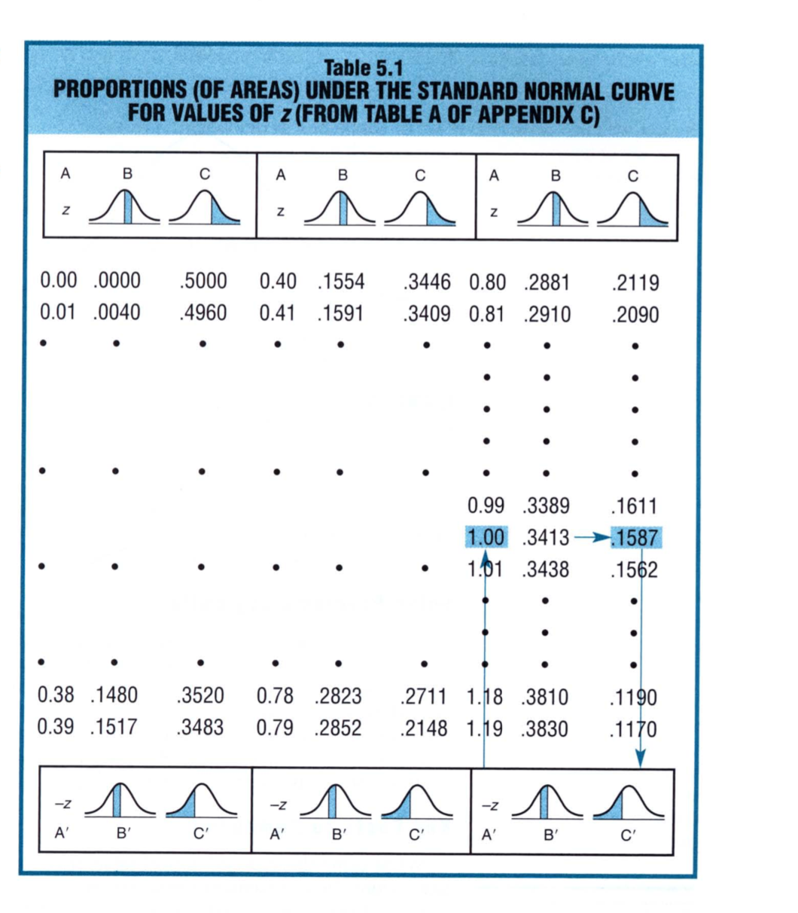

# Chapter 5: Normal Distribution & Standard Scores

The normal curve is a central piece of statistics. It describes many observed frequency distributions but it also describes some important theoretical distributions in inferential statistics. 

With the help of the standard normal table, we can answer questions about any normal distribution whose mean and standard deviation are known. This is particularly helpful and more efficient rather than dealing directly with each observed frequency distribution. At the center of normal distribution are the z scores. The z scores allow us to standardize distributions such that distributions with different shapes can be compared easily.  

Consider an example of a short FBI chief who wants to hire FBI recruits that are not taller than him. Given his height of 65 inches, he does not want to recruit men with heights higher than that. Below is a distribution of heights of the new recruits. 

This is a relative frequency distribution of heights of 3091 men. To find the proportion of men who are of a particular height, merely note the value of the vertical scale that corresponds to the top of any bar in the histogram. For example, 0.10 of these men, or about 309 men, are 69 inches tall. When expressed as a proportion, any conclusion based on the 3091 men can be generalized to other comparable sets of men, even sets containing an unspecified number. However, this distribution has a limitation: it is based on a group of just 3091 men, so any conclusions drawn from this distribution can be erroneous due to chance irregularities in the original distribution. 

## The Normal Curve

Something can be generalized this by creating distributions that are based on larger numbers. A distribution based on 30,910 men would be more accurate than 3091 and similarly the one based on 3,091,000 would be much more accurate. But it is either super difficult or impossible to get such large number of people. 

The idealized normal curve has been superimposed on the original distribution of 3091 men as can be seen below. Irregularities in the original distribution, most likely due to chance, are ignored by the smooth curve. Accordingly, any generalizations based on the smooth normal curve will tend to be more accurate than those based on the original distribution. 

When looked at the normal distribution, the shaded area tells us the following: 

* The total area under the curve represents the proportion of applicants we have surveyed. This area adds up to 1. 
* The shaded area is the proportion of applicants whose heights are exactly less than 65. 

Here are some properties of the normal curve: 

* The normal curve is a theoretical curve defined for continuous variable. It is symmetric and bell-shaped.
* The lower half of the normal curve is the mirror image of its upper half. 
* The peak of the normal curve is at the center, or the midway of the distribution. 
* The values of the mean, median, and mode are located at the midway point. They all coincide. 

> When using the normal curve, we need to know the mean and the standard deviation. 

Once we have the mean ($\mu$) and the standard deviation ($\sigma$) for the given distribution, we have the normal curve for that distribution. We cannot arbitrarily change the $\mu$ and $\sigma$, because doing so will change the distribution. For example, here we have two different distributions because their means are different but their standard deviations are the same. While in the second case, we have the same mean but  the standard deviations are different. 

## z Scores

> A z score is a unit-free, standardized score that, regardless of the original units of measurement, indicates how many standard deviations a score is above or below the mean of its distribution.

The **z-score** is computed using the following equation: 
$$
z = \frac{X-\mu}{\sigma}
$$

where $X$ is the original score and $\mu$ and $\sigma$ are the mean and the standard deviation, respectively, for the normal distribution of the original scores. 

A z-score consists of two parts: 

* a *positive* or *negative* sign indicates whether it is above or below the mean
* a *number* indicates the size of its deviation from the mean in standard deviation units

> A z score of +2.00 indicates that the original score is exactly 2 standard deviations or from the mean on the right-hand side of the mean, while -1.27 indicates that the original score is 1.27 standard deviations from the mean on the left-hand side of the mean.

## Standard Normal Distribution

> If the original distribution approximates a normal curve, then the shift to standard or z scores will always produce a new distribution that approximates the **standard normal curve**.

We want to have an original distribution approximates the normal curve because we know a whole lot about the normal curve. In fact, we have a normal table associated with the normal curve. So, by moving the original distribution to the normal curve will allow us to apply the knowledge we have about the normal curve onto the original distribution. 

> There are an infinite number of normal curves but just one **standard normal curve** with a mean of 0 and a standard deviation of 1. 

The conversion of original distribution to a normal curve is done through the calculation of z-scores. Here are some examples of original distributions with their raw values and the z-scores. 

The **standard normal table** consists of columns of z scores coordinated with columns of proportions. Here's an example of a normal table: 

The column has z-scores in it. The column B shows the shaded area for which we compute the z score, while the column C shows another shaded area and corresponding proportion for the same z-score. The normal curve is symmetric and so the negative z-score is read the same way as the positive z-score. The scores are read from the bottom to the top. 

The columns used in the normal table are illustrated below: 

## Solving Normal Curve Problems

There are two types of normal curve problems we encounter:

1. We use the known scores to find an unknown **proportion**
2. We use the known proportions to find an unknown **score(s)**

We will describe the steps to solve such problems: 

* **Solve Problems Logically:** Concentrate on the logic of the solution, using rough graphs of normal curves as an aid to visualizing the solution. Only after thinking through a solution should you do any calculations and consult the normal tables. 
* **Key Facts to Remember:** 
  * The proportions for B and C add up to 0.5 for any given z score. 
  * The total area under the curve is 1.0. 
  * The proportion for the upper half and the lower half is each equal to 0.5.
  * Z scores can be negative but proportions are always positive.  

## Finding Proportions

We will take a step-by-step approach to computing proportion for a single z-score. 

### Finding Proportion for a Single Score

As an example we will consider the FBI example. For this curve we have a mean of 68 inches and a standard deviation of 3 inches. We want to know the proportion of FBI applicants who are shorter than exactly 65 inches.  

1. **Sketch a normal curve and shade in the target area:** We are looking at the shorter end of the distribution so we shade that area from 65 to all the way down to what as low the distribution goes. 
2. **Plan your solution according to the normal table:** In this case we are looking at the left-hand side of the distribution so our z-score is negative. We will be looking at C' column in the normal table. 
3. **Convert X to z:** We are looking at proportion of 65 and less so X = 65. Using mean and standard deviation we find: z = (65 - 68) / 3 = -1.00. 
4. **Find the target area:** With this z-score find the target area. Using A' as 1.00. For this z-score we find a proportion value of 0.1587. So, we conclude that only 0.1587 of all the FBI applicants will be shorter than 65 inches. Now, we know the sample had 3097 applicants, so that would be 491 applicants will be shorter of equal to 65 inches. 

> Always read the normal curve problems carefully as a single word can change the entire problem

For example, if you had been asked to find the proportion of applicants who are *taller* than 65 inches. In this case, we will have to find the area under the curve to the right of the 65 inches. This would involve calculating B' + B + C. 

> As you read from left to right, the X and z scales along the base of the normal curve always increase in value. 

### Finding Proportion for *between*Two Scores

Suppose the problem is the following: the gestation period for human fetuses approximate a normal curve with a mean of 270 days (9 months) and a standard deviation of 15 days. What proportion of gestation periods will be between 245 and 255 days? 

For this part of the problem, we do the following: 

1. **Sketch a normal curve and shade in the target area:**. This step is like the one we saw earlier. 
2. **Plan your solution according to the normal table:** For this part, we are looking to compute the area under the curve between two limits: 245 and 255. We would do so by computing the proportion from 255 to 0 and 245 to 0 and subtracting the two proportion. This will give us a proportion between 245 and 255. 
3. **Convert X to z:** We need to compute z-score for two values: 
   1. z = (255 - 270) / 15 = -1.00
   2. z = (245 - 270) / 15 = -1.67
4. **Find the Target Area:** For -1.00, we get a proportion of 0.1587 and for -1.67 we get a proportion of 0.0475. So the area in between is: 0.1587 - 0.0475 = 0.1112 or 11% of the gestation periods will be between 245 and 255 days. 

> Enter Table looking for only single z score. 

### Finding Proportions *beyond* Two Scores

There are times you may get a problem that looks like the following: Assume that high school students' IQ scores approximate a normal distribution with a mean of 105 and a standard deviation of 15. What proportion of IQs are more than 30 points either above or below the mean? 

1. **Sketch a normal curve and shade in the two target areas**. This is shown in the figure below
2. **Plan your solution according to the normal table. ** Now in this case we have two scores and we are looking at two distinct proportions on each side of the mean. The mean of the distribution os 105 so we are looking at raw values of 135 and 75. We are looking at columns C' and C.
3. **Convert X to z**. We have two scores:
   1. z = (135 - 105) /15 = 2.00
   2. z = (75 - 105) / 15 = -2.00
4. **Find the target areas**. Because the normal curve is symmetric our scores are identical in proportions. We find the proportion to be 0.0228. Because we are looking at either larger than or less than the mean, we add this proportion value and we have 0.0456 or 4.6% of the students will have IQ scores larger or less than 30 points from the mean. 

> Sometimes the language can be confusing so here are somethings to consider: 
>
> * **More** than 30 points **either above or below** the mean translates into two target areas. 
> * **Within** 30 points **either above or below** the mean translates to target area corresponding to the two unshaded areas in the above figure. Each of these within areas share a boundary with the mean.

## Finding Scores

So far, we have concentrated on normal curve problems for which Table A must be consulted to find the unknown proportion (of area) associated with some known score or pair of known scores. For instance, given a GRE score of 650, we found that the unknown proportion of scores larger than 650 equals 0.07. 

Now, we will concentrate on the opposite type of normal curve problem for which Table A must be consulted to find the unknown score or scores associated with known proportions. For instance, given that a GRE score must be in the upper 25 percent of the distribution, we must find the unknown minimum GRE score. 

### Finding One Score

Consider an exam where the the normal curve has a mean of 230 and a standard deviation of 50. Only the upper 20% are awarded grades of A. What is the lowest score on the exam that receives an A? To answer such type of questions, do the following: 

1. Sketch a normal curve and, on the correct side of the mean, draw a line representing the target score
2. Plan your solution according to the normal table. 
3. Find the value of z from the table
4. Convert z to the target score

Here's how we would solve the above problem: 

We know that we are looking at the upper 20% of the normal curve. We need to find the value of z such that the proportion is equal to 0.20. We find that the value of z is 0.84. Now that we know z, we can find X. In this case, it turns out to be 272. 

### Finding Two Scores

Assume that the annual rainfall in San Francisco area approximates a normal curve with the mean of 22 inches and a standard deviation of 4 inches. What are the rainfalls for the more atypical years, defined as the driest 2.5 percent of all years and the wettest 2.5 percent of all years? 

In this case, we have two extreme sides. We would solve it in the following way: 

Here we have a pair of scores one on each side of the distribution. We are looking at 2.5% of either side of the curve. This would translate to a z-score of roughly $\pm$2.0. With that we find at the rare events would occur if the rainfall were 14.16 inches or 29.84 inches. 

Later in inferential statistics, we will judge whether, for instance, an observed mean difference is real or transitory. As you will see this decision will depend on whether the one observed mean difference can be viewed as a common outcome or as a rare outcome in the distribution of all possible mean differences that could happen just by chance. Since common events tend to be identified with the middle 95 percent of the area under the normal curve and rare events with the extreme 2.5 percent in each tail, you will often use z-scores of $\pm$1.96 in inferential statistics. 

## More About z Scores

z scores are not limited to normal distributions. Non-normal distributions also can be transformed into sets of unit-free standardized z scores. Just that in such cases, the standard normal table cannot be consulted. Under most circumstances, z scores provide efficient descriptions of relative performance on one or more tests. For example, we really have no idea what it means that Megan earned a raw score of 159 on a math test. However, knowing that her z score of the test was 1.8 suggests that she did really well. Of course, for this we need to know whether the distribution of all math scores is normal, that we know the mean and the standard deviation. Nonetheless, it is much more informative that knowing the raw scores. 

Remember that z scores reflect performance relative to some group rather than an absolute standard. So, z score requires the nature of the reference group to be specified. In the example, we need to know Megan's performance in relation to other students in her class. 

> Whenever any unit-free scores are expressed relative to a known mean and a known standard deviation, they are referred to as **standard scores**. 

Another reason z scores are important is because we can compare various scores from various distributions togehter. By standardizing the scores, we can easily compare one with another. Take for example, three distributions corresponding to Test Scores, IQ scores, and GRE scores. Converting them to z score help us compare them equally. 

We can use the following formulat to convert from one score to another: 

For example, suppose we want to know what 2-sigma means for the GRE scores. We would do the following: 
$$
z' = 500 + (2)(100) = 700
$$
This tells us exactly that. 

