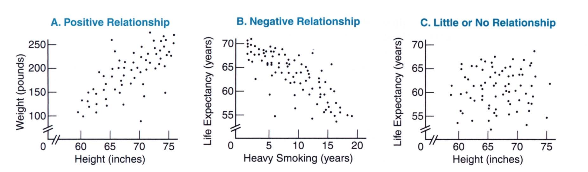
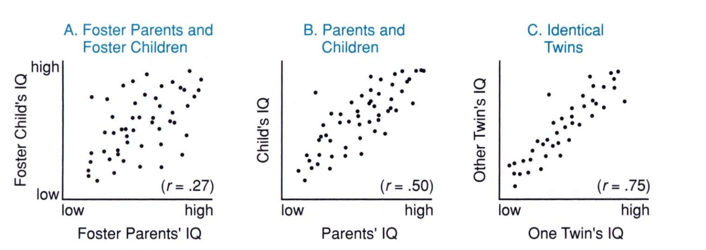
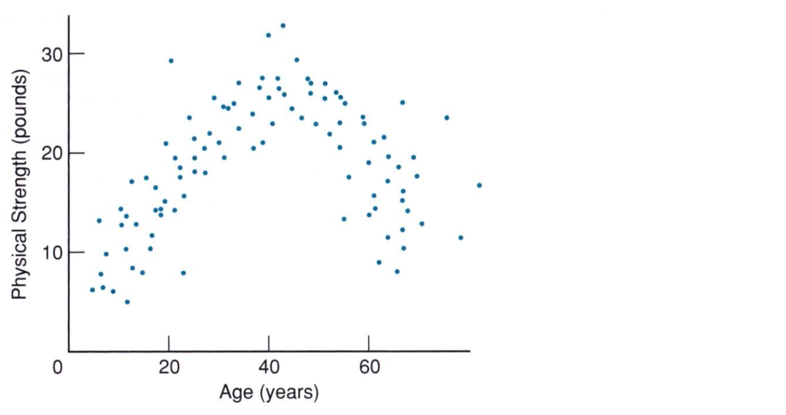
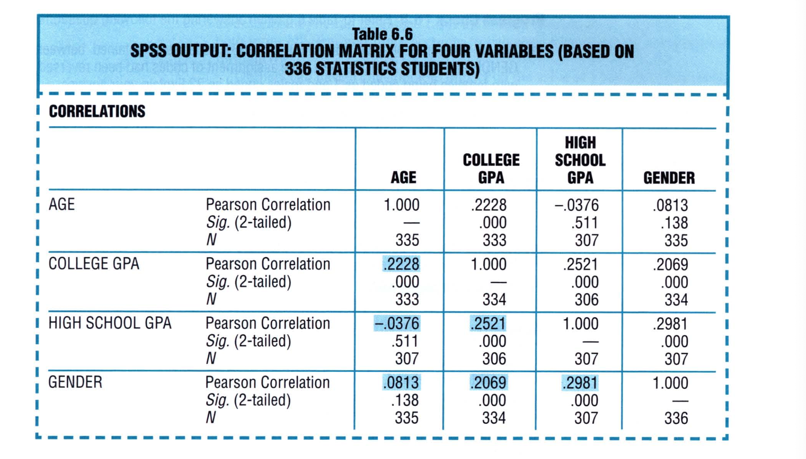
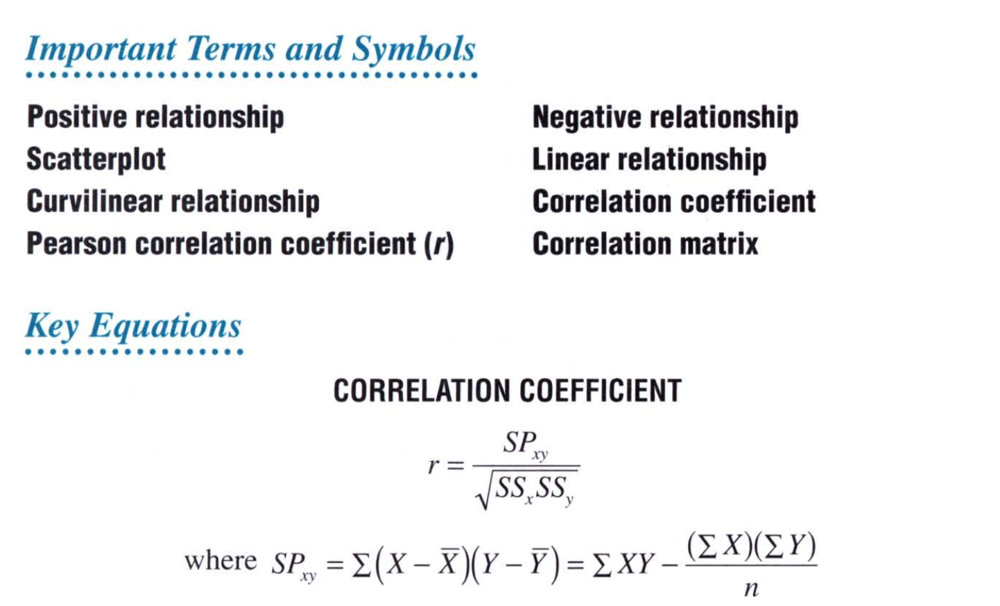

# Chapter 6: Describing Relationships: Correlation

In the previous chapter, we saw how we can compare distributions, compute scores from proportions and proportions from scores. In this chapter we compare variables and find out whether they have a relationship between them. If so, how do we quantify such a relationship? How do we describe the strength of relationship? We will see how we do that in this chapter. 

## An Intuitive Approach

The easiest way to see if two variables have a relationship is to plot them through a **scatterplot**. A scatterplot simply plots the two variables on a two dimensional surface. By looking at the scatterplot we can visually see if their relationship is **positive**, **negative**, or have **no relationship** beween them. Here are some of the examples: 

Having established the relationship is either positive or negative, we can visualize see if the relationship is **strong** or **weak**. 

> The more closely the dot cluster approximates a straight line, the stronger (the more regular) the relationship will be.

Here are examples of relationships that increase in their degree of strength. As we go from left to right, the strength of the relationship increases. The value `r`, which we will see later, quantifies the relationship. 

> A **perfect relationship** happens when the dot cluster equals a straight line. In practice, perfect relationships are most unlikely. 

So, far we have seen relationships are the **linear** in nature. We can also have **non-linear** relationships. Here's an example of non-linear relationship: 

## A Correlation Coefficient For Quantiative Data: r

> To describe linear relationships between pairs of variables for quantitative data, we make use of the **Pearson Correlation Coefficient, r**. 

The Pearson Correlation Coefficient has the following properties: 

* The value of r varies between -1.00 and +1.00
* The sign of r indicates the type of the linear relationship, whether positive or negative
* The numerical value of r, without regard to sign, indicates the strength of the linear relationship. The value of the r is a measure of how well a straight line (representing a linear relationship) describes the cluster of dots in the scatter plot. 

The Pearson Correlation Coefficient, r, tells us whether the relationship between pairs for quantiative variables is positive, negative, or has none. The magnitude of r tells us the strength of the relationship. In general, if the value of r of 0.50 or more, either the positive or the negative direction, would represent a *very strong* relationship in most areas of behavioral and educational research. But there are exceptions. In the case of IQ scores, r of at least 0.80 or more would be expected when correlation coefficients measure “test reliability”. This is to establish that any person's two scores tend to be similar and, therefore, that the test scores are reproducible. 

The relationship between the pairs are not always generalizable. This is because the generalization depends on the sample size at hand. If we have a small sample, the relation we have could have occurred by chance while a very large sample would strengthen the case for the interpretation of the relationship. 

> The value of r does not signify as a proportion or percentage of some perfect relationship. For example, a r value of 0.70 does not signify that the current relationship between pairs is 70% of a perfect relationship. 

When interpreting a brand new r, you'll find it helpful to translate the numerical value of r into a verbal description of the relationship. A r value of 0.70 for the height and weight of college students could be translated into *Taller students tend to weigh more*. We can also state that *Lighter students tend to be shorter*. 

> A correlation coefficient, regardless of size, never provides information about whether an observed relationship reflects a simple cause-effect relationship or some more complex state of affairs. That's why the general statement: **Correlation does not always imply causation**

To come to a conclusion that correlation implies causation (A implies B), we need to create an experiment in which case we conclusively find that B does not imply A and that there is no **confounding variable**, that can cause B. We will learn more about confounding variable in later chapter. 

## Computation Formula for r

The Pearson Correlation Coefficient is defined as follows: 
$$
r = \frac{\sum(X - \bar{X})(Y - \bar{Y})}{\sqrt{\sum(X - \bar{X})^2 \sum(Y - \bar{Y})^2}}
$$

> The correlation coefficient is simply the variance of between the two variables. 

## Outliers

We saw in Chapter 2 that **outliers** are defined as very extreme scores that require special attention because of their potential impact on the summary of data. This is also true when working with correlations. When the time comes to report correlations and you feel that there is an outlier, it is adviced to report two correlation values, one with and the other without the outlier. Unless, of course you have a valid reason to remove the outlier, in which case the reported correlation value will be the case when the outlier has been removed. 

## Other Types of Correlations

Although the Pearson Correlation Coefficient was designed for quantiative data, the Pearson Correlation Coefficient has been extended, sometimes under the guise of new names and customized versions of the equation we have seen above. Here are some other types of correlations we fnd in statistics: 

* To describe the correaltion between **ranks**, simply substitute the numerical ranks into Eq. 1 and then solve for the value of the Pearson r. This is known as **Spearman's** $\rho$ for ranked and ordinal data. 

* To describe the correlation between quantitative data (for example, annual income) and **qualitative** or **nominal data with only two categories**, assign arbitary numerical codes to the two qualitative categories and then solve Eq. 1. for the value of Pearson r. This is known as a **point biserial** correlation coefficient. 

* To describe the relationship between *two ordered qualitative variables*, assign any ordered numerical codes to categories for both qualitative variables, then solve Eq. 1. for the value of Pearson r. This is known as **Cramer's** $\phi$. 

   

## Correlation Matrix

When we have more than two variables we can create a **correlation matrix**. A correlation matrix looks something like this: 

The correlation matrix is symmetric along the diagonal. The diagonal is always 1 as the correlation of the variable with itself is always 1. The off-diagonal has the correlation values with other variables. 

