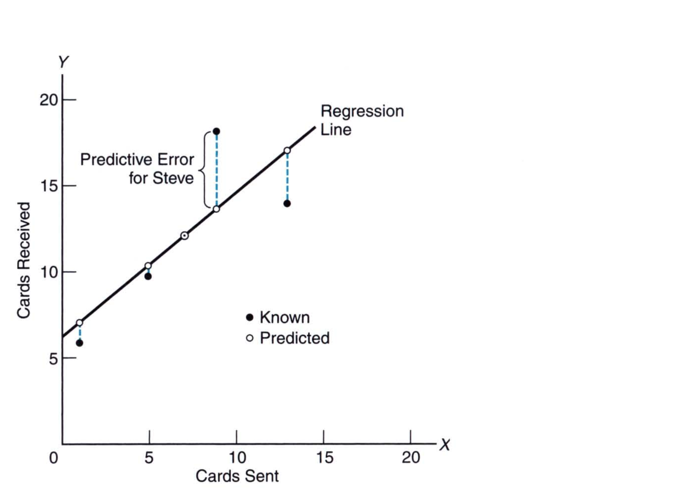

# Chapter 7: Regression

In the previous chapter, we saw how we can compare whether two variables are correlated or not. We also learned about the metric, Pearson Correlation Coefficient, that helped us quantify the correlation between the two variables. Given that the two variables are related, can we make predictions using this correlation?  For example, we find that the housing price is correlated with the size of the house. So, given a certain area of the house can we predict the price of the house from the data? In this chapter, we will learn how we can make predictions based on correlated data. 

## Regression Line

To understand regression, we will make use of an example of exchange of greeting cards. We have five friends who sent and recieved greetings cards. The table show below us the number of cards sent and received. 

| Friend | Sent | Received |
| ------ | ---- | -------- |
| Doris  | 13   | 14       |
| Steve  | 9    | 18       |
| Mike   | 7    | 12       |
| Andrea | 5    | 10       |
| John   | 1    | 6        |

Imagine that we plot the `Cards Sent` on the x-axis and `Cards Received` on the y-axis. The scatterplot looks something like this: 

Suppose now we have a friend Emma. She has sent 11 cards and would like to know how many cards would she receive given the correlation between cards sent and received. To make a prediction, we fit a straight line through thes data points as seen here: 

Now, we can read off the line for Emma. We find that the cards Emma will receive would be 15.20. 

> The **regression line** is a straight line rather than a curved line because of the linear relationship between the two variables. 

One of the problems with the regression line is that it does not always pass through each of the observations. The discrepancy between the **prediction** and the **actual** value is called the **predictive error** as shown below: 

There are an infinite number of lines that can go through these 5 observations. So, how do we decide which line fits the best? The best line is the one that minimizes the total predictive error. In other words, such a line will minimize the  total of the vertical discrepancies between the solid and open dots in the above figure. This begs the question, how do we find such a line? 

## Least Squares Regression Line

If we were to simply sum the predictive error, we would get a total sum of zero. This is because all the values will cancel each other. To avoid this, we compute the total sum of squared predictive errors. Therefore, the regression line **minimizes the total squared predictive error**. When such a line is located in this fashion, the regression line is often referred to as the **least squares regression line**. Such a line is found by fitting multiple lines through the data and then finding the line that gives the lowest total sum of squared errors. We can also find the equation of the line using mathematics. 

The least squared line is given by the following equation: 
$$
Y = aX + b
$$
This is known as the **Least Squares Regression Equation**. 

The **coefficients** `a` and `b` can be calculated in the following way: 
$$
a = \sqrt{\frac{\sum(Y - \bar{Y})^2}{\sum(X - \bar{X})^2}}r
$$

$$
b = \bar{Y} - a\bar{X}
$$

where $\bar{X}$ and $\bar{Y}$ refer to the sample means of all $Y$ and $X$ scores, respectively. Using this calculation we can show that for our example, the regression line has the following equation: $Y' = 0.80X + 6.40$. We can check this equation.  We can check this equation, say for Andrea: X = 5, we find Y = 10.40. The actual answer is 10.00. 

Once numbers have been assigned to `b` and `a`, the least squares regression equation emerges as a working equation with a most desirable property: it automatically *minimizes the total of all squared predictive errors for known Y scores in the original correlation analysis*. Now for any value of X, we can compute the value of $\bar{Y}$. 

### Limitation on Prediction

The limitation on prediction is that there is no evidence of cause-effect in the linear regression nor is it guaranteed to get the expected result when something has not happened yet. This should be kept in mind when working with linear regression. 

## Standard Error of Estimates

Whenever we make a prediction, we also need to state the error involved in the prediction. The estimate of error for new predictions reflects our failure to predict the number of cards received by the original five friends, as depicted in the discrepancies between solid and open dots. The error in the prediction is determined by the **standard error of the estimate**. The equation for estimating this is: 
$$
S_{y|x} = \sqrt{\frac{\sum(Y - Y')^2}{n - 2}}
$$

> We include the degrees of freedom n - 2 because any linear regression line can be made to coincide with two data points. 

Although, we can use the prediction,  $Y'$, to estimate the predictive error as shown in the equation above, we can also use the Pearson Correlation Coefficient to do the same. 
$$
S_{y|x} = \sqrt{\frac{\sum(Y - \bar{Y})^2 (1 - r^2)}{n - 2}}
$$

> The **standard error of estimate** can be though of as a rough estimate of the average amount by which known $Y$ values deviate from their predicted $Y'$ values. 

We can look at Equation 5. to note few things about $r$: 

* When $r = 1$, we have a perfect correlation and the standard error of prediction is zero. 
* When $r = 0$, we have the worst correlation and the standard error is simply the sum of squared errors. 

## Assumptions

There are two assumptions the linear regression model considers: 

> * Use of the regression equation requires that the underlying relationship be linear. This assumption will be violated if the underlying data has a non-linear relationship. 
> * Use of standard error of estimate assumes that except for chance, the scores in the data are dispersed equally about all segments of the regression line 

Here's an example of where we have violation of homoscedasticity: 

## Multiple Regression Equation

There is no reason to only look at linear regression lines with only one variable. We can have multiple input variables and one output variable as well. This is known as **multiple linear regression**. It looks something like this: 
$$
Y' = \beta_0 + \beta_1X_1 + \beta_2X_2 + ... + + \beta_nX_n
$$
Here the coefficient, $\beta_0, \beta_1, …,\beta_n$ are linear. 

## Regression Towards the Mean

**Regression towards the mean** refers to a tendency for scores, particularly extreme scores to move towards the mean. This tendency particularly happens for extreme observations. It can be explained in the following way. Suppose students are asked to take an exam for which they have not prepared. They then randomly check the answers. If you were to create a distribution of their scores that range from 0 and 100, you will find a normal distribution with the mean of 50. There will be some students who would have scores a 100 and some who would have scored a 0. Now, if you were given another test and their scores measured, you would find that those who got extreme scores like 100 or 0, would get lower and higher scores. That is to say, those who got close to 100 will get lower scores while those that got scores closer to 0 will get higher scores. Thus in general, over time the extreme scores tend to get closer to the average. 

The **regression fallacy** is committed whenever regression toward the mean is interpreted as a real, rather than a chance, effect. 

The regression fallacy can be avoided by splitting the subset of extreme observations into two groups. Suppose we have group of trainees on whom we are going to test to see if feedback makes a difference to their performance. One group is given no feedback while the other is given a positive or negative feedback. In this case, the first group is a controlled group for regression towards the mean, since any shift towards the mean on their performance will be due to chance. Ideally, you should see no difference in the performance between the two groups. 

