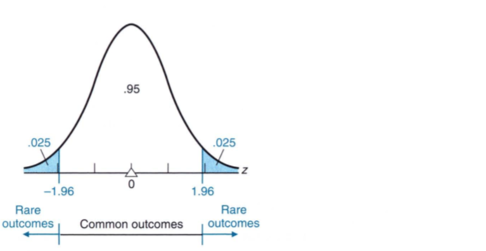
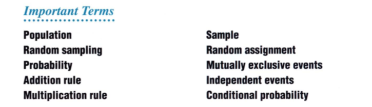

# Chapter 8: Populations, Samples, and Probability

In everyday life, we regularly generalize from limited sets of observations. Be it a sip of the soup to know if it is right or salty, a test drive of a car before we buy it or every dipping the toe in the pool to see if the water is cold. Valid generalization in inferential statistics require either random sampling in the case of surveys or random assignment in the case of experiments. 

## Populations & Samples

Generalizations can be dangerous if a sample misinterprets the population. To bypass this danger in inferential statistics, we often take the whole population in consideration if the population is small. However, if it is large, we have no choice but to rely on the sample from the population. 

### Populations

> Any complete set of observations (or potential observations) may be characterized as a **population**

When it comes to populations, there are **real populations** or **hypothetical populations**. The real populations are real in the sense that they are the whole populations as the population survey includes nearly all of the people in the country. The age of the visitors on a given day at the Disney would also include whole of the population at Disney parks in the country. In other words, the **real population includes all potential observations that are accessible at the time of sampling**. 

The hypothetical population is the opposite case when all potential observations are not accessible at the time of sampling. In most experiments, subjects are selected from a very small, uninspiring real populations. Experimental subjects are often viewed as a sample from a much larger hypothetical population. 

According to the rules of inferential statistics, generalizations should be made only to real populations that have been sampled. Generalizations to hypothetical populations should be viewed, therefore, as provisional conclusions based on the wisdom of the researcher rather than on any logical or statistical necessity. In effect, it's an open questions — answered only by additional experimentation — whether or not a given experimental finding merits the generalization assigned to it by the researcher. 

### Samples

> A subset of observations from a population may be characterized as a **sample**

In typical application the sample size is much smaller than the population. Less that 1% of the U.S. households are included in the Bureau of Labor Statistics' monthly survey to estimate the rate of employment. A Gallup poll surveys a small percentage of the population to predict the outcome of the president election. Yet, they are accurate within 2% of the actual percentage of votes for the winning candidate. 

There is no rule-of-thumb to determine the optimal size of the sample. However, questions like “What is the estimated variability among observations?” and “What is an acceptable amount of error in our conclusion?” can help us get a better understanding of the sample. Section 11.11 has specific procedures that can be followed to determine the optimal sample size for any situation. 

## Random Sampling

The valid use of techniques from inferential statistics requires that samples be random. 

> Sampling is random if, at each stage of sampling, the selection process guarantees that all potential observations in the population have an equal chance of being included in the sample

Tables of random numbers can be used to obtain a random sample. The size of the population determines whether you deal with numbers having one, two, or more digits. The only requirement is that you have at least as many different numbers as you have potential observations within the population. 

In cases when the population is not know, investigators resort to variations of the previous procedure. The Gallup organization divides the country into 4 parts, for each part it does an independent presidential survey. So, within each part, it randomly selects a city, then within that city randomly selects a precinct. Once household directories are obtained for that precinct, it randomly selects houses within it and so on. Sometimes pollsters use random digit dialing in an effort to give each telephone number an equal chance of being called for an interview. 

**Random samples from a hypothetical populations are not random because each sample does not have equally likely chance of being picked up.** There is a possibility that the sample wasn't present at the time of drawing samples. Nonetheless, it is common practice to treat samples from hypothetical populations as if they were random samples and to analyze sample results with techniques frm inferential statistics. 

## Random Assignment of Subjects

Experiments evaluate an independent variable by focusing on a treatment group and a control group. When doing an experiment, it is important to assign randomly the subjects to these two groups such that they have an equally likelihood of being in one or the other. 

This can be achieved by flipping a coin for each subejct and assigning them to a group based on the outcome. Or to associate numbers for each member and randomly picking the numbers for each group. Finally, it is important to note that the treatment group and the control group should have an equal number of participants. This ensures that at the experiment, any observed differences between the groups is not attributable to random differences and therefore would provide the most clear-cut evidence of a cause-effect relationship between independent variable and dependent variable. 

## Surveys or Experiments?

When using random numbers, it is important to have a general perspective. Are we doing a survey (subjects are sampled from a real population) or an experiment (subjects are assigned to various groups)? In the case of surveys, the objective is to obtain a random sample from the real population. In this case, use random numbers that goes well with random sampling and create samples for the survey. In the case of experiments, create equivalent groups whose membership has been determined by chance. Introduce restrictions to generate equal group sizes but use random numbers in a fashion that complies with the notion of random assignment — that all subjects have an equal opportunity of being assigned to each of the various groups. 

## Probability 

> Probability refers to the proportion or fraction of times that a particular event is likely to occur. 

The probability idea that we follow in statistics is either the frequentist approach where we compute the probability of an event happening as the ratio of the number of times the desired event occurs over all the events that are likely to occur. For example, the probability of rolling a 6 on a 6-sided die is calculated as the ratio of 6 occurring over all possible events that can occur. We find that this is 1/6. 

### Probabilities of Complex Events

Often you can find the probabilities of more complex events by using two rules— the addition and multiplication rules—for combining the probabilities of various simple events. 

#### Addition Rule

The addition rule is used when the questions include, “Find the probabilty of something happening **at least X times**”. This suggests that we find all the probabilities of something happening until the X value and adding those probabilities. So, what is the probability that a randomly selected woman is at least 72 inches tall? This includes the probability of a woman at 72 plus the probability of a woman at 73 and so on until we get to the end. 

The addition rule of probability works if the two events are **mutually exclusive**. 

> Two events, A & B, are said to be **mutually exclusive** if they cannot occur together. 
>
> **For mutually exclusive events,** 
> $$
> P(A \cup B) = P(A) + P(B)
> $$
>
> **For non-exclusive events,** 
> $$
> P(A \cup B) = P(A) + P(B) - P(A \cap B)
> $$
> 

#### Rule of Subtraction

> The probability that event A will occur is equal to 1 minus the probability that event A will not occur: 
> $$
> P(A) = 1 - P(A')
> $$
> 

#### Multiplication Rule 

The multiplication rule is slightly different if the events are independent or dependent. 

> If A and B are two **independent events**, then the probability that both events occur simultaneously is: 
> $$
> P(A \cap B) = P(A)\cdot P(B)
> $$
>
> If A and B are **not independent events**, then the probability of both events occuring simultaneously is:
> $$
> P(A\cap B) = P(A)\cdot P(B|A)
> $$
> 

The notation P(B|A) means “the probability of B, given that A has happened”. This is also known as **conditional probability**. 

## Probability and Statistics

Probability assumes a key role in inferential statistics including the importance of **hypothesis testing**. There is an inevitable variablity that accompanies any observed result and so it's value must be viewed within the context of many possible results that could have occurred just by chance. The aid of theoretical curves such as the normal curve, and the provisional assumption, known as the **null hypothesis**, we can find out whether the variation we see happened by chance or is indeed real. If the probability is very small, the result is viewed as a rare outcome, and we conclude that something real— that is something that can't be reasonably be attributed to chance—has occurred. On the other hand, if this probability isn't very small, the result is viewed as a common outcome, and we conclude that something transitory—that is, something that can reasonably be attributed to chance—has occurred. 

**Common Outcome:** is generally a lack of evidence that something special has occurred or that it lacks **statistical significance**. Therefore, such an observation cannot be taken seriously. 

**Rare Outcome:** signifies that something special has occurred and therefore has **statistical significance**. Therefore, such an observation should be taken seriously. 

As an aid to determine whether observed results should be viewed as common or rate, statisticians interpret different proportions of area under theoretical curves, such as the normal curve. Because 95% of the area of the normal curve is within $\pm1.96$, any event whose z-score is within this range is considered a **common event**. On the other hand, any event whose z-score is smaller or larger than $\pm1.96$ is considered a **rare event**. This corresponds to 2.5% at each of the normal distribution tails. 

