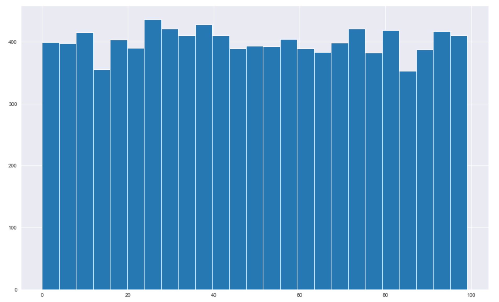
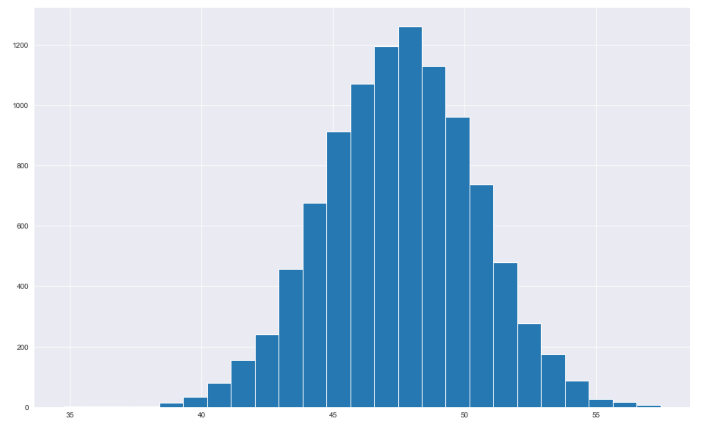
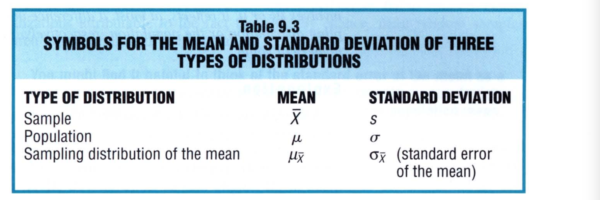
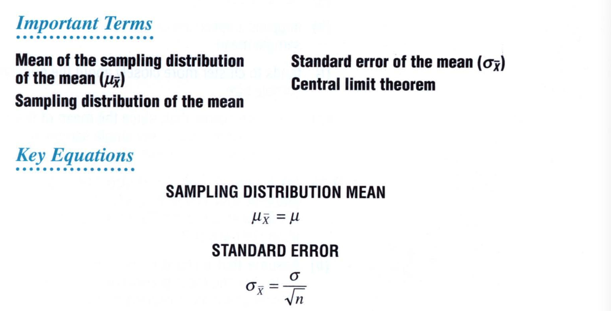

# Chapter 9: Sampling Distribution of the Mean

This chapter focuses on the single most important concept in inferential statistics—the concept of a sampling distribution. A sampling distribution serves as a frame of reference for every outcome, among all possible outcomes that could occur just by chance. 

## What is a Sampling Distribution?

In general, we wish to get a sense of the population that we have at hand. However, the population, as we saw in the earlier chapter, is far too large to access or prohibitively expensive to work with. In such cases, we need to rely on the sample from the population. However, just a sample may not tell us accurately the characteristics of the population. If the sample is selected randomly, it may be representative of the population or it may not be. Instead if we take a collection of random samples from the population, collectively the distribution of the samples will paint a more accurate picture of the population. 

The process of doing this is to take random samples from the population and compute the mean of each of the samples. Suppose we take 1000 samples from the population, each consisting of 100 data points and then take their mean, we will have 1000 sample means. If we were to create a histogram of the sampling means, we have the **sampling distribution of the mean**. It is also known as the **sampling distribution of sample means**. 

> The sampling distribution of the mean refers to the probability distribution of means for all possible random samples of a given size from some population

The reason the sampling distribution of the sample means is very important because by taking a large samples from the population, we effectively get the characteristics of the population. For example, the mean of the distribution of the sample means is very close to the population mean while the standard deviation of the distribution of sample means is close to the standard deviation of the population.  Furthermore, once we have this, we can then compare a new sample from the population with our sample distribution of the same means to decide how representative is this sample of the population. 

In effect, sample distribution of the sample means describes the variability among sample means that occur just by chance and thereby serves as a frame of reference for generalizing from a single sample. 

So, if we have a mean of the sample distribution of the sample means is 500 and and standard deviation of 2.3, and suppose we draw a sample from the population and get a value of 533 for a given sample, we can tell how representative this sample of 533 is. We would find that it is quite rare. 

## Creating a Sample Distribution from Scratch

Here's how we can create a sample distribution from scratch

 ```python
# Let's create the population
pop = [random.randrange(0,100) for i in range(10000)]
pop = np.array(pop)

# Find the mean and standard deviation of the population
print(pop.mean())
print(pop.std())
 ```

```python
49.38
28.81
```

```python
# Here's how the population looks like: 
plt.hist(pop, bins=25);
```



Now let's draw samples from the population: 

```python
def create_sample(n, number_of_samples=100):
    samples = []
    for i in range(number_of_samples):
        indexes = [random.randrange(0,100) for i in range(n)]
        sample = np.array([pop[index] for index in indexes])
        samples.append(sample)
        means = np.mean(samples, axis=1)
    return means

a = create_sample(100, 10000)
```

In this case we draw 10,000 samples from the population with each sample consisting of 100 data points. In other words for every 100 data points, we compute the mean of the sample and then draw another 100 data points. We do this 10,000 times. 

```python
# Here's the mean of the sample means:
print(np.mean(a))
print(np.std(a))
```

```python
47.55
2.88
```

```python
plt.hist(a, bins=25);
```



We see that the population distribution is different from the sampling distribution of sample means. The sampling distribution of sample means looks very symmetric and its mean is very close to the population mean. However, it's standard error is different from the population standard error. We will see more about this later. 

## Some Important Symbols

We need to establish symbols for mean, standard deviation of the population, of the samples and so forth. This allows to minimize the confusion. The standard deviation of the the sample distribution of the sample means is called the **standard error of the mean** or simply the **standard error**. 



## Mean & Standard Error of All Sample Means

As we saw earlier, 

> The mean of the sampling distribution of the sample means **always** equals the mean of the population

However, this is not the case with the standard error,

> The standard error of the sampling distribution of the sample means equals the standard deviation of the population divided by the square root of the sample size

In other words, we can find the standard error from the population standard deviation using, 
$$
\sigma_{\bar{X}} = \frac{\sigma}{\sqrt{n}}
$$
where $n$ is the sample size. 

We can check this with our example. 

```python
# Population Standard Deviation
print(pop.std())

28.81

# Standard Error of the mean: 
print(pop.std() / np.sqrt(100))

2.88

# What we calculated: 
print(np.std(a))

2.88
```

In other words, if we compute the standard error of the sampling distribution of the sample means, we have: 

```python
np.std(a) * np.sqrt(100)

28.79
```

This is super close to `28.81`. 

> You might find it helpful to think of the standard error of the mean as a rough measure of the average amount by which sample means deviate from the mean of the sampling distribution or from the population mean

## Effect of Sample Size

As an important implication of Eq.1 is that whenever the sample size equals two or more, the variability of the sampling distribution is less than that in the population. 

> Any increase in sample size translates into a smaller standard error, and therefore, a new sampling distribution with less variability. 

it is not surprising that variability should be smaller in sampling distributions than in populations. The population standard deviation reflects variability among **individual observations**, and it is directly affected by any relatively large or small observations within the population. On the other hand, the standard error of the sample means reflects variability among **sample means**, each of which represent a collection of individual observations. The mean takes away the variability that exists between invidiual observation and because of this the standard error is more stable than the standard deviation of the population. This stabilizing effect becomes even more pronounced with larger sample sizes. 

## Shape of the Sampling Distribution

A product of statistical theory, expressed in its simplest form, 

> The central limit theorem states that, regardless of the shape of the population, the shape of the sampling distribution of the mean approximates a normal curve if the sample size is sufficiently large

According to this theorem, it doesn't matter whether the shape of the parent population is normal, positively skewed, negatively skewed or flat. As long as the sample size is sufficiently large, we will always get a normal curve. This is something we saw in our example. We had a flat distribution for the population but with sufficient sample size, our distribution was fairly normal. 

The central limit works because in a normal curve, the intermediate values are the most prevalent and extreme values, either large or smaller, occupy the tapered flanks. When the sample size is large, it is *most likely* that any single sample will contain the full spectrum of small, intermediate, and large scores from the parent population, whatever its shape. 

## Other Sampling Distributions

Depending on the sample size, we get a different sampling distribution. We can also get a different sampling distribution for medians, proportions, standard deviations, variances, and correlations, as well as for differences beetween pairs of means, pairs of proportions, and so forth. 



