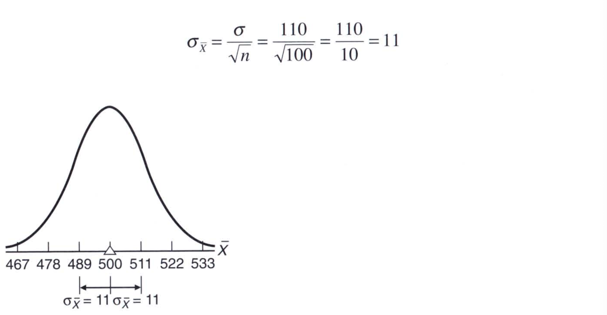
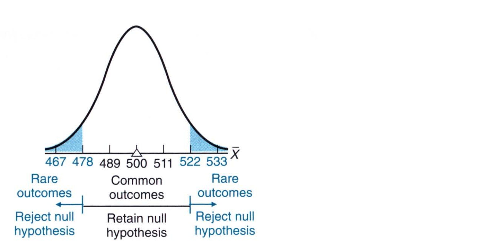
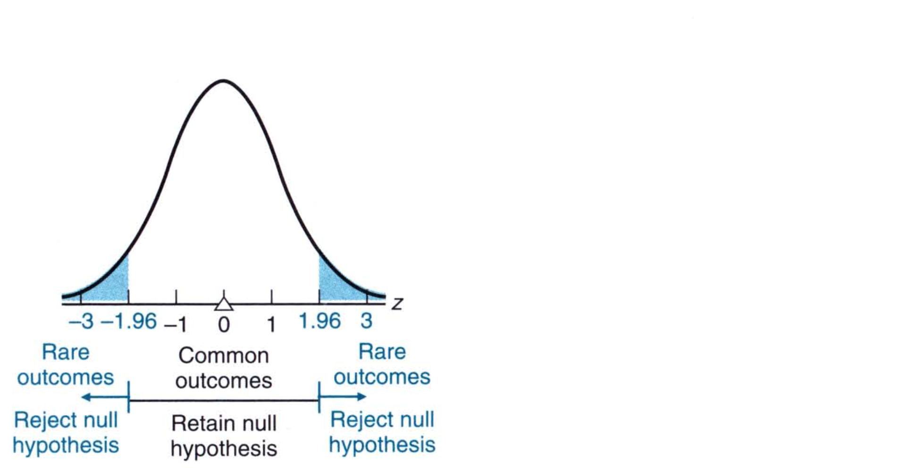
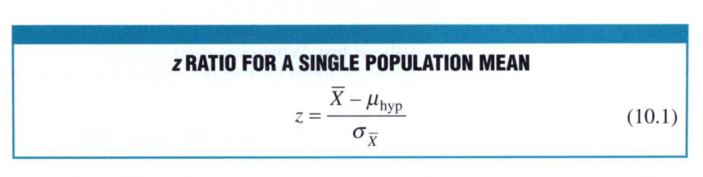
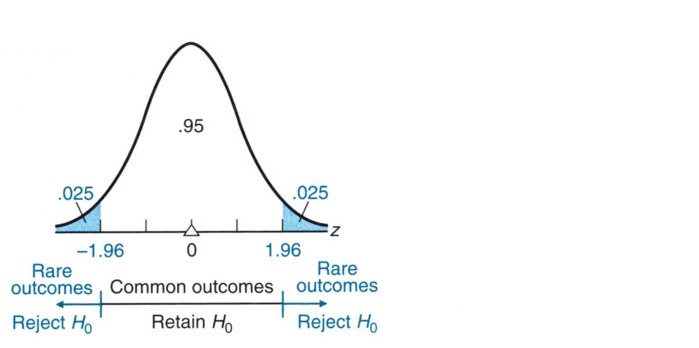

# Chapter 10: Introduction to Hypothesis Testing: The *z* score

To understand hypothesis testing, let's take an example of SAT scores. We all have taken these tests before and we know what the scores are. Imagine that on a nationwide basis, the SAT critical reading scores for all college-bound students during a recent year were distributed around a mean of 500 with a standard deviation of 110. Now suppose we do not have access to the population but that we can take random samples from the population. Suppose we take such a random sample from the local population and find that the mean score of that sample of these 100 freshman to be 533. Now let's test the hypothesis whether something special is going on with this score. Now there are two things that we can hypothese, nothing special about this score or something is special about this score. The *nothing is special about this score* is referred to as the **null hypothesis** and the *something is special is going on* is referred to as  **alternative hypothesis**. We define both of these formally later. 

Now to decide whether the 533 is a rare or common outcome we do the following:

if the null hypothesis is true, then the distribution of sample means, each of size 100, from the population of freshman will be centered about the national average of 500. That is, it will be close to 500. If we know the population standard deviation, we can compute the standard error: 

Notice the shape of the hypothesized sampling distribution approximates a normal curve, since the sample size of 100 is large enough to satisfy the requirements of the central limit theorem. 

The null hypothesis that the population mean for the freshman class equals 500 is tentatively assumed to be true. It is tested by determining whether the one observed sample mean qualifies as a common outcome or a rare outcome in the hypothesized sampling distribution. 

> An observed sample mean qualifies as a **common outcome** if the dfference between its value and that of the hypothesized population mean is small enough to be viewed as a probable outcome under the null hypothesis. 

That is, a sample mean qualifies as a common outcome if it doesn't deviate too far from the hypothesized population mean. This means the score appears to be closer to the dense concentration of possible sample means in the middle of the sampling distribution. 

> A common outcome signifies a lack of evidence that, with respect to the null hypothesis, something special is happening in the underlying population. 

This means that there is no compelling reason for rejecting the null hypothesis and therefore the null hypothesis is retained. 

> An observed sample mean qualifies as a **rare outcome** if the difference between its value and the hypothesized population mean is too large to be reasonably viewed as a probable outcome under the null hypothesis. 

That is, a sample mean qualifies as a rare outcome if it deviates too far from the hypothesized mean. This means the score is among the sparse concentration of possible sample means in either tail of the sampling distribution. 

### Boundaries for Common and Rare Outcomes

The boundaries for common and rare outcomes are shown in the figure below. The techniques for constructing these boundaries are described in later sections. 

In this example, if the one observed sample mean is located between 478 and 522, it will qualify as a common outcome under the null hypothesis, and the null hypothesis will be retained. However, if the one observed sample mean is greater than 522 or less than 478, it will qualify as a rare outcome under the null hypothesis and the null hypothesis will be rejected. 

## z Test for a Population Mean

For the hypothesis test with SAT reading scores, it is customary to base the test on the hypothesized sampling distribution of z scores as shown below rather than the hypothesized sampling distribution of mean scores as show in the previous figure. 

Now z represents a variation on the familiar standard score, and it displays all of the properties of standard scores as we saw in Chapter 5. Just like the sampling distribution of sample means, we can compute the **sampling distribution of z**, which represents the distribution of z values that would be obtained if a value of z were calculated for each sample mean for all possible random samples of a given size from some population. In other words, we convert the sample mean scores into z-scores. This gives us a z distribution of sample mean scores. 

Once we are done, we can then test our hypothesis on any score by first converting it to a z score and then see how far it is from the mean of the z distribution. In our example, we take 533 and convert that to a z-score: 

Here $\sigma_{\bar{X}}$ is the standard error of the mean and $\bar{X}$ is the mean sample score. 

$$
z = \frac{(533 - 500)}{11} = \frac{33}{11} = 3
$$
 Now any z value that is greater than $+1.96$ and less than $-1.96$ is considered a rare event. In our case, we have a z score of 3, which means it is a rare event. Consequently, we have to reject the null hypothesis as the score is not a common occurance. 

### Assumptions of z Test

> When a hypothesis test evaluates how far the observed sample mean deviates, in standard error units, from the hypothesized population mean, it is referred to as a **z test for a population mean**. 

The z test only works when: 

1. The population is normally distributed or the sample size is large enough to satisfy the requirements of the central limit theorem
2. The population standard deviation is known

## Step-by-Step Procedure

Let's take our example of SAT scores and see how we can solve the problem. 

1. **Research Problem:** Does the mean SAT reading score for all local freshman, of 533, differ from the national average of 500? 

2. **Statistical Hypothesis:** Note down the hypotheses clearly: 
   $$
   H_0: \mu = 500 \\
   H_1: \mu \neq 500
   $$

3. **Decision Rule:** Reject $H_0$ at the 0.05 level of significance if z$\geq$ 1.96 or z $\leq$ -1.96. 

4. **Calculations:** Convert the scores to z scores. In our case, we find z = 3

5. **Decision:** Reject $H_0$ at the 0.05 level of significance because z = 3 exceeds 1.96. 

6. **Interpretation:** The mean SAT reading score for all local freshman does not equal but exceeds the national average of 500. 

## The Null Hypothesis ($H_0$)

> The **null hypothesis**, $H_0$ is a statistical hypothesis that usuallly asserts that nothing special is happening with respect to some characteristic of the underlying population. 

Because the hypothesis testing procedure requires that the hypothesized sampling distribution of the mean be centered about a single number, the null hypothesis equals a single number. Furthermore, the null hypothesis always makes a precise statement about a characteristic of the population, never about a sample. Remember, the purpose of a hypothesis test is to determine whether a particular outcome, such as an observed sample mean, could be reasonably orginated from a population with a hypothesized charactertisic. 

### Finding the Single Number for $H_0$

The single number actually used in $H_0$ varies from problem to problem. Even for a given problem, this number could originate from any of several sources. If, as sometimes happens, it's impossible to identify a meaningful null hypothesis, don't try to salvage the situation with arbitrary numbers. Instead, use another entirely different technique, known as **estimation**, which is described in Chapter 12. 

## Alternative Hypothesis ($H_1$)

> The **alternative hypothesis $H_1$** asserts the opposite of the null hypothesis. 

A decision to retain the null hypothesis implies a lack of support for the alternative hypothesis, and a decision to reject the null hypothesis implies support for the alternative hypothesis. The alternative hypothesis is identified with the **research hypothesis**, the informal hypothesis or a hunch that, by implying the presence of something special in the underlying population, serves as inspiration for the entire investigation. 

The “something special” could be a deviation from a national average, a deviation from some control condition produced by a new teaching method, a weight-reduction diet or a self-improvement workshop. 

## Decision Rule

A **decision rule** specifies precisely when $H_0$ should be rejected. There are many possible decision rules that we will look at in the next chapter. A very common one, which we saw, specifies that $H_0$ should be rejected if the observed z equals or is more positive than 1.96 or if the observed z equals or is more negative than -1.96. Conversely, $H_0$ should be retained if the observed z falls between $\pm 1.96$. 

### Critical z Scores

The figure below shows that z scores of $\pm 1.96$ define the boundaries for the middle 0.95 of the total area (1.00) under the hypothesized sampling distribution for z. 

The z scores of $\pm 1.96$ are referred to as critical z scores as they play a vital role in the decision of $H_0$. 

### Level of Significance 

The above figure also indicates the proportion (0.025 + 0.025 = 0.05) of the total area that is identified with rare outcomes. Often referred to as the l**evel of significance of the statistical test**, this proportion is symbolized by the Greek letter $\alpha$ and is discussed in much detail in the next chapter. In the present example, the level of significance, $\alpha$ equal 0.05. 

> The **level of significance, $\alpha$** indicates the degree of rarity required of an observed outcome in order to reject the null hypothesis $H_0$. 

For instance, the 0.05 level of significance indicates that $H_0$ should be rejected if the observed z could have occurred just by chance with a probability of only 0.05, or 5% or less.