# Chapter 11: More About Hypothesis Testing

Hypothesis tests permit us to draw conclusions that go beyond the limted set of actual observations. This chapter describes why rejecting the null hypothesis is stronger than retaining the null hypothesis and why a on-tailed test is more likely than a two-tailed test to detect a false null hypothesis. We also look at what happens when we assume that the null hypothesis is true but infact it is false and the same goes with alternative hypothesis. 

## Why Hypothesis Tests? 

The hypothesis tests are used to generalize our conclusions beyond the sample data that we have collected. For example, if we had taken the SAT scores of every local freshman from the local city, we wouldn't have to do a hypothesis test. We could directly compare this result with the population and find out the difference between this score and the national average. However, as we took just a sample of 100 freshman from the local city and not all the freshman, we need to generalize based on what we have gotten. It is therefore, we need hypothesis tests to do so. 

The standard error is important in hypothesis tests because it, along with the population mean helps us put the score we have at hand on the same ground and make comparison. The z score effectively puts everything on the same scale so a comparison is possible. Given the fact the underlying population is normally distributed, we already know, in terms of z scores, where the rare events lie and where the common events lie. Thus it is simply the matter of computing the z scores and finding what they are and placing them in the rare events bins or the common events bins. If they happen to be in rare events bins, we can safely reject the null hypothesis but if they are in the common events bin, we cannot reject the null hypothesis. This is fundamental basis of hypothesis tests. 

### Possibility of Incorrect Decisions

When we do hypothesis testing, we are after all taking a sample from the population and deciding whether the sample represents the population or not. However, we can get this wrong. A high z score may suggest that we reject the null hypothesis but infact, it is true. This possibility always exists when performing hypothesis tests. 

> Rejecting the true $H_0$ is referred to as a **type I error**. It is also called a *false alarm*

In order to avoid this situation, we could decrease the $H_0$ rejection area as small as possible. However, doing so poses a danger, in the sense that we would keep the false $H_0$. This also is wrong. 

We have to make a compromise in such case. From the previous chapter, we learned about **level of significance**. We found that the level of significance for z-scores of $\pm$1.96 is 5%. The level of significance states the probability of something happening by chance when the z-score is equal to or greater than $+$1.96 or equal to or less than $-1.96$. We know this is 0.025 or 2.5% on either side or a combined 5%. We can turn this and state that the probability of retaining a false null hypothesis is 2.5% on either side when the z score is equal to or greater than $+$1.96 or equal to or less than $-$1.96. This is shown in the shaded area: 

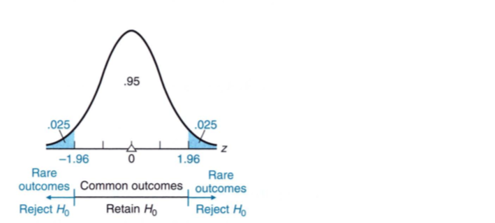  

> Even though we never really know whether a particular decision is correct or incorrect, it is reassuring that in the long run, most decisions will be correct—assuming the null hypotheses are either true or seriously false. 

## Strong or Weak Decisions

The decision to retain $H_0$ is generally considered to be weak because it suggests that we have not found an example when $H_0$ could be false. This makes it fairly weak. While the decision to reject $H_0$ is generally considered to be strong because rejecting $H_0$ suggests that $H_1$ is more likely to be true. 

> The decision to retain $H_0$ implies not that $H_0$ is probably true, but only that $H_0$ could be true, whereas the decision to reject $H_0$ implies that $H_0$ is probably false (and that $H_1$ is probably true)

Since most investigators hope to reject $H_0$ in favor of $H_1$, the relative weakness of the decision to retain $H_0$ usually does not pose a serious problem. 

However, one may think that we could simply test the $H_1$ directly, we would not need to consider $H_0$. But in general $H_1$ is almost always tested indirectly. There are several reason why instead of $H_1$, $H_0$ is tested directly: 

* **The alternate hypothesis lacks the necessary precision to be tested directly**: To be tested, the hypothesis must specify a single number about which the hypothesized sampling distribution can be constructed. Now, when it comes to research, a single number cannot be created due to inherent error involved in the measurements. As the hypothesis test requires a single number, we are unable to provide so for the alternate hypothesis. However, this can easily be done for the null hypothesis as we construct it. 
* **Supported by a Strong Decision to Reject:** because the research hypothesis is identified with the alternative hypothesis, the decision to reject the null hypothesis, should be made, will provide strong support for the research hypothesis, while the decision to retain the null hypothesis, should it be made, will provide, at most, weak support for the null hypothesis. 

As mentioned previously, the decision to reject the null hypothesis is stronger than the decision to retain it. Logically, the statement as “All cows have four legs” can never be proven in spite of a steady stream of positive instances. It only takes one negative instance—one cow with three legs—to disprove the statement. A positive statement weakly proves the null hypothesis but a negative instance strong disproves the null hypothesis. Therefore, a weak support for a null hypothesis is of little consequence, as this hypothesis—that nothing special is happening in the population—usually serves only as a convenient testing device. 

## One-Tailed and Two-Tailed Tests

Let's consider some techniques that make the hypothesis test more responsive to special conditions. To illustrate this, we will continue with our example of SAT scores. In all these cases, we assume that the $H_0 = 500$. Or the null hypothesis states that there is no difference between the local SAT scores and the national average. 

### Two-Tailed Test

In the case of the two-tailed test, the form of the alternative test is the following: 
$$
H_1:\mu \neq 500
$$
This alternative hypothesis says that the null hypothesis should be rejected if te mean reading score for the population of local freshman differs in either direction from the national average of 500. This decision rule si referred to as a **two-tailed** or **nondirectional test**. 

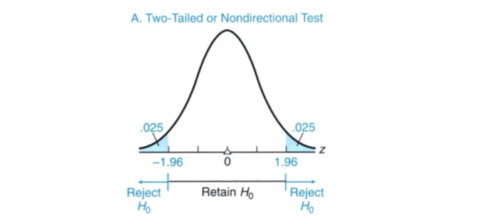

In a nondirectional test, we have to reject $H_0$ on either side of the tail only then is the hypothesis test complete. 

### One-Tailed Test (Lower Tail Critical)

In the case of the one-tailed test that has a lower tail critical, the form of the alternative test is the following: 
$$
H_1: \mu < 500
$$
It reflects a concern that the null hypothesis should be rejected only if the population mean reading score for all local freshmen is less than the national average of 500. This corresponding decision rule, with its critical z of -1.65 is referred to as a **one-tailed** or **directional test** with the lower tail critical. The region to reject $H_0$ is shown in figure B.

### One-Tailed Test (Upper Tail Critical)

In the case of the one-tailed test that has an upper tail critical, the form of the alternative test is the following: 
$$
H_1: \mu > 500
$$
It reflects a concern that the null hypothesis should be rejected only if the population mean reading score for all local freshman is greater than the national average of 500. This corresponding decision rule, with its critical z of +1.65 is referred to as a **two-tailed** or **directional test** with the upper tail critical. The region to reject $H_0$ is shown in figure C. 

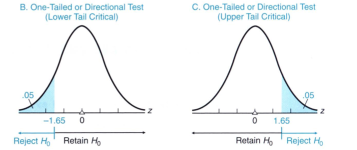

#### Extra Sensitivity of One-tailed Test

As we can see in the figure above. the one-tailed test has a much larger rejection area than the two-tailed test. Therefore, the decision to reject a false $H_0$ is more likely to occur in the one-tailed test than in the two-tailed test. 

#### One or Two Tails? 

> Before a hypothesis test, if there is a concern that the true population mean differs from the hypothesized population mean only in a particular direction, use the appropriate one-tailed test for extra sensitivity. Otherwise, use the more customary two-tailed or nondirectional test. 

It is to be noted that the selection of a one- or two-tailed test should be made before the data are collected. Never look at the value of observed z to determine whether to locate the rejection region for a one-tailed test in the upper or the lower tail of the distribution of z. 

#### New Null Hypothesis for One-Tailed Tests

When we use a one-tailed test, we should provide a complete statement of the null hypothesis in the direction of no concern. Fore example, when considering a one-tailed test for the upper critical, the null hypothesis would be: 

**One-tailed test upper tail critical**
$$
H_1: \mu > 500 \\[10pt]
H_0: \mu \leq 500
$$
**One-tailed test lower tail critical**
$$
H_1: \mu < 500 \\[10pt]
H_0: \mu \geq 500
$$
In other words, rather than simply stating $H_0$ = 500, we give it a full range. 

> Whenever a one-tailed test is employed, write $H_0$ to include values of the population mean in the direction of no concern—even though the single number in the complete $H_0$ identified by the equality sign is the one value about which the hypothesized sampling distribution is centered and, therefore, the one value actually used in the hypothesis test

## Choosing A Level of Significance

The level of significance indicates how rare an observed z must be before $H_0$ can be rejected. Often we set the level of significance to 5% or 0.05. However, the level of significance has an inherent risk of rejecting the true null value. When the level of significance equals 0.05, there is a 5% chance that the z score will stray into the rejection region and we will reject the null hypothesis. 

So, what level of significance should we use? That depends on what is important to you. When the rejection of a true $H_0$ is particularly serious, a smaller level of significance can be selected. Generally, a smaller level of significance such as 1% or 0.1% are selected. 

> Unless there are obvious reasons for selecting either a larger or a smaller level of significance, use the customary 0.05 level

The table below gives level of significance for various type of tests

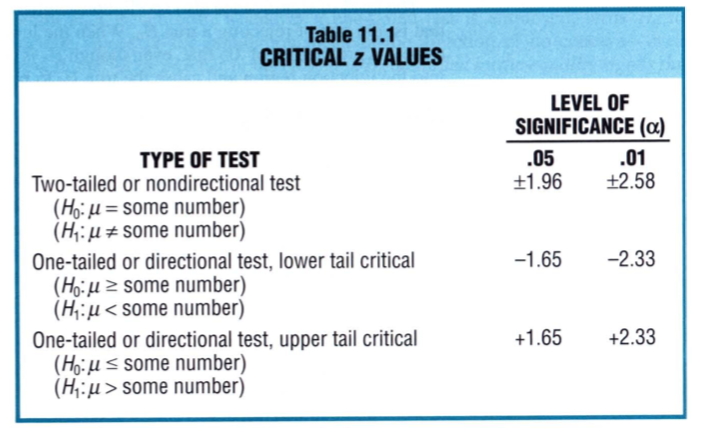

## Testing a Hypothesis About Vitamin C

Let's look at hypothesis test in action. We want to carry out a hypothesis test by focusing on a study to determine whether vitamin C increases the intellectual aptitude of high school students. 

We randomly select 36 students from a large school district. Each of them take 60 mg of vitamin C for a period of two months before testing their IQ. We know that the IQ scores in this school district has a mean of 100 and standard deviation of 15. 

Because we want test if the ingestion of vitamin C increases intellectual aptitude, our null and alternative hypothesis would be: 
$$
H_0: \mu \leq 100 \\[10pt]
H_1: \mu > 100
$$

#### z Test is Appropriate

The z test is appropriate because the population standard deviation is known and the shape of the population is known to be normal. 

Ideally two groups, control and an experimental group. The control group could be given a placebo while the experimental group would get the Vitamin C. The hypothesis tests for experiments with two groups are described in Chapter 14 and 15. 

#### Decision Rule

We know that the alternative hypothesis has chosen the one-tailed upper tail critical test. In this case, we will look for a z score that is equal to or greater than 1.65 at a significance level of 0.05. 

We find the sample standard deviation to be: 
$$
\bar{\sigma} = \frac{\sigma}{\sqrt{n}} = \frac{15}{\sqrt{36}} = 2.5
$$

### Four Possible Outcomes

There are four possible outcomes in this experiment. This is like the confusion matrix: 

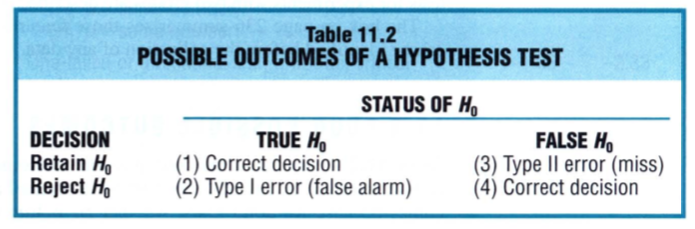

1. If $H_0$ is true and we retain it. We have correctly retained it. 
2. If $H_0$ really is true and we reject it. This involves a **Type I error**. 
3. if $H_0$ really is false and we retain it. This involves a **Type II error**
4. If $H_0$ really is false and we reject it. We have correctly rejected it. 

Let's look at each of these in more detail. 

###  If $H_0$ Really is True

If $H_0$ is really true then we are concerned about two things: retaining $H_0$ or rejecting it. The scenarios can be illustrated by looking at the distribution of IQ from the experiment: 

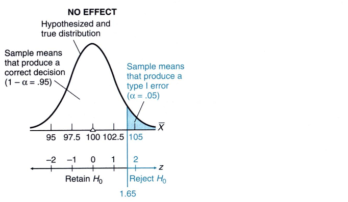

We know that the z score of rejecting for one-tailed test is set at 1.65. So, if our z score is larger than 1.65 and $H_0$ is true, than we have a 5% chance that we make a Type I error. Or in other words, the probability of making a Type I error is 5%. In other words, we have a 95% probability that we will not make a Type I error. 

> The probability of a Type I error equals $\alpha$, the level of significance 

We can reduce the Type I error by reducing the value of $\alpha$. For example, when $\alpha$ is set to 0.001, we have a much smaller probability of making a Type I error. 

> If $H_0$ is true, the probability of a Type I error, $\alpha$ equals the level of significance, and the probability of a correct decision equals 1 - $\alpha$. 

 ### If $H_0$ Really is False Because of a Large Effect

Suppose that $H_0$ is indeed false and the effect is really large. Suppose Vitamin C increases the population mean by 10 points. This would be a 10-point effect. The difference between a true and a hypothesized population mean is referred to as an **effect**. If this is the case, we need to be concerned about either retaining or rejecting a false $H_0$. 

It is essential to distinguish between the hypothesized sampling distribution and the true sampling distribution as shown below. 

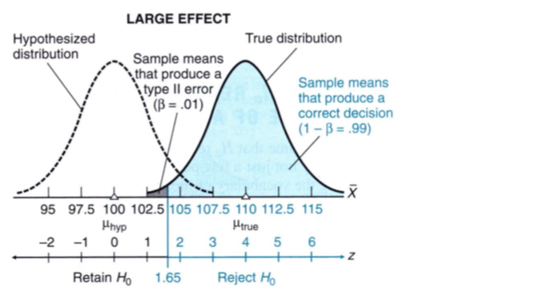

Centered about the hypothesized population mean of 100, the **hypothesized sampling distribution** serves as the parent distribution for the familiar decision rule with a critical z of 1.65 for the projected one-tailed test. Once the decision rule has been identified, attention shifts from the hypothesized sampling distribution to the true sampling distribution. 

The true sampling distribution is centered at a mean of 110 (100 + 10 points increase). It serves as the parent distribution for the one randomly selected sample mean (or z) that will be observed in the experiment. Viewed relative to the decision rule, the one randomly selected sample mean dictates whether we retain or reject the false $H_0$. 

When, just by chance, a randomly selected sample mean originates from a very small black portion of the true sampling distribution of the mean, its z value is less than 1.65, we should retain $H_0$. Because $H_0$ is really false, this is incorrect decision or type II error. 

> The probability of a type II error is given by the symbol $\beta$. 

In our case, the Type II error is 0.01. So, the probability of correctly rejecting the null hypothesis is 1-$\beta$ = 0.99 or 99%. In other words, in the case of large effect, there is a high probability of making a correct decision. 

> When there a large effect, the hypothesis tests tend to produce correct decisions when either $H_0$ is really true or $H_0$ really is false. 

### If $H_0$ Really is False Because of a Small Effect

In the case when $H_0$ is really false the difference between the means in the distributions is not that large. In other words, the effect size is small. This scenario is illustrated here: 

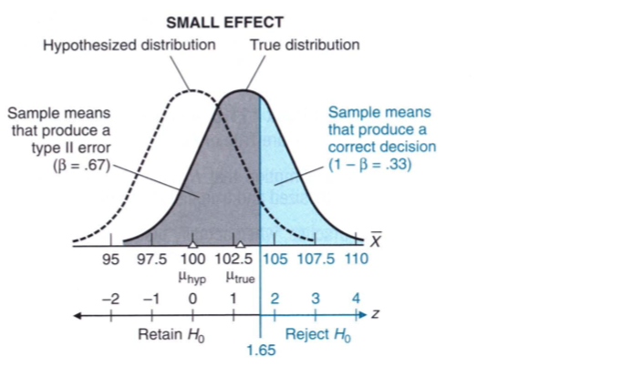

In this case we have assumed the effect size is just 3 points. We see a much large overlap of retaining a false $H_0$ rather than rejecting it. In the case, the one-tailed test performs poorly; there is a fairly high probability of 0.67 that a Type II error will occur and a low probability of 0.33 that the correct decision will be made. 

> If $H_0$ really is false, the probability of a Type II error, $\beta$, and the probability of a correct decision 1 - $\beta$, depend on the size of the effect. The smaller the effect, the higher the probability of a Type II error and the lower the probability of a correct decision. 

## Influence of a Sample Size

From the previous section we learned that in order to increase the probability of detecting a false $H_0$, increase the sample size. We can see this effect directly in the computation of standard error. 

We know from the previous sections, that increasing the sample size decreases the standard error. This is because the sample size, n, is in the denominator. Therefore, increasing n would decrease the standard error. The standard deviation or the standard error illustrates the spread of the distribution. When the standard error or the deviation is small, the distribution is tighter. When the distribution is tigher, the overlap between the hypothesized and true distribution is also small. Therefore, if the effect size is small but the sample size is large, we can still detect a false $H_0$.

The figure below shows the case of small effect when the sample size is large

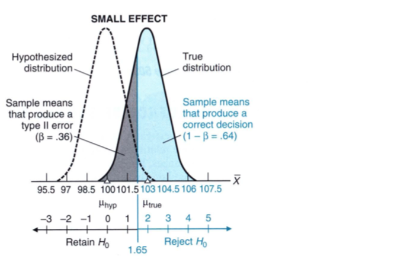

When the standard error was large, the probability of correctly detecting a false $H_0$ was 33%. However, as we increased the sample size, the probability of correctly detecting a false $H_0$ went up to a value of 64%. If we were to increase the sample size to 10,000 the 1 - $\beta$ would go to 85%. 

Looking at this case, you may think that simply increasing the sample size would decrease the probability of picking the false $H_0$. However, that is not true. Increasing the sample size causes the standard error to decrease which in turn narrows the distributions. This also causes the hypothesis test to become hyper-sensitive to small changes. For example, a difference of 0.5 point, a really small effect, between the hypothesized distribution and the true distribution can become significant if the sample size is very large. 

In the same way, a very small sample size will make the hypothesis test too insensitive and therefore it will miss every a very large important effect. Therefore, before an experiment, we need to select a sample size that helps to maximize the detection of a large effect. But how do we do this? 

Statistics supplies investigators with charts, often referred to as **power curves** that help select the appropriate sample size for a particular experiment. 

## Power and Sample Size

> The **power** of a hypothesis test equals the probability (1-$\beta$) of detecting a particular effect when the null hypothesis $H_0$ is false. 

The completment of $\beta$, failing to detect a false $H_0$, is called the power. The **power curve** shows how the likelihood of detecting any possible effect—ranging from a very small to very large—varies for a fixed sample size. Our Vitamin C example can be seen here for a sample size of 29 and 13. 

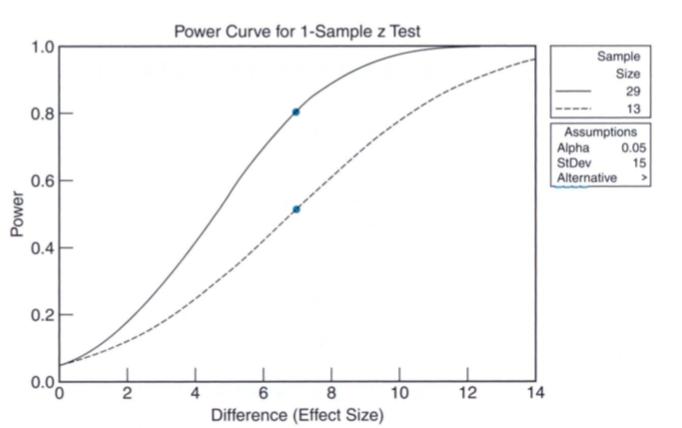

We see that the effect size of 7, which we may consider to be sufficient for our experiment, may work well when the sample size is 29 rather than when it is 13. We may also state that we are happy to see a power of 0.8 to conclude that we can be satisfied with a 20% chance of accepting a false $H_0$. 

Thus when it comes to a hypothesis test, we need to select the following: 

* Decide to use a one- or a two-tailed hypothesis
* Level of significance, $\alpha$ to reduce the Type I error
* Decide on the level of power (1-$\beta$) to reduce the Type II error
* Decide on the effect size that's adequate to see the effect

All of this will help you decide on the sample size to use for the hypothesis test. 

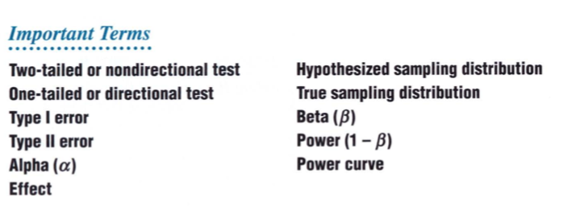

