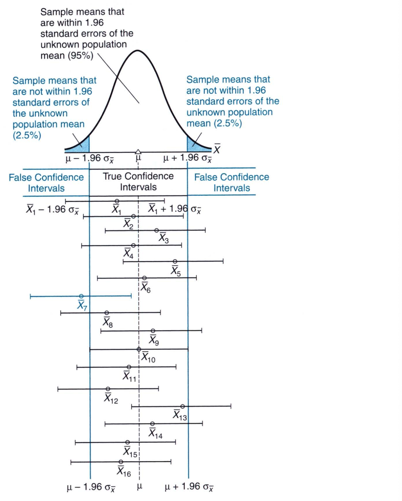
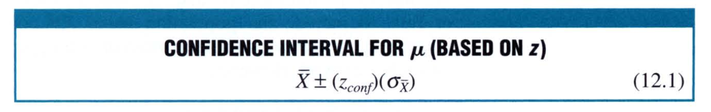
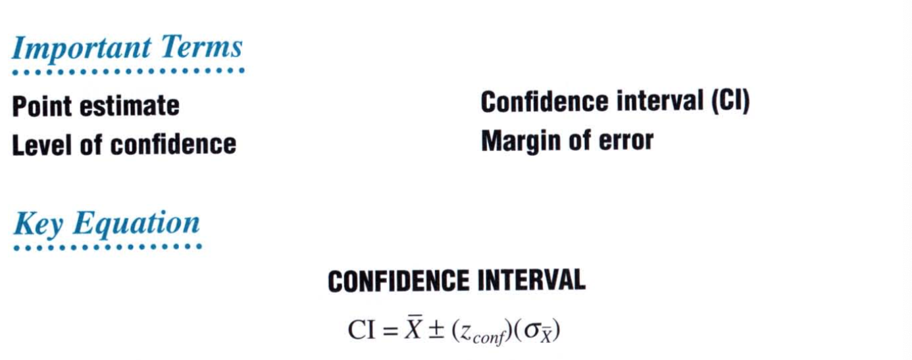

# Chapter 12: Estimation (Confidence Intervals)

A hypothesis test merely indicates whether an effect is present. A confidence interval is more informative since it indicates, with a known degree of confidence, the range of possible effects. A confidence interval can appear either in isolation or in the aftremath of a test that has rejected the null hypothesis. 

In Chapter 10 we saw an example of SAT scores from the local population and how we used the z score to see whether the scores of 533 were higher than the national population z scores. We concluded that indeed they were higher than the national population scores. However, the same SAT investigation could have been prompted by a wish merely to estimate the value of the local population mean rather than to test a hypothesis based on the national average. This new concern translates into an estimation problem. 

## Point Estimate for $\mu$

> A point estimate for $\mu$ uses a single value to represent the unknown population mean

The best single point estimate for the unknown population mean is simply the observed value of the sample mean. So, if we randomly sample scores of 100 local freshman and we get a score of 533, then 533 is the point estimate of the unknown population mean for all local freshman. 

The point estimates tend to be inaccurate because of sampling variability. It is unlikely that the single sample mean will coincide with the population mean. Point estimates convey no information about the degree of inaccuracy due to sampling variability. We do not generally use point estimates, rather we use interval estimates or **confidence intervals**. 

## Coinfidence Interval (CI) for $\mu$

> A confidence interval for $\mu$ uses a range of values that, with a known degree of certainty, includes the unknown population mean. 

The CI can be of various types. For example, we can have a CI of 95% of 80% or 65%. The 95% confidence interval states that if we create 100 CIs, say that vary between 511.44 and 554.56, 95 of such intervals will contain the true value of the population mean. The remaining 5 percent are false because they fail to include the unknown population. 

Let's illustrate the process of creating a confidence interval. We have the sampling distribution of sampling mean for the SAT scores. We do not know the population mean. We take 100 samples from the population every time and compute the sample mean. Given that we take 100 samples, the central limit theorem tells us that the sample distribution of sample means is a normal distribution. Now, we decide to create a CI with 95% confidence. This means, that we use the 95% of the area under the normal distribution in our sample distribution of sample means. We do this by taking the z score interval: 
$$
\bar{X}\pm 1.96 \bar{\sigma}
$$
This will give us 95 percent confidence interval for each sample mean. Why, according to statistical theory, do 95 percent of these confidence intervals include the unknown population mean? As seen from the figure below, because the sampling distribution is normal, 95% of all sample means are within 1.96 standard errors of the unknown population mean, that is 95% of all sample means deviate less than 1.96 standard errors from the unknown population mean. Therefore, when sample means are expanded into confidence intervals—by adding and subtracting 1.96 standard errors—95 percent of all possible confidence intervals are true because they include the unknown population mean. 

In practice, we only use one sample mean to compute the confidence interval. The computation of sample means in the above example was only for demonstration purposes. 

### Confidence Interval for $\mu$ Based on Z

Going back to our example of SAT scores. We found that the sample mean for the local freshman was 533. We can use this mean value to compute the 95% confidence as follows: 

The confidence interval is constructed by using the following formula: 

In our case we have $\bar{X}$ = 533. We use a confidence of 95%, which translates to a z score of 1.96. Finally, we compute the sample standard error as, mean of the population divided by the square root of the sample. So we have: 

#### Two Assumptions

The computation of confidence interval assumes that: 

* The population standard deviation is known
* The population is normal or that the sample size is sufficiently large (>25)

## Interpretation of A Confidence Interval

A 95 percent confidence claim reflects a long-term performance rating for an extended series of confidence intervals. So, even when we just use one sample mean to construct a confidence interval and for this single one, we are not absolutely sure that the population mean will be in the confidence interval that we have constructed, but we can be reasonably confident that the one observed confidence interval includes the true population mean. In other words, there is just a 5% chance that we will have a sample mean, which when used to create a confidence interval will not contain the true population mean. But most of the time, we will pick a sample mean that will contain the population mean in its confidence interval. 

## Level of Confidence 

> The **level of confidence** indicates the percent of time that a series of confidence intervals includes the unknown population characteristic, such as the population mean. 

Any level of confidence may be assigned to a confidence interval merely by substituting an appropriate vallue of z in the formula. For example, to create a level of confidence of 99%, we use a z value of 2.58. For our example, we get: 

This implies that, in the long run, 99 percent of these confidence intervals will include the unknown population mean. 

### Effect on Width of Interval

The higher the confidence percentage, wider is the width of the confidence interval, and therefore less precise is the confidence interval. Any shift to a higher level of confidence always produces a wider, less precise confidence interval unless offset by an increase in sample size. 

Wider the confidence intervals, further they can be from the population mean and can yet include the population mean. In other words, being wider, they have a much large leeway, or wiggle space to be wrong but at the same time include the population mean. The narrow the confidence interval, the less leeway they have and therefore the more precise they are. So, a 60% confidence interval is much narrower but is also mostly like to contain less of the population mean. 

### Choosing a Level of Confidence

Although many different levels of confidence have been used, 95% and 99% are the most prevalent. Generally, a larger level of confidence, such as 99 percent, should be reserved for situations in which a false interval might have particularly serious consequences, such as the failure of a national opinion pollster to predict the winner of a presidential election. 

## Effect of Sample Size

> The larger the sample size, the smaller the standard error and hence, the more precise (narrower) the confidence interval will be. 

So, as the sample size grows larger, the standard error will approach zero and the confidence interval will shrink to a point estimate. Given this perspective, the sample size for a confidence interval, unlike that for a hypothesis test, never can be too large. 

#### Selection of Sample Size

As with hypothesis tests, sample size can be selected according to specifications established before the investigation. To generate a confidence interval that possesses the desired precision, yet complies with the desired level of confidence, refer to formulae for sample size in other statistics book. Valid use of these formuale requires that before the investigation, the population standard deviation be either known or estimated. 

## Hypothesis Tests or Confidence Intervals?

Ordinarily, data are used either to test a hypothesis or to construct a confidence interval, but not both. Confidence intervals tend to be more informative than hypothesis tests. 

> Hypothesis tests merely indicate whether or not an effect is present, whereas confidence intervals indicate the possible size of the effect. 

In the case of the Vitamic C experiment, hypothesis test would have told us whether there an effect of Vitamic C on the IQ scores. However, if we had constructed a 95% confidence interval which would span 102 to 112, then we could say that the effect of VItamin C would be somewhere between 2 and 12 IQ points. 

### When to Use Confidence Intervals

If the primary concern is whether or not an effect is present—as is often the case in relatively new research areas—use a hypothesis test. On the other hand, if the task is to verify the previous experiment, the investigator may use the confidence interval to estimate the how accurate are her results in comparison to the previously done research. 

You should also use confidence interval whenever a hypothesis test results in the rejection of the null hypothesis. For example, after it's established by rejecting the null hypothesis, that vitamin C has an effect on IQ scores, it makes sense to estimate, with a 95% confidence interval, that the interval between 102 and 112 describes the possible size of that effect, namely, an increase (above 100) of between 2 and 12 IQ points. 

## Confidence Interval for Population Percentage

Often in media, the confidence interval will be stated something like this: A recent news release reported that among a random sample of 1500 adult Americans, 64 percent favor some form of capital punishment. Furthermore, teh **margin of error** equals $\pm$3%, given that we wish to be 95% confident in our result. This is effectively the confidence interval stated as we know: 

Often in national polls, the huge sample reduces the size of the standard error and thereby guarentees a relatively small margin of error of $\pm$3%. If, in the pollster's judgement, a larger margin of error would have been tolerable, smaller samples could have been used. For instance, if a larger margin of error of $\pm$5% would have been tolerable, a random sample of about 500 adults could have been used rather than 1500 adults, while if $\pm$10% was could enough, we could have used only 100 adults. 

### A Final Caution

When based on randomly selected respondents, confidence intervals reflect only one kind of error—the **statistical error due to random sampling variability**. The other kinds of **nonstatistical errors** can compromise the value of confidence interval. For example a bias question would skew the poll and therefore introduce nonstatistical errors in them. 

### Other Types of Confidence Intervals

Confidence intervals can be constructed not only for population means and percents but also for differences between two population means, as discussed in subsequent chapters. Although not discussed in this book, confidence intervals also can be constructed for other characteristics of populations, including variances and correlation coefficients. 

