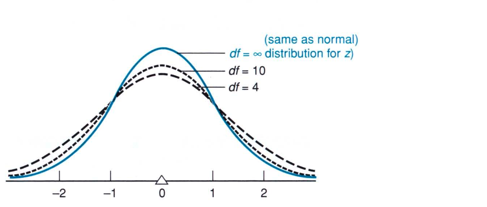
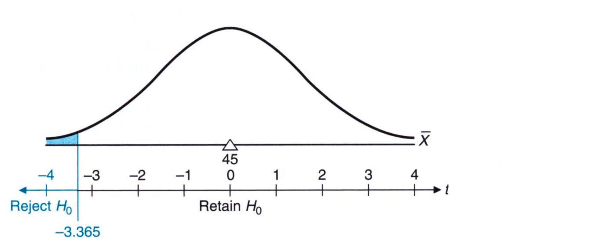
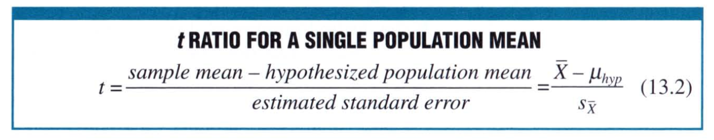
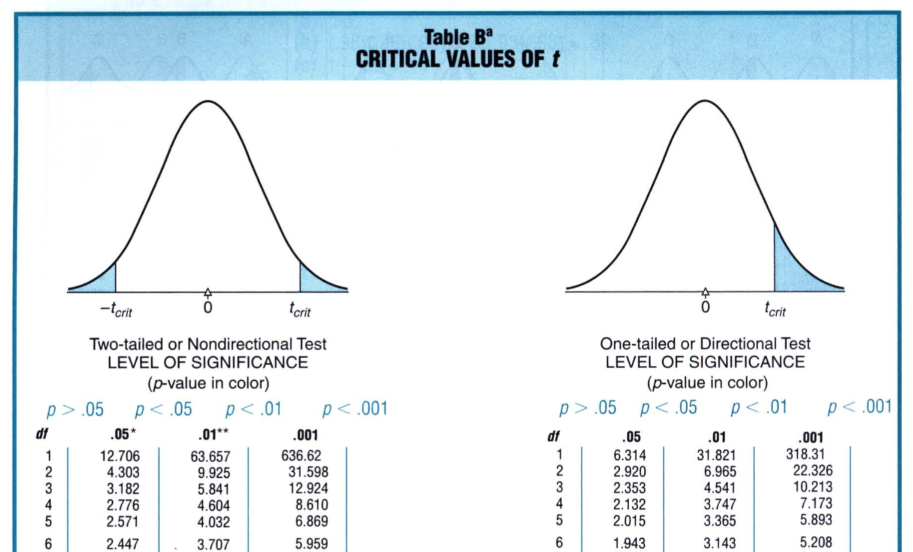
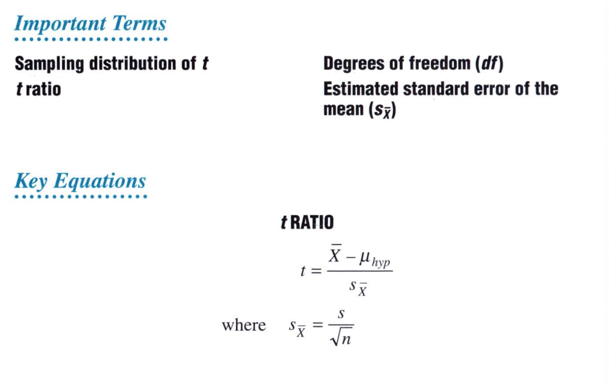

# Chapter 13: $t$ test For One Sample

To understand the t test, let's consider an example: A given country has federal laws that dictate that new automobiles  must average 45 miles per gallon of gasoline. Suppose we are the federal organization and we want to test whether a certain automobile company complies with these terms. We set out to pick a handful of cars from their lineup. Our hypothesis is that they don't comply while the null hypothesis is that they comply. We would write such a hypothesis as follows: 

 

Next we decide on the significance limit. We know that if the null hypothesis is true and we discard it, making a Type I error, we would be unnecessarily penalizing the automobile company. So, we set the significance value at 1% or 0.01 instead of 5% or 0.05. 

We could carry on the steps we followed in Chapter 10 and compute the z-score and find whether the null hypothesis is true or should it be discarded. However, note that we only have a handful of cars that we use to test this hypothesis so the z test cannot be used. Instead we will make use of the t-test. We will see more why this is the case. 

## Sampling Distribution of t

Like the sampling distribution of z, the **sampling distribution of t** represents the distribution that would be obtained if a value of t were calculated for each sample mean for all possible random samples of a given size from some population. The t distribution is also called Student's t distribution and the t test is also called Student's t test. 

At the heart of t distribution is the **degrees of freedom**. We discussed degrees of freedom in Chapter 4. Recall that when the n deviations about the sample mean are used to estimate variability in the population, only n - 1 are free to vary because of the restriction that the sum of these deviations must always equal zero. Since one degree of freedom is lost, the total degrees of freedom is `n - 1`. We say that the sample has n - 1 degrees of freedom: 
$$
df = n - 1
$$
This is the degrees of freedom for one sample. 

In our case, suppose we take 6 cars as our sample, the corresponding t test is based on a sampling distribution with `6 - 1 = 5` degrees of freedom. 

The figure below shows three t distributions with three different degrees of freedom. 

Notice that as the degrees of freedom increases, the tails on the either end of the t distribution become thinner while if the degrees of freedom are small, the tails are thicker. When the degrees of freedom are infinite, the t distribution looks just like the z distribution. 

To test the hypothesis, we need to find critical values for t, just as we did for z. For 0.01 level of significance, the critical value for t distribution is $\pm 3.365$. This is used for one-tailed test. If we decide to use a two-tailed test, for the same level of significance, we would find critical values of $\pm4.032$. 

The above shows the t distribution we will use and the critical value we will consider either to accept or reject the null hypothesis. 

## t Test

There are a lot of similarities between the z test and the t test. The process is similar with one caveat: the population standard deviation is unknown and it must be estimated from the sample. Now, we would say that this is quite the same for the z test. However, in the z test, the central limit theorem tells us that the standard deviation of the sample mean is the standard deviation of the population. However, in the case of the t test, we cannot apply the central limit theorem because the sample size is small. Therefore, we will have to estimate the population standard error in a different way. Nonetheless, the equation to computing the t test is as follows: 

Now let's see how we can estimate the standard error of the population. The **estimated standard error of the mean is given by**:
$$
s_{\bar{X}} = \frac{s}{\sqrt{n}}
$$
where $s$ is given by: 
$$
s = \sqrt{\frac{\sum(X - \bar{X})^2}{df}}
$$
There we have it. We know the degrees of freedom, the mean of the sample and the values within the sample. Using these three values, we can compute the estimated standard error. Let's take an example to illustrate this. We have the milage of six cars as given by the variable $X$: 

| X    | $X^2$ |
| ---- | ----- |
| 40   | 1600  |
| 44   | 1936  |
| 46   | 2116  |
| 41   | 1681  |
| 43   | 1849  |
| 44   | 1936  |

So, in this case we have: 

n = 6
$$
s = \sqrt{\frac{11118 - 11094}{6 - 1}} \\
=\sqrt{\frac{24}{5}} \\
= 2.19
$$
 With that we can now find the standard error: 
$$
s_{\bar{X}} = \frac{2.19}{6} = 0.89
$$
We can now compute the t test. We know from the problem that the hypothesized population mean is 45. So, we have: 
$$
t = \frac{\bar{X} - \mu_{hyp}}{s_{\bar{X}}} \\
= \frac{43 - 45}{0.89} = -2.25
$$
We see that the value is less negative than our critical value of -3.365. Hence, we cannot reject the null hypothesis. This in turn means that the automobile company complies with the federal regulations. 

## Common Theme of Hypothesis Tests

In the remainder of the book we will discuss a vareity of tests—z, t, F, U, T and H—for an assortment of situations. 

> All of these hypothesis tests represent variations on the same theme: if some observed characteristic, such as the mean for a random sample, qualifies as a rare outcome under the null hypothesis, the hypothesis will be rejected. Otherwise, the hypothesis will be retained. 

To determine whether an outcome is rare, the observed characteristic is converted to some new value, such as t, and compared with critical values from the appropriate sampling distribution. Generally, if the observed value equals or exceeds a positive critical value, the outcome will be viewed as rare and the null hypothesis will be rejected. 

## Estimating The Standard Error

If the population standard deviation is unknown, it must be estimated from the sample. It is because of this that we need to replace the z test with the t test. In the case of the t test, we estimate the standard error from the sample. 

where $s_{\bar{X}}$ represents the estimated standard error of the mean; $n$ equals the sample size; and $s$ is defined as

 

where $s$ is the sample standard deviation; df refers to the degrees of freedom; and SS is the sum of squared errors:

The new version of the standard error, the **estimated standard error of the mean**, is used whenever the unknown population standard deviation must be estimated. 

## Calculations for the $t$ test

Here we highlight the steps taken to compute the $t$ test: 

1. Given the data find the mean of the same $\bar{X}$
2. Compute the sum of squared errors, SS
3. Compute the value of $s$
4. Compute the estimated standard error of the mean, $s_{\bar{X}}$
5. Assign the value to $\mu_{hyp}$
6. Compute the $t$ score. 

## Confidence Interval for $\mu$ based on $t$

Rather than testing the hypothesis based on 45 mpg, you may want to estimate the unknown mean gas milage for the population of cars. When the population standard deviation is unknown and, therefore, must be estimated, as in the present case, $t$ replaces z in the new formula for the confidence interval: 

where $\bar{X}$ is the sample mean; $t_{conf}$ represents a number from the t tables and $s_{\bar{X}}$ is the estimated standard error of the mean. 

To find the  $t_{conf}$, first compute the number of degrees of freedom and then look at the column that shows the degrees of freedom. For that find the  $t_{conf}$. In our case, we will use 95% confidence interval and we have 6-1 = 5 degrees of freedom. So, our  $t_{conf}$ would be: 

We look at the two-tailed t test. We use 95% CI, which corresponds to a significance of 5%. With 5 degrees of freedom, our $t_{conf}$ is 2.571. With this we compute our CI to be: 

It can be claimed that with 95% confidence, the interval ebtween 40.71 and 45.29 includes the true mean gas mileage for all of the cars in the population. Although we never really know whether this particular confidence interval is true or false, we can be reasonably confident that the true mean for the entire population of cars is neither less than 40.71 mpg nor more than 45.29 mpg. 

## Assumptions

Whether testing hypotheses or constructing confidence intervals for population means, use $t$ rather than $z$ whenever, **as almost always is the case**, the population standard deviation is unknown. Strickly speaking, when using $t$, you must assume that the underlying population is normally distributed. Even if this normality assumption is violated, $t$ retains much of its accuracy as long as the sample size isn't too small (>10). 

