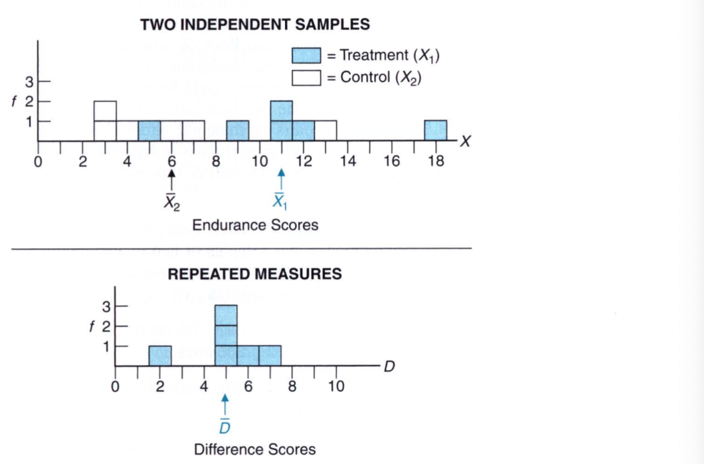
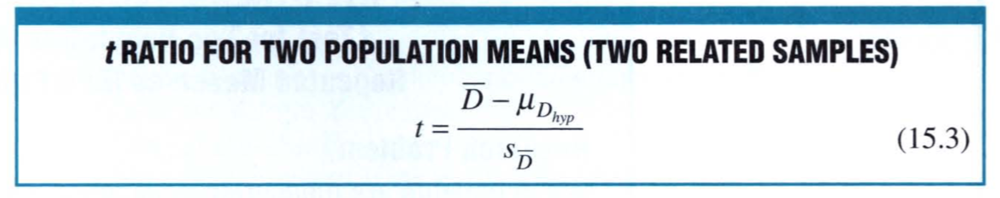
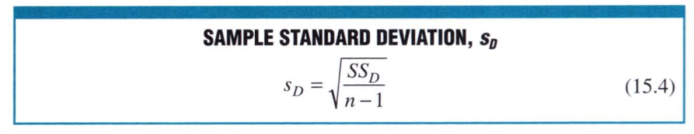
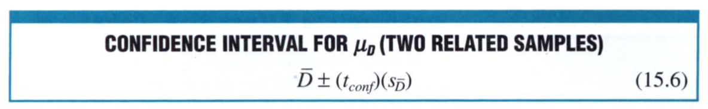
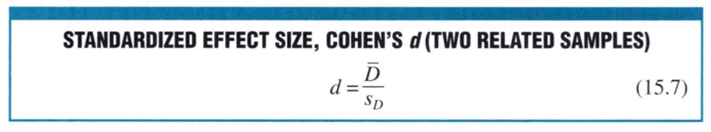
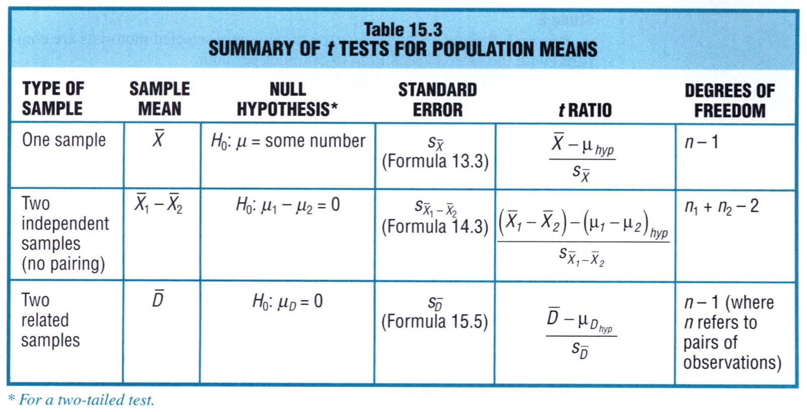
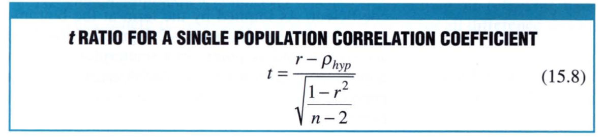
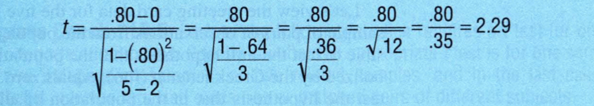
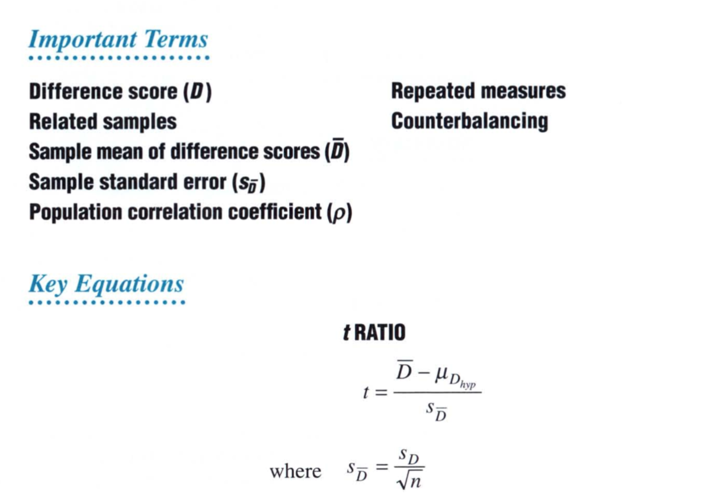

# Chapter 15: $t$ Test of Two Related Samples (Repeated Measures)

The differences among individuals can blunt the precision of a statistical analysis because of their considerable impact on the overall variability among scores. You can control this by measuring each subject twice and using a t test for repeated measures. This $t$ test can be extra sensitive to detecting a false null hypothesis. However, several potential problems must be addressed before adopting a repeated-measures design. 

 ## EPO Experiment with Repeated Measures

In the EPO experiment we saw that the endurance scores of patients reflect not only the effectof EPO, if it exists but also the random effects of many uncontrolled factors. One such uncontrolled factors is the *individual differences* which reflects the array of characteristics such as attitude, personality, physical fitness, etc.. These can cause appreciable random variations among endurance scores, and therefore, make it more difficult to detect any treatment effect. We can circumvent this by measuring each subject twice, before and after the treatment. This will allow us to eliminate the individual differences we encounter. 

### Difference (D) Scores

The difference D scores for a given patient before ($X_1$) and after ($X_2$) is given by, 

This essentially converts the two-sample problem into a one-sample problem with D scores. 

The mean difference can be obtained in the following way: 

Let's look at the example discussed in the previous chapter about EPO experiment. The table below shows the scores and the difference between the two. 

The figure below shows the two independent samples and the repeated measures. We see that the means are different between indpendent samples and repeated measures. 

So, the technique for controlling individual differences is referred to as **repeated measures**, because each subject is measured more than once. The special case of repeated measures is the **two related samples** where each observation in one sample is paired, on a one-on-one basis, with a single observation in the other sample. 

One of the drawbacks of repeated measures is that there should be considerable time for the patient to be between the treatment group and the control group. We should wait as long as it takes to be absolutely sure that there are no lingering effects from the treatment that continue to exist when the patient is put in the control group. If there are concerns that effects cannot be eliminated, use each subject in only one condition. 

Sometimes, it is customary to randomly assign half of the subjects to experience the two conditions in a particular order— say first the treatment and then the control condition—while the other half of the subejcts experience the two conditions in the reverse order. This is known as **counterbalancing**. This takes into consideration the sequence bias in one direction over the other. 

## Statistical Hypotheses

As we look at the difference, we are left with a single score and we can express the null hypothesis in terms of this new population. If we think that the EPO has either no effect or a negative effect, we can write out null hypothesis as, 

And the alternative hypothesis as, 

This translates to a directional hypothesis. 

## Sampling Distribution of $\bar{D}$

The sample mean of the difference scores, $\bar{D}$ varies from sample to sample, and it has a sampling distribution with its own mean, $\mu_{\bar{D}}$, and standard error $\sigma_{\bar{D}}$. We can think of this as the sample distribution of sample means, which was a distribution of means. It has an associated mean and standard error. This is something we saw in Chapter 9. 

Since the mean of the sampling distribution equals the population mean, we can write the mean of the distribution of difference scores as, 

In the same way, we can compute the standard error of the distribution of mean of difference scores as, 

## $t$ Test

We define the test for repeated measures, where we have the difference scores as, 

with $n - 1$ degrees of freedom. In this case, the $\mu_{D_{hyp}}$ represents the hypothesized population mean, which is zero. 

### Detailed Calculations of the Repeated Measures EPO Experiment

#### Research Problem

When patients are measured twice, once with and once without EPO, does the population mean difference score show greater endurance due to EPO? 

#### Statistical Hypothesis

The statistical hypothesis is given by, 

#### Decision Rule

Reject the null hypothesis at 0.05 level of significance if $t \geq 2.015$ with df = n - 1 = 6-1 =5 degrees of freedom. 

#### Calculations

We find, 
$$
t = \frac{5 - 0}{0.68} = 7.35
$$

#### Decision

Reject the null hypothesis at 0.05 level of significance because the calculated $t$ of 7.35 exceeds 2.015. 

#### Interpretation

There is evidence that when patients are measured twice, EPO is found to increase the mean endurance score. 

Here are some formulae that are used in the calculations of t-scores. 

## Estimating Effect Size

The confidence interval can be constructed from the following equation, 

The $t_{conf}$ represents the number (distributed with n - 1 degrees of freedom) from the $t$ tables, which satisfies the confidence specifications. 

For our example, we have the following: 

It can be claimed with 95% confidence, that the interval between 3.25 and 6.75 minutes includes the true mean for the population of difference endurance scores. In this case, we see that the both limits of the confidence intervals are positive. This suggests that when the patient is measured twice, EPO facilitates endurance. We can also be confident that the true facilitative effect is neither less than 3.25 minutes nor more than 6.75 minutes. 

Having rejected the null hypothesis for the EPO experiment with repeated measures, we can claim that the sample mean difference of 5 minutes is statistically significant. We can guage the importance of the statistically significant result by calculating the Cohen's d for two related samples, 

## Assumptions

The main assumption in $t$ test is that the populationof difference scores are normally distributed. We do not need to be too concerned as long as the sample size is large enough. If you see departure from normality, either increase the sample size or make use of the less sensitive but more assumption-free **Wilcoxon T test** (described in Chapter 20).

## Overview: Three $t$ Tests for Population Means

So far we have seen three $t$ tests. You must decide whether to use a $t$ test for one sample, two independent samples, or two related samples. This decision is fairly straightforward if you proceed, step by step, as follows: 

#### One or Two Samples? 

First, decide whether there are one or two samples. If there is only one sample, because the study deals with a single set of observations, then, of course, you need not search any further. The appropriate $t$ is that for one sample. 

#### Are the Two Samples Paired? 

Second, if there are two samples, find out if they have a one-to-one basis. If they do, then use the two related samples $t$ test. However, if there is no evidence of pairing between individual observations, then the appropriate $t$ is that for two independent samples. 

## $t$ Test for the Population Correlation Coefficient $\rho$

 The $t$ test can also be used to determine whether the correlation coefficient $\rho$, we get from a correlation study is significant or not. In this case, the null hypothesis is that there is no correlation while the alternative hypothesis is that there is correlation. We can then obtain the $t$ score for this coefficient as, 

 

Here's how we would go about doing it. Look at the problem of number of cards sent and the number of cards received from Chapter 6. 

#### Problem

Could there be a correlation between the number of cards sent and the number of cards received for the population of all friends? 

#### Statistical Hypotheses

$$
H_0: \rho = 0\\[20pt]
H_1: \rho \neq 0
$$

#### Decision

Reject the null hypothesis at 0.05 level of significance if $t \geq 3.182$ or if $t \leq -3.182$. Here we used $n  - 2 = 3$ degrees of freedom. 

#### Calculations

Given that $\rho$ = 0.80 and $n$ = 5, 

#### Decision

Retain the null hypothesis at the 0.05 level of significance because $t = 2.29$ is much less than 3.182. 

#### Interpretation

The population correlation coefficient could equal zero. There is no evidence of a relationship between the number of cards sent and the number of cards received in the population of friends. 

### Importance of Sample Size

This is quite surprising that even at $\rho = 0.8$, the $t$ test tells us that there may not be any correlation between the variables. But we need to look at the sample size. Because we only have 5 samples, the variability is fairly large. In order to reject the null hypothesis, we may need $\rho = 0.88$ at the current sample size. If we had a much larger sample, we could have easily rejected the null hypothesis. 

The assumption the $t$ test makes here is that the values of X and Y, which are correlated come from a normal bivariate population. If they deviate from the normal distribution, the test results will be approximate and they should be interpreted accordingly. 

