# Chapter 14: $t$ test for Two Independent Samples

In this chapter we will see how to compare the means of two independent groups that will allow us to make unambiguous conclusions about cause-effect relationships. For example, we may compare a treatment group and the control group. We will use an example to see how this is done. We will also look at the difference between statistically significant and the p-value. p-value is at the core of hypothesis testing. 

## EPO Experiment

To start with suppose we have been asked to test whether a synthetic drug called erythropoietin enhances performace. We are given a treatment group and a control group. This experiment is independent as the control group and the treatment group both are completely different indiviudals. The treatment group is given EPO while the control group is not given any drug. For computational convenience, we only have a very small sample in each of the two groups. We let both groups do an endurance test where we measure the performance in terms of duration. Higher the duration better is the performance. The figure below shows the indurance performance of the two groups: 

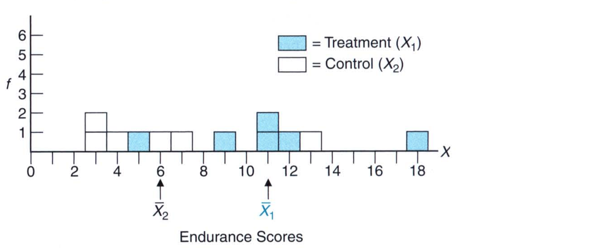

The mean difference between the two groups is `11 - 6 = 5`. We would like to know the answer to the following questions: 

* How do we interpret this difference? Does it mean the EPO enhances the endurance? 
* Given the overlap between the two groups, is this difference transitory and just likely to appear by chance? 

To answer these questions we make use of the $t$ test for two independent samples. This test will evaluate the difference of 5 minutes and will let us know if this is real or by chance. 

### Assumptions

There are few things to consider before we do the test: 

* The two samples are **independent** because each group consists of different people. In other words, there is no bias between the two samples. 

* The samples were taken **randomly** from a larger population. 

* The difference between population means reflects the **effect** of EPO on endurance. The effect can be zero, it can be positive or negative. When it is negative we would state that EPO hinders endurance and not enhances it.

* The variances of the two populations are equal. 

   

### Statistical Hypotheses

Once these assumptions have been cleared, we move to constructing the **null hypothesis** and the **alternative hypothesis**. We are looking to see whether the EPO enhances endurance. Therefore, our null hypothesis would be: 
$$
H_0 : \mu_1 - \mu_2 \leq 0
$$
The alternative hypothesis is that the EPO does enhance endurance. So, we would write this as: 
$$
H_1: \mu_1 - \mu_2 > 0
$$
Depending on what the researcher wants, we would have the following alternative hypotheses: 
$$
H_1: \mu_1 - \mu_2 \neq 0 \\[15pt]
H_1: \mu_1 - \mu_2 < 0
$$

## Sampling Distribution of $\bar{X_1}$ and $\bar{X_2}$

The samples that we have come from two populations: control group and treatment group. When we compute the difference of the mean, we cannot simply rely on one single point. The new mean difference for a repeat experiment would most likely differ that from that for the original experiment. The **sampling distribution of **$\bar{X_1}$ and $\bar{X_2}$ is a concept introduced to account for the variability associated with differences between sample means. *It represents the entire spectrum of differences between sample means based on all possible pairs of random samples from the two underlying populations*. Once the sampling distribution has been centered about the value of the null hypothesis, we can determine whether the one observed sample mean difference qualifies as a common or a rare outcome. 

From chapter 9, we know that the mean of the sample distribution is the mean of the population. Hence, the difference of the means of the sampling distributions will also be the difference of the mean of the populations. 
$$
\mu_{\bar{X_1} - \bar{X_2}} = \mu_1 - \mu_2
$$
The **standard deviation** of the difference of the means of the sampling distribution is: 
$$
\sigma_{\bar{X_1} - \bar{X_2}} = \sqrt{\frac{\sigma^2_1}{n_1} + \frac{\sigma^2_2}{n_2}}
$$
where $n_1$ and $n_2$ are the two sample sizes and $\sigma^2_1$ and $\sigma^2_2$ are the population variances.  

> The standard error of the difference between means, is a rough measure of the average amount by which any sample mean difference deviates from the difference between population means. 

If the observed difference is sufficiently larger than the standard error, it qualifies as a rare event and the null hypothesis is rejected if not, the null hypothesis is retained. 

## $t$ Test

The $t$ test is expressed in terms of the $t$ ratio: 

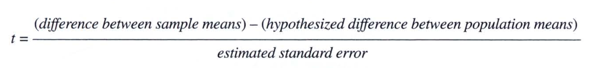

Which we can express as symbols: 

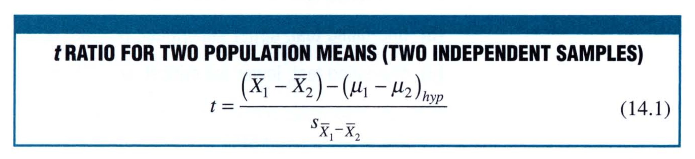

Where the degrees of freedom are: 
$$
df = n_1 + n_2 - 2
$$
and **$(\mu_1 - \mu_2)_{hyp}$ represents the hypothesized difference of zero between population means**; $s_{\bar{X_1} - \bar{X_2}}$ represents the estimated standard error. 

### Finding the critical $t$ values

To find the critical values of $t$, we look at the Table B in the book. The table looks something like this: 

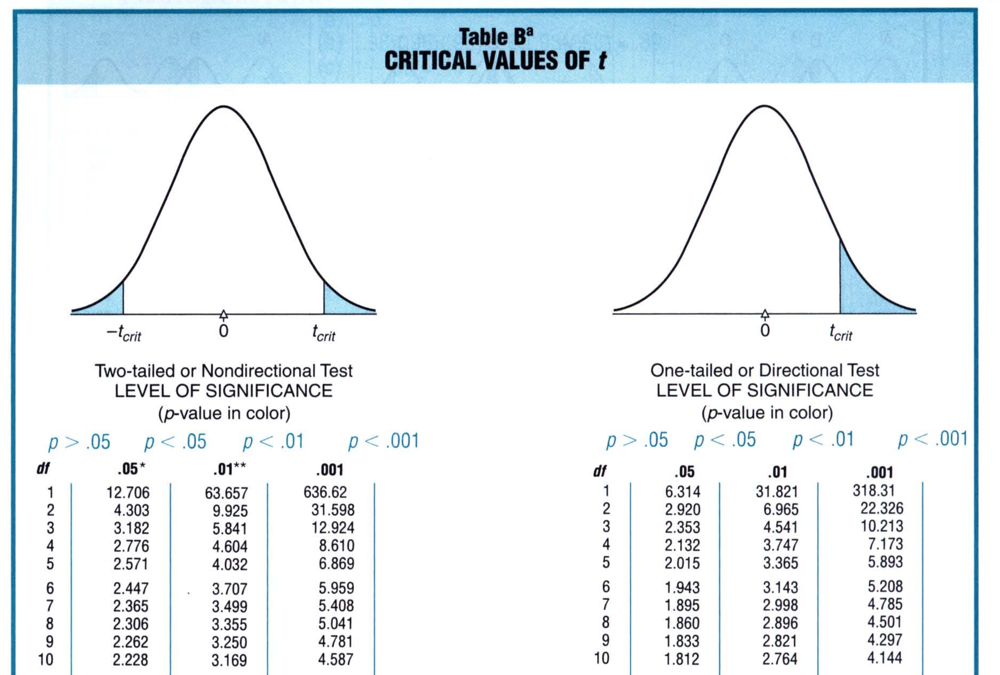

In our case, we have a one-tailed test so we look at the right-hand side. Next, we need to compute the degrees of freedom. In our example, we have 6 samples of each group. So, our degrees of freedom would be: 
$$
6 + 6 - 2 = 10
$$
For $df$ = 10, we choose our level of significance. In general, we select 0.05. For this value our critical $t$ value is: `1.812`. Thus our hypothesized sampling distribution of $t$ would look something like this: 

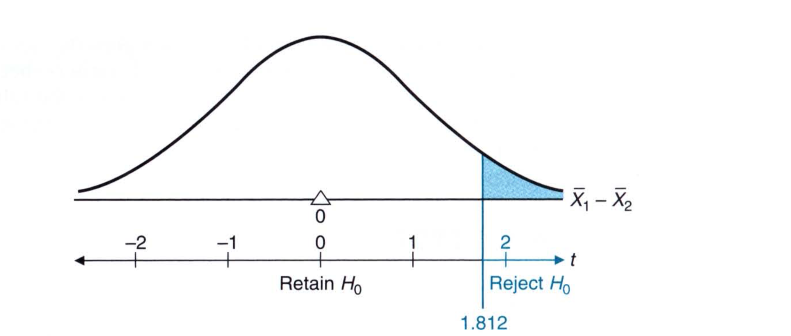

## Calculations for the $t$ Test

Now that we have our critical value, let's find out whether the mean difference between the two groups is a common event or a rare event

| Serial Number | Treatment Group | Control Group |
| ------------- | --------------- | ------------- |
| 1             | 12              | 7             |
| 2             | 5               | 3             |
| 3             | 11              | 4             |
| 4             | 11              | 6             |
| 5             | 9               | 3             |
| 6             | 18              | 13            |

#### Step 1: Compute the means

$\bar{X_1}$ = 66/6 = `11`

$\bar{X_2}$ = 36/6 = `6`

#### Step 2: Compute the standard error

We first compute the two **sample sums of squares**:

$SS_1$ = $\sum X_1^2  - \frac{\sum (X_1^2)}{n_1}$ = 816 - 726 = `90`

$SS_2$ = $\sum X_2^2  - \frac{\sum (X_2^2)}{n_2}$ = 288 - 216 = `72`

Next, we compute the **pooled variance**, $s_p$, which is defined as follows: 

$s_p$ =$\frac{SS_1 + SS_2}{df}$ = 162/10 = `16.2`

Using the information, we find the difference in standard error: 

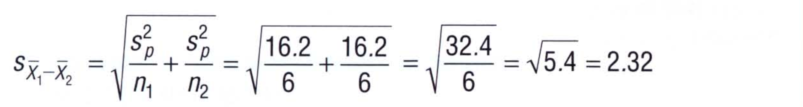

#### Step 3: Compute $t$ score

The $t$ score is given by: 

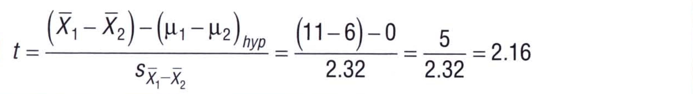

In this case, we find that the t value of 2.16 exceeds our critical t value of 1.812. This suggests that the difference between population means is greater than zero. Therefore, there is eveidence that EPO increases the mean endurance scores of treatment patients. 

## p-Values

In general, the null hypothesis is neither retained nor rejected but viewed with degrees of suspicion, depending on the degree of rarity of the observed value of the test result. Instead of subscribing to a single predetermined level of significance, the investigator waits until *after* the test result has been observed and then assigns a probability, known as a p-value, representing the degree of rarity attained by the test result. 

> Rather than setting the level of significance before doing the experiment, the researcher can compute the probability of getting a score (z or t) after the experiment. The p-value for a test result represents the degree of rarity of that result, given that the null hypothesis is true. Smaller p-values tend to discredit the null hypothesis and to support the research hypothesis.  

Strickly speaking, the p-value indicates the degree of rarity of the observed test result when combined with all potentially more deviant test results. In other words, the p-value represents the proportion of area, beyond the observed result, in the tail of the sampling distribution, as shown in the shaded area for the two different results. 

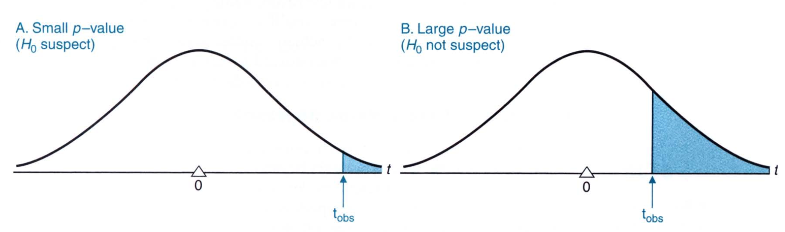The figure above shows the one-tailed p-value. Just like the test, we can also use the two-tailed p-values. The two-tailed p-values require equivalent shaded areas on both sides of the distribution and the resulting two-tailed p-value would be twice as large as its corresponding one-tailed p-value. 

Example of the table seen above shows a way to find approximate p-values, that is, p-values involving an inequality, such as p < 0.05 or p > 0.05. To find the approximate p-value for the t = 2.16, we first find the degrees of freedom column. Next, we look across that line. We have 1.812, 2.764, and 4.144. If you look at the top, they correspond to p-values of 0.05, 0.01, and 0.001. The value of 2.16 is between 1.812 and 2.764. Which means, that this value has a p-value is that lower than 0.05 and larger than 0.01. Or that getting this value in an experiment by chance has a probability of less than 5% given that $H_0$ is true. Therefore, it supports the alternative hypothesis. This conclusion is consistent with the decision to reject $H_0$ when a more structured hypothesis test at the 0.05 level of significance was conducted for the same data. 

The computation of p-values after the experiment is not considered a structured hypothesis test, where the structured hypothesis test requires setting the level of significance before the experirment is performed. Noentheless, this less structured approach does have merit. Having eliminated the requirement that the null hypothesis be either retained or rejected, you can postpone a decision until sufficient evidence has been mustered, possibly from a series of investigations. For example, in an experiment we obtain a t value of 1.70, which is only slightly deviant than the critical t value of 1.812 for the 0.05 level of significance. Given the less structured approach, an investigator might establish that p=0.06 for the observed t. Reporting the borderline result with that p-valule implies at least some support for the research hypothesis. 

The **drawback to this unstructured approach** is that in the absence of a firm commitment to either retain or reject the null hypothesis according to some predetermined level of significance, it's difficult to deal with the important notions of type I and type II errors. 

### Level of Significance or p-value? 

Do not confuse the level of significance with the p-value, even though they originate from the same table and look the same

> Specified **before** the test result has been observed, the **level of significance** describes a degree of rarity that, if attained by the test result, triggers the decision to reject $H_0$ 

> Specified **after** the test result has been observed, the **p-value** describes the most impressive degree of rarity actually attained by the test result. This would then trigger the decision to reject $H_0$. 

## Statistically Significant Results

Tests of hypotheses are often referred to as **tests of significance** and test results are described as being **statistically significant** is $H_0$ is rejected or **not statistically significant** is $H_0$ is retained. Rejecting the null hypothesis and statistically significant both signify that the test result can't be attributed to chance. However, there are some nuances between what can be said to be statistically significant and what can be said about rejecting the null hypothesis: 

*  Rejecting the null hypothesis always refers to the population, such as rejecting the hypothesized zero difference between two population means
* Statistically significant always refers to the sample, such as assigning statistical difference between two sample means

It is not be used for the either of the two. In other words, you cannot say that you reject the null hypothesis for a sample, nor can you say that the null hypothesis is statistically significant. Statistical significance doesn't imply that the underlying effect is important. Statistical significance between pairs of sample means implies only that the null hypothesis is probably false, and not whether it's false because of a large or small difference between population means. 

### Beware of Excessively Large Sample Sizes

Using excessively large sample sizes can produce statistically significant results that lack importance. If the difference between thw means is small, increasing the sample size to a large one, can make the result statistically significant. Statistical significance merely indicates that an observed effect, such as an observed difference between sample means, is sufficiently large, relative to the standard error, to be viewed as a rare outcome. It also means that the observed outcome is reliable and that it would reappear as a similarly rare outcome in a repeat experiment. It is very desirable, therefore, that we go beyond reports of statistical significance by estimating the size of the effect, and, if possible judging its importance. 

## Estimating Effect Size: Confidence Interval

Generally, it makes sense to estimate the effect in an experiment only if the result is statistically signficant. If that is not the case, we could consider the effect to be transitory and would attribute it to chance. 

### Confidence Intervals

As we have seen, CI for the sample mean is a range of values that, in the long run, include the unknown effect a certain percent of the time. Given the two independent samples, a confidence interval for the difference of their means can be constructed from the following expression: 

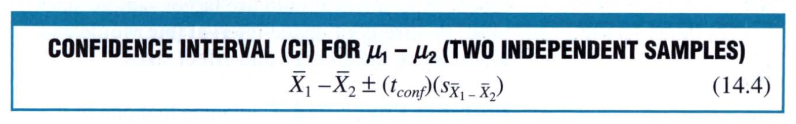

where $\bar{X_1} - \bar{X_2}$ represents the difference between sample means; $t_{conf}$ represents a number, distributed with $n_1 + n_2 - 2$ degress of freedom, and $s_{\bar{X_1} - \bar{X_2}}$ represents the estimated standard error of the mean difference. For the example of EPO, we can compute this as follows: 

Now it can be claimed, with 95% confidence that the interval between -0.17 minutes and 10.17 minutes includes the true effect size, that is, the true difference between population means for endurance scores. 

The numbers in this confidence interval refer to *differences* between population means, and the signs are particularly important since they indicate the direction of these differences. Otherwise, the interpretation of the confidence interval for $\mu_1 - \mu_2$ is the same as that for $\mu$. It is interesting to note that in this example, the confidence interval can be negative. This means that EPO can actually hinder performance, albeit a little. 

We also find that the range is fairly large and imprecise as we would expect given the very small sample sizes and therefore a relatively large standard error. If we were to repeat the experiment, we would use a much larger sample size. 

## Estimating Effect Size: Cohen's d

 Cohen's d describes effect size by expressing the observed mean difference in standard deviation units. This is similar to z-scores. The formula is as follows: 

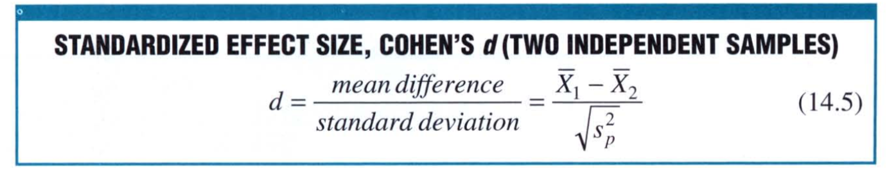

where $s_p$ is the pooled variance estimate. 

Division of the mean difference by the standard deviation has several desirable consequences: 

* This allows to create a stable frame that is not influenced by the sample size. This allows to make straightforward comparisons between studies with appreciably different sample sizes
* The d is unitless and is therefore is expressed only in terms of standard deviations

### Cohen's Guidelines for d

Here's some guidelines on interpreting the values of d: 

* Small effect size if d is less than or in the vicinity of 0.20 (1/5 SD)
* Medium effect size if d is in the vicinity of 0.5 (1/2 SD)
* Large effect size if d is in the vicinity of 0.8 (4/5 SD)

Here's an example of Cohen's d for GPAs, IQs, and SAT scores: 

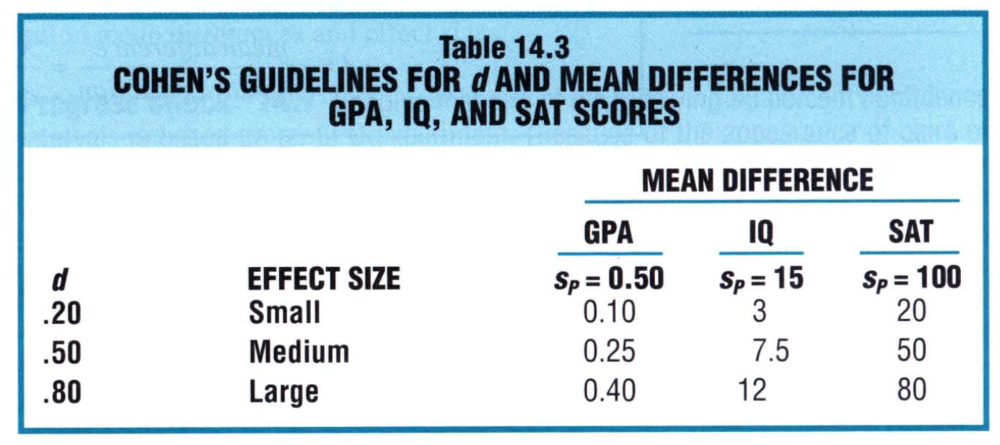

When working wtih Cohen's d, it is important to take into consideration special circumstances. For example a Cohen's d value of 0.20 is small in SAT scores and perhaps worthless if the experiment involved a lengthy series of workshops on taking SAT scores but it is viewed as worthwhile if it occured after a brief study session. 

The figure below shows graphicaly the impact of Cohen's d guidelines on the degree of separation between pairs of normal curves. 

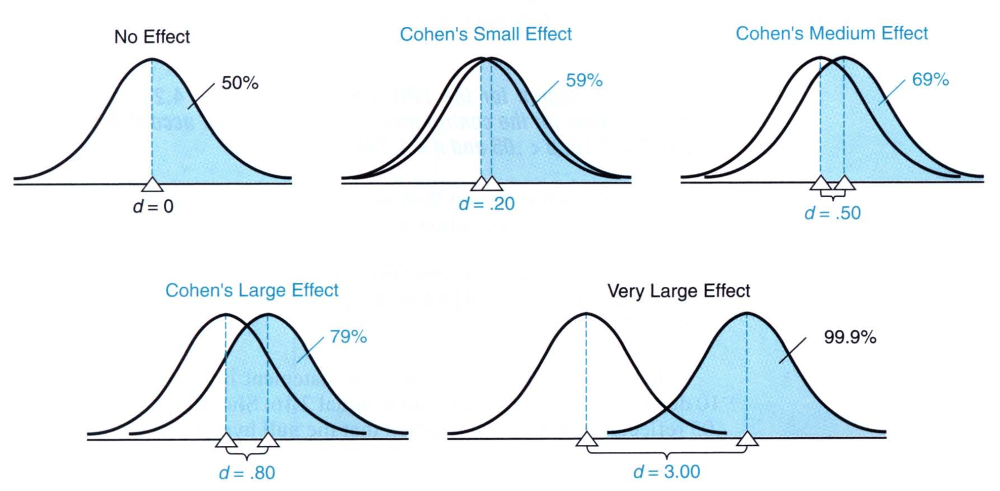

The shaded area reflect the percent of scores in one curve that exceed the mean of the other curve. 

## Reports in the Literature

It's become common practice to report means and standard deviations, as well as the results of statistical tests. A published report of the EPO experiment might read as follows: 

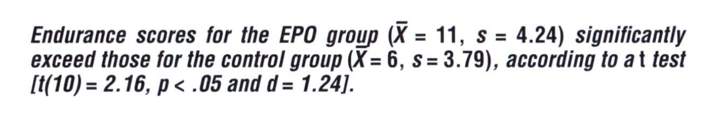

It is also common practice to describe results with data graphs. In the data graphs as shown below the dependent variable, mean endurance, is identified in the vertical axis, while valules of the independent variable are located as points in the horizontal axis. Dots identify the mean endurance scores for EPO and control groups while error bars reflect the standard error associated with each dot. 

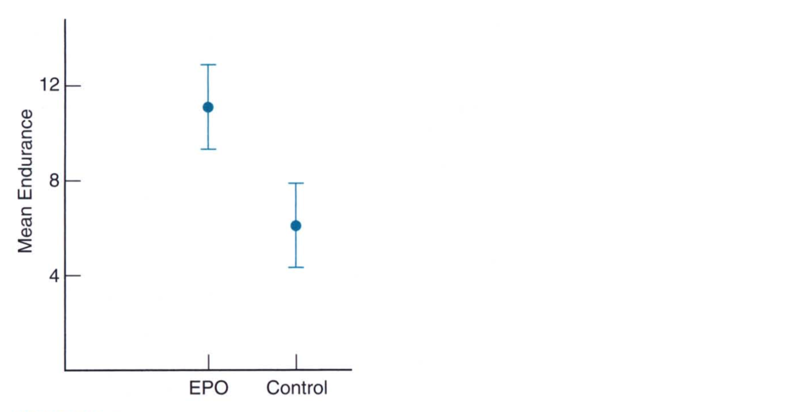 

## Assumptions

Whether testing a hypothesis or constructing a confidence interval, t assumes that both underlying populations are normally distributed with equal variances. You do not need to be concerned if both sample sizes are greater than 10. If you see conspicuous departure from normality consider the following: 

1. Increase sample sizes to minimize the effect of any non-normality
2. Equate sample sizes to minimize the effect of unequal population variances
3. Use a slightly less sensitive, more complex version of t designed for unequal variances
4. Use a less sensitive but more assumption free test such as the Mann-Whitney U test described in Chapter 20

## Computer Output

If you were to run the test in R or SAS, you would get an out put that looks like this: 

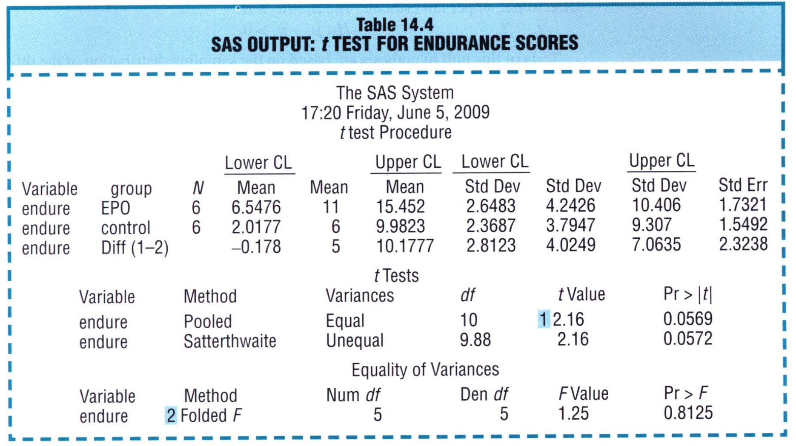

We will see more of these in the subsequent chapters. 

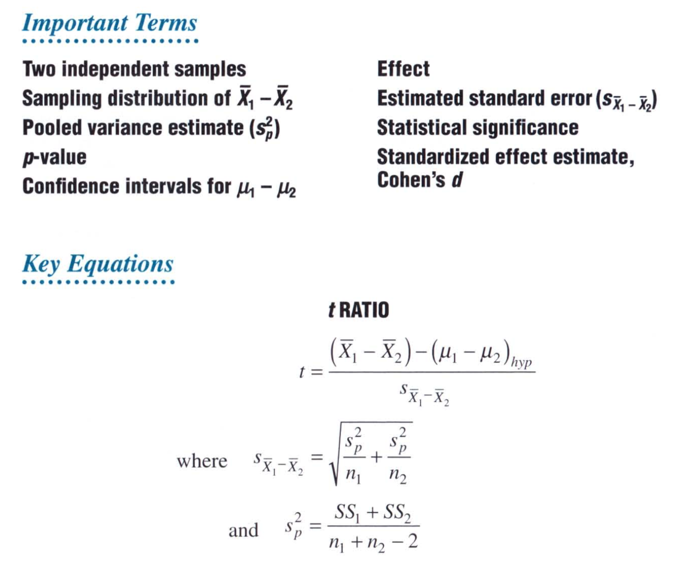

