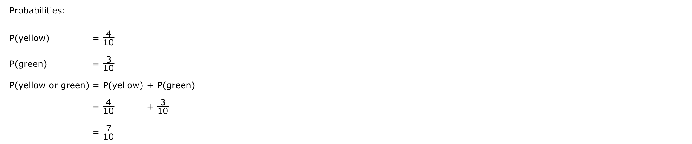

[TOC]

# Statistics Notes

These are my statistics notes for the Data Science interview prepration. These notes are taken from Khan Academy couse on Statistics and Probability. 

## Probability

The **sample space** is an important concept in probability. 

>  A set S that consists of all possibile outcomes of a random experiment is called a **sample space** and each outcome is called a **sample point**. Often there are more than one sample space that can describe outcomes of an experiment, but there is usually only one that will provide the most information. 

When you toss a coin the sample space is $S = \{H, T\}$, where $H$ is the head and $T$ is the tail. When you throw a die, the sample space consists of 6 outcomes: $S = \{1, 2, 3, 4, 5, 6\}$. 

> An **event** is a subset A of the sample space S. That is, it is a set of possible outcomes. If the outcome of an experiment is an element of A, we say that the event A has occurred.  

### Set Operations

For a given set A and B, which are subset of sample space, S we have the following operations: 

* A $\cup$ B  is the event "either A or B or both". This is known as the union of A and B
* A $\cap$ B  is the event "both A and B". This is known as the intersection of A and B
* A' is the event that is "not A". This is known as the complement of A
* A - B = A $\cap$ B is the event "A but not B". In particular, } A' = S - A

### Probability Theory

The **classical approach of probability** is that if an event can occur in h different ways out of a total number of n possibile ways, all of which are **equally likely**, then the probability of the event is: 
$$
\text{Probability} = \frac{h}{n}
$$

The **frequency approach of probability** is that after n repetitions of an experiment, where n is very large, an event is observed to occur in h of these, then the probability of the event is h/n. This is also called the *empirical probability*of the event. 

Both the classical and frequency approaches have serious drawbacks, the first because each event needs to be equally likely and second because the events need to be very large. Because of these drawbacks, we have axiomatic approach to probability

### The Axioms of Probability

Suppose we have a sample space S, and let A be the event in this sample space. The probability of A is defined as P(A), where P is the probability function. 

* For every event A in the sample space: 
  $$
  P(A) \geq 0
  $$

* For the sure or certain event S: 
  $$
  P(S) = 1
  $$

* For any number of mutually exclusive events $A_1$, $A_2$, …, 
  $$
  P(A_1 \cup A_2 \cup A_3...) = P(A_1) + P(A_2) + P(A_3) ...
  $$

* For every event A, 
  $$
  0 \leq P(A) \leq 1
  $$

* For all events $A_1$, $A_2$, ...in the sample space S,
  $$
  \sum P(A_i) = 1
  $$

### Addition Rule of Probability

We already saw this rule stated above but want to reiterate out here. If A and B are **mutually exclusive events** (i.e., they cannot occur together), the probability of A or B occuring is given by: 
$$
P(A \cup B) = P(A) + P(B)
$$

#### Example

 A glass jar contains 1 red, 3 green, 2 blue, and 4 yellow marbles. If a single marble is chosen at random from the jar, what is the probability that it is yellow or green?

Because the events are mutually exclusive we can use the addition rule: 

If the two events A and B are **not mutually exclusive**, the probability that A or B will occur is: 

$$
P(A \cup B) = P(A) + P(B) - P(A \cap B)
$$

### Multiplication Rule to Independent Events

When two events, A and B are mutually exclusive, the probability of A and B occuring is: 
$$
P(A \cap B) = P(A)\cdot P(B)
$$

 #### Example

Suppose that we are going to roll two fair 6-sided dice. What is the probability that both dice show a 3? 

P(A) = 1/6 and P(B) = 1/6. For both to occur at the same time: P(A and B) = 1/36. 

### Multiplication Rule for Dependent Events

Given two events A and B. Suppose the B depends on A. Then, 
$$
P(A \text{ and } B) = P(A) \cdot P(B|A)
$$

## Counting

We are going to learn how to count the number of possibilities in the probability questions. There are various techniques that are used. We will learn these techniques as we go along. 

### Counting Outcomes Using Tree Diagram

Tree diagrams display all the possible outcomes of an event. Each branch in a tree diagram represents a possible outcome. Tree diagrams can be used to find the number of possible outcomes and calculate the probability of possible outcomes.

To understand how to use the tree diagram, let's consider the example: We are at a car dealership. We have been told that we will win a car based on the flip of the coin. Now there are various types of cars that one can win. For example, there are two types of engines: 4-cylinder and 6-cylinder. Each of the cars can be red, blue, green, and white. We would like to know the probability of getting a 6-cylinder white car. 

We can solve this problem by first finding the total number of outcomes and then based on our choice, compute the probability: 

This is known as the tree diagram. For each of the possibilities, we have other possibilites. The total number of outcomes are therefore, computing the leaves of the tree. We find there are 8 total possibilities. We can also do the reverse by choosing the colors first and then computing the types of engines. We will find that the result is the same. So, to answre our question, the probability of getting a white 6-engine car is `1/8`.

> In the case of this, we can generalize the following. If there are k choices and each of the k choices have n choices, then the total number of choices are: `nk`.

Here's another example: Paula is going to choose the size, color, phrase, and picture for a birthday card for her friend. There are 2 sizes, 4 colors, 7 phrases, and 4 pictures for her to choose from. (The printing company charges a fee to add extra design elements, so she will choose only one of each.)

**How many different card designs are possible?**

The answer would be: $2 \times 4 \times 7 \times 4 = 224$ choices. 

### Permutations

To understand how the permutations work, let's consider an example of putting 5 people on 5 chairs.  How many ways there are of putting 5 people in 5 chairs. In the second scenario, consider that we have just 3 chairs. How many ways there are of putting 5 people in 3 chairs. The answer is the following.

The way to look at this is to count the ways of putting each of the people in each of the seat. So, in the first chair, there are 5 ways of putting 5 people. Once that chair is filled with a person, we have 4 people and 4 chairs. There are 4 ways of putting 4 people in 4 chairs and so on. So, the total number of ways is given by:

 `5 x 4 x 3 x 2 x1  = 5!` possibilities. 

In the second scenario we continue until we stop at 3 as there are no more chairs. In this case, we have:

 `(5 x 4 x 3 x 2 x 1)/(2 x 1) = 60 `possibilities. 

The general formula of permutations is the following: 

> If there are n people and k chairs, then the total number of possibiliies is given by: 
> $$
> P(n, k) = \frac{n!}{(n-k)!}
> $$

Let's look at another example: There are 6 colors. How may 4-color codes can be made if the colors cannot be repeated? 

We have to assume that the order of the colors do not matter. That is to say GRYB is different from BYRG. If this is the case, we would do 6 choose 4. Using the formula, we find that is equal to 360 different color codes. 

### Combinations

The combinatins are different from permutations in the sense that combinations care about the order in which things are arranged while permutations do not care. For example, we have 6 people and 3 chairs. How many ways there are of arranging 6 people in three chairs? 

We know from permutations that there are `6!/3!` or 120 ways of arranging 6 people in 3 chairs. However, if we do care about the order then we have double counted them. So, we have to divide the total ways by the **number of ways arranging 3 people**. This will result in a total of 120/6 = 20 ways. 

To understand better, let's consider the case of arranging 4 people in 2 chairs: 

So, we can write our combination formula as follows: 
$$
C(n,k) = \frac{P(n,k)}{P(n-k, k)}
$$
In our example, we have n = 4 and k = 2. Using the formula we get: 
$$
C(4,2) = \frac{P(4,2)}{P(2,2)}
       = \frac{12}{2} = 6
$$
We can simplify the above equation and write more formally as follows: 

> The number of ways to arrange n things in k ways without repeatition is: 
> $$
> C(n, k) = \frac{n!}{k!(n-k)!}
> $$

## Random Variables

**Random variables** are variables that are assigned the values of outcomes of a certan event. For example, a coin flip is an event that has two outcomes: `H` and `T`. The random variable that is assigned these values would be: 
$$
X=\left\{
\begin{array}{c l}	
     H: & 1\\
     T: & 0
\end{array}\right.
$$
When we roll a 6-sided die, the outcome can be one of the following: 
$$
Y = \{0, 1, 2, 3, 4, 5, 6\}
$$
In both these cases, `X` and `Y` are random variables. 

### Discrete & Continuous Random Variables

Discrete random variables are variables that can only take discrete values. The toss of the coin or a roll of a 6-sided die are examples of **discrete random variables.**

**Continuous random variables** are variables that take on continuous values. For example, an individual is selected at random from a large group of adult males, the probability that her height X is precisely 68 inches is zero. However, there is a non-zero probability that the height may range between 67 inches and 69 inches. The continuous probability is computed by taking the two limits and finding the area of the curve between those two points. 

#### Example

Construct a probability distribution for random variable for three tosses of coin. Count the number of heads after 3 flips of this fair coin. 

The random variable takes three values: X = {0, 1, 2, 3}. So, the probability distribution would be: 

P(X = 0) = 1/8

P(X = 1) = 3/8

P(X = 2) = 3/8

P(X = 3) = 1/8

### Descriptive Statistics with Random Variables

The **mean of a random variable** is called the **expected value** of the random variable. The expected value of a random variable X is defined as: 
$$
\mu_X = \sum(X \times p(X))
$$
Countinuing with our example, we find that the expected value of X is: 

$\mu_X$ = 0 * 1/8 + 1 * 3/8 + 2 * 3/8 + 3 * 1/8 = 12/8 = 1.5

So, `E(X) = 1.5`. We can see that the mean value of X would be between 1 and 2. 

The **variance of a random variable** is defined by computing the squared difference between the mean value and the random variable, and summing these values together: 
$$
\sigma^2_X = \sum(X - \mu_X)^2
$$
The **standard deviation of a random variable** is simply defined as the square root of the variance: 
$$
\sigma_X = \sqrt{\sigma_X^2}
$$

### Probability Density Function

The probability density function is defined as a function of a continuous random variable, whose integral across an interval gives the probability that the value of the variable lies within the same interval. Suppose, we wish to know the probability of it raining between 11 a.m .and 12 p.m. We also know the continuous probability distribution of rain. In which case we can find the probability of it raining by computing the area under the curve: 

### Transforming Random Variables

The random variables can be transformed by an additive constant or a multiplicative constant. Suppose we have a continuous distribution or a probability density function (PDF) for a given random variable X. Then when we transform this PDF by adding an additive constant, K, we have the following: 

So, our transformation has been: 
$$
Y = X + k
$$
When we do such a **additive transformation**, the mean and standard deviations also change. In the additive case, we have: 

$$
\mu_Y = \mu_X + k \\
\sigma_Y = \sigma_X
$$
Now, when we have a **multiplicative transformation**, the mean and the standard deviations take a different form: 

$$
Z = kX \\
\mu_Z = k\mu_X \\
\sigma_Z = k\sigma_X
$$

### Combining Random Variables

> The expected value of the sum of two random variables X and Y is the sum of the expected values of each random variable.

$$
E(X + Y) = \mu_X + \mu_Y
$$

> The expected value of the difference of two random variables X and Y is the difference of the expected values of each random variable. 

$$
E(X - Y) = \mu_X - \mu_Y
$$

> The variance of sum or difference of two random variables is the sum or the difference of their individual variances. This is only true if X and Y are **independent**. 

$$
\sigma^2(X \pm Y) = \sigma^2(X) + \sigma^2(Y)
$$

#### Example

Let's look at an example of combining two random variables. 

**Question**: Megan commutes to work and she worries about running out of fuel. The amount of fuel she uses follows a normal distribution for each part of her commute, but the amount of fuel she uses on the way home varies more. The amounts of fuel she uses for each part of the commute are also independent of each other. Here are summary statistics for the amount of fuel Megan uses for each part of her commute: 

**Suppose that Megan has 25 L of fuel in her tank, and she intends to drive to work and back home. What is the probability that Megan runs out of the fuel?** 

**Answer**: We have two distributions: `to work` and `to home`. Both these distributions have their associated mean and standard deviations. As mentioned both distributions are normal and each are independent. We want to know the probability of Megan running out of the fuel. 

Because we are looking at total consumption of the fuel over a round trip, we need to add the two distributions. Doing so we get for the the combined mean: 
$$
\mu_{total} = \mu_W + \mu_H \\[10pt]
= 10 + 10 = 20
$$
To compute the standard deviation of the combined distribution, we compute the variance. We find: 
$$
\sigma^2_{total} = \sigma^2_W + \sigma^2_H \\[10pt]
 = (1.5)^2 + (2.0)^2 = 6.25
$$
So, the standard deviation would be: $\sqrt{6.25}$ = `2.5`. 

Now that we have the new mean and standard deviation and knowing that the distribution is a normal distribution, we can compute how many z-scores is the value 25 L from the mean. We have that to be: (25 - 20) / 2.5 = `2`. The area under the curve of the positive tail with a z value of 2.0 is 0.0228 or 2.3%. If we decide to use < 5%  as our significance, we find that there is a very low chance of this happening. 

 #### Example

Let's look at another example.

**Question** the men have a mean height of 178 cm with a standard deviation of 8 cm. The women have a mean height of 170 cm with a standard deviation of 6 cm. The male and female heights are each normally distributed. We independently and randomly select a man or a woman. **What is the probability that the woman is taller than the man?**

**Answer:** Given that we are looking for the probability that the woman is taller than the man, we are looking at the probability of the difference between the woman and the man to be positive. So, if we define M as the random variable for a man that is randomly selected; W the random variable that a woman is randomly selected.Let's define D as the difference between these random variables. D = W - M. 

With this in mind and knowing that the two distribution are normally distributed and independent, we do the following: 
$$
\mu_D = \mu_M - \mu_W \\[10pt] = 178 - 170 = 8
$$
And the standard deviation is: 
$$
\sigma_D = \sqrt{\sigma_W^2 + \sigma^2_H} = 10
$$
Now, we are looking at the case when D < 0. Because, when D is negative, that is when the woman is taller than a man. In terms of z-scores when D = 0, we have: 
$$
z = \frac{0 - 8}{10} = -0.8
$$
For this z-score, we look at the table and find the probability to be `0.2119` or 21.19%. 

## Binomial Random Variables

Binomial variables follow a certain rule. We say that a variable X is a binomial variable is it satisfies all of the following conditions: 

* Made up of independent trials
* Each trial can be classified as either success or failure
* Has a fixed number of trials
* probability of success on each trial is constant

There are times when the condition `independent trials` can be ignored. This is because we cannot always have a case where the trials are independent. For example, there are people at the mall and you wish to randomly pick up that is coming out and ask them if they filed their taxes. Now, to take it completely independent and that the probability of success of each trial is constant, you have to ask them to answer the question and go back into the mall. If they don't do so, the probability of success for each trian would not be constant and the random variable we are looking at won't be random. 

However, it turns out that if we take a large number of trials and even if the trials are not independent, the sheer size of them would make the whole process independent. Generally, we say that if our trials are on the sample that is less than 10%, then the sample can be considered to be independent. This is known as the **10% rule of independence**. 

### Binomial Distribution

To construct a binomial distribution, let's consider an example of flipping a coin 5 times. So, our random variable X = {0, 1, 2, 3, 4, 5}. This variable is a binomial variable as it satisfies all of the four conditions. 

As we are flipping the coin a total of 5 times and each outcome has two possibilities, there are $2^5$ = 32 possibilities in total. Now, for each value in the random variable, we compute the probability: 

We use 5-choose-0 for example because in the case `X=0`, we have no heads. We see that there is just one possibility when there is just no heads. In the same manner, there is just one possibility when there is just all heads. In the same manner, we do 5-choose-1 because, we want to select all cases when there is just one head and so on. 

We see that this distribution has a symmtry associated with it. This is how the probabilities would look like: 

We see that this is discrete probability as we can only take certain values. A discrete distribution like this is called a **binomial distribution**. We call it binomial distribution because we can get these distributions using combinotrics. This distribution is important in statistics because at times we assume that the underlying distribution is a binomial distribution. Later we will talk about why we do this. 

If we decide to do more and more of these trials, if we were to do these say a 10,000 times, the above distribution will become a continuous distribution and will approach a probability density function and it will look like the normal distribution. We can also say that the binomial distribution is a discrete normal distribution. As we increase the number of trials, the binomial distribution approaches the normal distribution. 

The generalized form of a Binomial Distribution is given by: 
$$
P(\text{Exactly k scores in n attempts}) = {n\choose k}p^k(1-p)^{n-k}
$$
This is read as follows: *The probability of making exactly k scores in n attempts is given by n choose k times the probability of success to the power k times the probability of failure to the power n minus k*. Here we have p as the probability of success and (1-p) is the probability of failure. 

#### Example

**I have a 0.35 probability of making a free throw. What is the probability of making 4 out of 7 free throws?** 

This is a classic binomial random variable questions. We know that p = 0.35. We also know that k = 4 and n = 7. WIth this information we can easily compute the probability. 

**What is the probability of making less than 5 free throws?**

This would be adding the probabilities of adding for 1, 2, 3, and 4 free throws exactly. 

